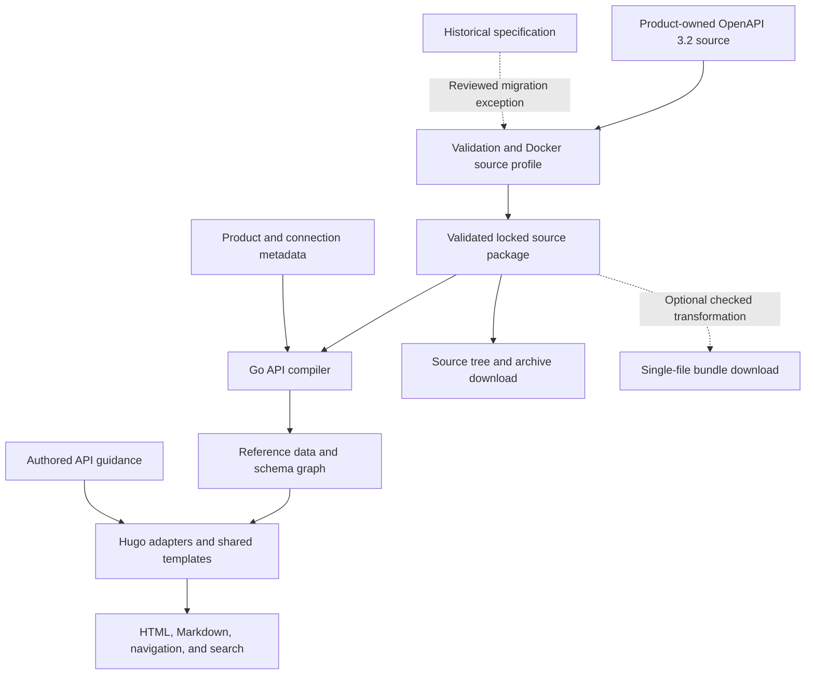

# Unified API documentation architecture

This proposal defines a tailored presentation system and an enforceable source
contract for Docker's HTTP API documentation. It builds on the
[repository inventory](API-DOCUMENTATION-INVENTORY.md), with additional
research into OpenAPI, Hugo, and the migration of the Engine specification.
The [tooling review](API-DOCUMENTATION-TOOLING.md) records the broader component
evaluation behind the revised pipeline recommendation.
The [prototype findings](API-DOCUMENTATION-PROTOTYPE.md) record the implemented
dry-run, source migration ledgers, verified capabilities, and remaining work.

Status: draft recommendation, September 7, 2026. Repository evidence is based
on commit `371255294cf8db2ee20206bf5cc9c165a3a1ea16`. Experiments used temporary
directories and did not modify product specifications or site implementation.
No authenticated API behavior was tested.

## Conclusions

| Decision | Recommendation |
| --- | --- |
| Presentation | Build a tailored reference system within the Docker docs experience. Use Hugo for page creation, templates, and publication, with a separate API preprocessing step. |
| Source contract | Require OpenAPI 3.2.0 and a versioned Docker documentation profile for APIs entering the unified system. Validate the locked source package used for publication. A single-file bundle is an optional, separately checked derivative. |
| Semantic processing | Resolve specification behavior before rendering. HTML, Markdown, navigation, and request examples must consume the same prepared reference data. |
| Ownership | Make source conformance part of product maintenance. Engine's migration includes its upstream code-generation pipeline. Historical conversion is an explicit exception with an owner and fidelity checks. |
| Delivery | Publish complete static HTML, substantive Markdown, searchable operation content, stable links, and downloadable specifications. Add focused browser interactions where they improve reading. |

The shared format is necessary, but it does not make the APIs behave alike.
Uniform source requirements should enforce accurate descriptions of each
API's authentication, transport, errors, and data formats. They should not
require a product to change its protocol to accommodate the templates.

There is enough information to design the system. Before onboarding an API,
its owner must confirm the contract, resolve material contradictions, and
accept responsibility for keeping the source compliant. These are adoption
gates, rather than reasons to postpone the architecture work.

## Constraints supplied by the user

- Build a tailored system. Comparing off-the-shelf renderers with custom
  rendering is outside the requested research.
- Provide a shared API catalog and direct navigation between product manuals
  and API references, leading to the same canonical reference.
- Coordinate with the separate site information architecture effort. This
  proposal does not select final URLs or execute navigation restructuring.
- Focus on HTTP APIs. Detailed SDK and GraphQL documentation remain follow-up
  work.

Reusing a validation tool or specification-processing library is compatible with
this direction. Selecting that infrastructure does not commit the site to
the vendor's reference UI.

## Findings that determine the design

### Hugo is suitable for presentation

The [repository Dockerfile][repo-dockerfile] pins Hugo 0.163.0. Hugo's
[content adapters][hugo-adapters] can create ordinary pages and resources
from data. Its [output formats][hugo-outputs] support separate HTML and
Markdown templates for the same page. The repository already enables those
outputs for pages and sections.

Generated API pages can therefore participate in the existing page
collections, sidebar, metadata, sitemap, and Markdown discovery. Content
adapters run before the complete page collection exists; their inputs should
come from the API build artifacts, rather than from a scan of `site.Pages`.

Hugo's [OpenAPI parser implementation][hugo-parser] uses
[`kin-openapi` v0.139.0][hugo-modules]. It loads typed objects and resolves
references, but does not invoke specification validation. Tests against
Hugo 0.163.0 produced the following results:

| Isolated fixture | Observed result |
| --- | --- |
| OpenAPI 3.1.2 schema with `type: [string, "null"]`, `const`, and `examples` | Parsed and retained these fields. |
| Schema `$ref` with sibling description and `required` | Resolved value retained the siblings, but serializing the reference object through `jsonify` omitted them. |
| Valid OpenAPI 3.1 response with `schema: true` | Parsing failed. |
| OpenAPI 3.2 `query` operation | Parsing succeeded, but the typed operation collection reported zero operations. |
| Specification missing required `info.version` | Parsing succeeded. |

These results establish incomplete support for the proposed contract in
Hugo's pinned parser. The tooling review also tested `kin-openapi` 0.149.0:
it recognizes `QUERY` and boolean schemas, but rejects valid 3.2 tag metadata
and loses a reference-sibling description when serializing a schema reference.
Parser capability must be assessed against a specific version and function.

Use Hugo's general data facilities for prepared reference data. Do not make
`openapi3.Unmarshal` the sole validation or semantic processing boundary.

### OpenAPI 3.2 fits the API portfolio

[OpenAPI 3.2.0][oas32] and [3.1.2][oas31] were published on September 19,
2025. Version 3.2 includes [streaming media support][oas-streams] through
`itemSchema`, including server-sent events. It also adds tag hierarchy and
display metadata, named servers, and support for additional HTTP methods.
The [release notes][oas32-release] describe these additions.

The streaming additions are relevant to Model Runner and Docker Agent.
Engine also needs explicit stream documentation, although its multiplexed
and upgraded connections cannot be fully described by an item schema.

An isolated test with [Redocly CLI][redocly] 2.51.2 successfully validated and
bundled an OpenAPI 3.2 document containing an external `itemSchema` reference,
a type union accepting `null`, and tag `summary`/`kind`. Bundling preserved
the streaming field and resolved the external reference into components.
The broader [component review](API-DOCUMENTATION-TOOLING.md) subsequently found
that its structural linter rejects valid boolean Schema Objects. The earlier
probe supports a narrow bundling role, not selection as the source validation
gate. OpenAPI 3.2 support requires separate checks of parsing, structure,
schema compilation, examples, and transformation fidelity.

The proposed source header is:

```yaml
openapi: 3.2.0
jsonSchemaDialect: https://spec.openapis.org/oas/3.1/dialect/base
```

The `3.1` segment in that dialect URI is intentional: OpenAPI 3.2 retains
that [default schema dialect][oas-schema], based on JSON Schema 2020-12.
The Docker profile should require this dialect and disallow overrides until
the system explicitly supports them. OAI also publishes 3.2 dialect resources;
the pipeline must register the selected dialect explicitly, rather than
substituting a library default. Exact dialect/annotation integration remains
a required implementation test. Later patch-version adoption should be a
coordinated tooling/profile update.

### Format conversion needs semantic review

The [Engine source][engine-spec] is also an input to production Go type
generation. Its upstream [generation script][engine-generation] invokes
`swagger generate model` with custom templates. Migrating the authoritative
format therefore affects more than the documentation build.

An isolated conversion of Engine v1.56 with `swagger2openapi` 7.0.8 exited
successfully and preserved 98 paths, 108 operations, and 160 named schemas.
Nevertheless:

- The default conversion removed 13 `x-nullable` declarations beside `$ref`
  nodes, their associated descriptions, and two `x-omitempty` declarations.
- The archive download's successful response had no `content`, while its
  error schema was associated with `application/x-tar`.
- Attach error responses inherited stream media types, while the introductory
  error contract describes JSON errors.
- Setting `--targetVersion 3.1.0` changed the version declaration without
  converting the remaining OpenAPI 3.0 `nullable` semantics.

The `--refSiblings allOf` option preserved the affected reference siblings,
but left the declarations about `null` as extensions. That does not complete
a modern schema migration. Some output defects also expose limitations or
ambiguities in the source rather than converter failures.

The [converter's documentation][swagger-converter] targets OpenAPI 3.0.x.
Its version flag is not evidence of semantic conversion to 3.1 or 3.2. This
experiment is evidence about migration risk, not a production dependency
selection.

### Source conformance has measurable gaps

Additional parsing of the five reference specifications found:

| Source | Relevant conformance work |
| --- | --- |
| Hub | 40 of 54 operations lack `operationId`. The spec contains 31 `nullable` keys and a broken `team_repo` reference. Descriptions include renderer-specific authentication badges. |
| Engine | Operations use `Distribution` and `Session` tags that are not declared at the root. The source contains six `collectionFormat` keys and 224 `x-nullable` declarations, alongside Go generation extensions. |
| DVP | Two path-level server overrides must be retained. Authentication is duplicated from Hub; the security scheme uses invalid `type: https`, and `security` is placed on path items. |
| Registry | `info.version` and machine-readable security requirements are absent. Eleven operations carry `x-codeSamples`. |
| Governance | The source is OpenAPI 3.1 and passes the structural check recorded in the inventory, but its token request prose contradicts Hub's request schema. |

These counts describe the source files, not server behavior. In particular,
Engine's `x-nullable` and omission extensions interact with Go code
generation. Their presence is not sufficient evidence that an API property
accepts JSON `null`; requiredness, omission, pointer representation, and zero
values must be reviewed separately. [Go-swagger's schema documentation][go-swagger-schemas]
explains these interactions.

## Presentation architecture



The historical path includes an explicit conversion step before the source
profile gate. The renderer receives one contract and does not contain
Swagger-versus-OpenAPI branches.

### Prepare reference data before templating

Implement a build step that consumes the validated source package and API metadata.
Its output should be a versioned JSON model with the information required
for presentation, plus the original schema graph and source pointers. Use
typed operation views for navigation and effective settings, while retaining
raw Schema Objects, resource identities, and reference edges as authority.
Do not reconstruct the contract through a convenience model's serialization method.

The preparation step must compute:

- Operations, stable identifiers, navigation groups, source locations, and
  version availability
- Effective servers and security, including inheritance and explicit
  overrides
- Effective parameters, resolving path/operation overrides by name and
  location, with their serialization rules
- Request and response variants, headers, media types, examples, and schema
  references
- Links among operations, schemas, guides, and published versions, with
  diagnostics for missing targets or unsupported constructs

Preserve the schema graph instead of expanding every reference recursively.
Schema alternatives, cycles, and `$ref` siblings must retain their meaning.
The model is a presentation index over the contract, not a replacement
schema language. Changes to its shape require a model-version update and
compatible templates.

### Give every operation a consistent anatomy

| Part of the reference | Presentation requirement |
| --- | --- |
| Context | API/product identity, selected API version, release/support context, and connections to the product manuals |
| Operation | Purpose, method, path, stable link, deprecation status, and related workflow guidance |
| Connection and access | Effective server or connection profile, applicable authentication flow, and API-specific permission requirements |
| Request | Parameters by location, requiredness, constraints, serialization, selectable body media types, and examples |
| Responses | All documented status codes, response headers, media types, schemas, body absence, and streaming/protocol notes |
| Schema exploration | Linked named schemas, nested fields, alternatives, constraints, and request/response context |

Make operations individually addressable in the data model. A version
overview, operation view, and schema view should be reusable presentation
units. Final page grouping and URL placement should be settled with the IA
effort, without coupling the compiler to a particular sidebar arrangement.

Readers should be able to select a version, filter operations within it,
follow schema references, switch media types and examples, and copy a request.
These controls must support keyboard navigation and expose their selected
state. Use progressive enhancement so substantive reference content remains
available in static HTML and Markdown.

Preserve `allOf` as intersecting constraints and `oneOf` as exactly one
matching alternative. Show whether a property must be present separately
from whether its value can be `null`. Do not present an example, a default,
or a discriminator hint as an additional validation rule.

### Make request examples dependable

Generate common HTTP examples from effective operation data. Use reviewed
authored examples for protocol sequences and cases that exceed the initial
generator's capabilities. Examples must preserve parameter serialization,
shell quoting, required fields, meaningful `false`/`0`/empty values, and the
chosen connection profile.

This is a concrete reason to move logic out of the existing templates.
The [cURL helper][repo-curl] uses the first root server, adds bearer
authentication when any bearer scheme is declared, and emits a
single-quoted header containing literal `$TOKEN`. Those choices do not
follow operation-level server/security behavior or produce the intended
shell expansion. Separate HTML and Markdown generators must not make their
own competing decisions about these details.

For Engine, connection metadata supplies socket or configured remote
examples. `X-Registry-Auth` remains registry delegation credentials and
does not become daemon authentication. For Hub, the token exchange is a
documented flow. For Registry, the challenge and token service are a
different flow. A shared authentication component should display those
facts accurately.

An embedded request console is optional follow-up work. It is not a
requirement for reading the reference or using its examples.

### Reuse Hugo publication facilities

Use content adapters to create pages/resources from the prepared model.
Use shared templates for operation and schema views, with separate HTML
and Markdown output templates backed by the same input. Authored guides
can remain ordinary Markdown with references to stable API/operation IDs.

The presentation must integrate with existing discovery mechanisms:

- [Metadata output][repo-metadata] needs titles, descriptions, keywords,
  product identity, and version context for generated pages.
- [Markdown discovery][repo-llms] needs usable Markdown URLs. A link to a
  specification is not equivalent to the operation's reference text.
- [Pagefind config][repo-pagefind] excludes all HTML tables. API parameter
  and schema names need an explicit indexing strategy, or they will vanish
  from search when presented in tables.
- The [sidebar][repo-sidebar] needs the intended version and product context,
  while retaining existing hidden-page behavior.
- Existing ReDoc page URLs, specification downloads, and fragment links
  need a migration map. Server redirects cannot inspect URL fragments;
  preserving fragment links requires compatible anchors or a client-side
  mapping on the old destination page.

Test operation search using a path, method, parameter name, schema property,
and response code. Check whether results identify the API version. Determine
default historical-version visibility with the IA effort; keep versioned
references stable even when the default version changes.

## Source requirements

The following is the proposed Docker documentation profile, version 1.
These requirements are additional policy where OpenAPI permits more choice.
They are not claims that every otherwise-valid OpenAPI document must follow
the same conventions.

Apply the rules to each product's maintained source in CI. A source can
consist of multiple files. Repeat the checks on the exact locked source
package that the docs system receives. Check any converted or bundled
derivative separately; successful transformation does not waive source
requirements or establish preserved semantics.

| ID | Required contract | Enforcement |
| --- | --- | --- |
| S1 | OpenAPI 3.2.0 and the specified OAS schema dialect. No Swagger fields or legacy `nullable` keywords standing in for JSON Schema semantics. | Format/dialect validation and custom rules scoped to specification/schema keywords, without banning properties merely named `nullable` in an application model. |
| S2 | Nonempty `info.title`, `info.description`, and `info.version`; a declared owner in authored metadata; immutable source revision and digest stamped into publication metadata by the build. | Source profile plus metadata schema and build provenance. Keep API contract version, OAS version, and product release distinct. |
| S3 | No duplicate mapping keys, unresolved references, or unpinned remote dependencies. Package the entry specification and dependencies with their resource identities and reference semantics intact. | Strict parsing, dependency lock/digests, and offline reference resolution. Allow multi-file authoring. Validate the downloadable layout and any optional transformation separately. |
| S4 | Every operation has a stable, unique `operationId`, summary, and useful description. | Profile checks and comparison with the prior version. Uniqueness is within an API version; the same operation retains its ID across versions. Preserve existing IDs instead of renaming them for cosmetic consistency. |
| S5 | All operation tags are declared, with descriptive navigation metadata. Each operation has exactly one primary navigation group; additional labels are allowed. | Profile uses OAS 3.2 tag metadata, including `kind: nav`, to identify navigation tags. Group names and display text are separate. |
| S6 | Every operation has an accurate effective server or a declared local connection profile. Server variables and overrides are documented. | Resolve root/path/operation server precedence, validate variables, and check connection metadata. Never turn a placeholder or relative Engine server into a claim that Docker hosts the API. |
| S7 | An explicit root security policy or complete operation policies, declared schemes, and intentional unauthenticated exceptions. Credential acquisition and authorization requirements are documented. | Resolve root/operation inheritance and check scheme references. Path-level `security` is invalid. Confirm product-specific flows with the owner. |
| S8 | Parameters specify location, requiredness, a `schema` or `content` definition, descriptions, constraints, and applicable serialization. Required path parameters match the path template. | Structural/profile validation, example checks, and serialization fixtures. Preserve content-based parameters, including JSON-encoded values and admitted `querystring` parameters. Operation parameters override path parameters with the same name and location. |
| S9 | Schemas accurately express presence, `null`, types, composition, constraints, and request/response annotations. | Dialect-aware validation and feature-coverage checks. Do not replace difficult constraints with unconstrained objects or erase alternatives. |
| S10 | Document actual responses, status codes, important headers, body absence, and all supported media types for the operation. | Profile completeness checks plus owner review. A success body, a JSON error, and an archive must not inherit an inaccurate common format. |
| S11 | Supply meaningful request and response examples for supported variants. Binary bodies can use a fixture or documented transfer example rather than inline JSON. | Validate examples in their request/response and media context. Explicitly track exceptions; do not fabricate responses merely to satisfy an example rule. |
| S12 | Descriptions use portable CommonMark. No HTML/CSS badges, Hugo shortcodes, embedded renderer components, or layout-dependent links. | Markdown/profile checks and link validation. Product setup and multi-operation workflows belong in authored guides. |
| S13 | Preserve deprecation status, replacement guidance, compatibility limits, and the relation to supported product releases. | Source/profile checks, version comparison, and a version manifest. Do not change historical contract behavior while updating presentation. |
| S14 | Every meaningful specification feature has an implemented presentation or an explicit capability error. Extensions have a documented purpose and handling policy. | Feature inventory and compiler diagnostics. Preserve declared generation extensions that the presentation does not use; do not silently ignore unsupported standard semantics. |

### Authentication must retain its actual semantics

Use standard security schemes where they describe the product correctly.
For example, `mutualTLS` is available for certificate-based authentication.
Unix socket permissions and SSH transport still require connection guidance.
Do not describe Hub's custom token exchange as OAuth merely to reuse OAuth UI.

The [Security Requirement Object][oas-security] defines alternatives as OR
across array entries and combined requirements as AND inside one entry.
`security: []` removes inherited requirements. An empty requirement object
can permit anonymous access as one alternative. A declaration of a bearer
scheme alone establishes neither its applicability nor how to acquire a token.

The profile must preserve those distinctions. It must also distinguish
authentication from permissions, entitlements, and resource visibility.
An operation without HTTP authentication is not necessarily publicly
reachable: a local socket can impose a separate access boundary.

Share approved token-flow documentation and component definitions through
pinned source dependencies where appropriate. Keep each API's accepted
credentials and authorization constraints explicit. Resolve the inventory's
Hub, Governance, DVP, and OAT contradictions before presenting one shared
flow as authoritative.

### Define supported schema capabilities

A common dialect still has a large vocabulary. The first implementation
should support the following presentation levels:

| Level | Features | Required behavior |
| --- | --- | --- |
| Structured exploration | Scalars, arrays, objects, boolean schemas, required properties, type unions, enums, constants, defaults, examples, references, cycles, composition, discriminators, additional properties, and read/write annotations | Render meaningful schema views with links, alternatives, and constraints. Preserve request/response context. |
| Explicit constraint view | Less-common assertions such as `not`, conditional schemas, dependent requirements, pattern properties, tuple items, and unevaluated properties | Validate with the same dialect, preserve the assertion, and display a labeled constraint block with explanatory links. This is a supported presentation, not silent omission. |
| Capability addition required | Custom dialects/vocabularies, unsupported reference behavior, or features without a faithful presentation | Block onboarding with the exact source location and missing capability. Add support before publishing that contract; do not ask the owner to weaken it. |

Tests must cover `$ref` siblings, cycles, scope/base-URI behavior, and any
dynamic reference features admitted by the profile. Reference resolution
must not be implemented as an unqualified dictionary lookup or unlimited
tree expansion.

For example validation, choose an explicit policy for `format`, content
annotations, and read/write annotations. Use the JSON Schema 2020-12
implementation of the selected validation tool. Disable coercion, default
insertion, and removal of properties so validation does not alter the
example to make it pass. A schema-valid example is still not proof of actual
server behavior.

### Represent streams and binary data accurately

Require the actual media type and explain whether the body is a single
document, sequential values, an event stream, an archive, or another binary
format. Use OpenAPI 3.2 `itemSchema` where its sequential-media semantics
apply. Describe framing, termination, errors after the stream starts, and
reconnection where supported.

Engine's HTTP upgrade and TTY-dependent multiplexing need protocol guidance
in addition to the HTTP handshake. A `101` response does not describe the
subsequent bidirectional conversation. Do not relabel every Engine stream
as server-sent events.

Binary bodies need accurate content metadata even when they have no JSON
schema. The profile must accept that distinction. It must not equate an
absent schema with an absent response body.

### Keep companion metadata small

Maintain a schema-validated API manifest alongside the specification. It
should identify the API/product, owner, source repository/path,
specification entry file, supported versions, lifecycle, connection
profiles, and linked authored guidance. Store the Docker profile version
and any migration exception there as well. The build/import step stamps the
exact source revision, dependency digests, and source-package digest into
publication metadata. Include a bundle digest if that derivative is produced;
the authored source does not need to contain its own commit hash.

The manifest supplies facts that OAS does not adequately express, such as
socket setup and the relationship between API versions and Engine releases.
Do not duplicate operation signatures, response schemas, or security
requirements in it. OAS remains authoritative for those facts.

Use standard OAS 3.2 tag display/hierarchy fields in place of renderer-specific
grouping markup. Preserve needed upstream Go generation extensions as
metadata the presentation does not use. Any specification extension that affects
presentation must have a schema, an owner, and defined behavior in both
HTML and Markdown.

## Implementation and verification

### Recommended build components

Use a Go preprocessing tool before Hugo. The [repository build][repo-dockerfile]
already has a Go environment for Hugo. The [tooling review](API-DOCUMENTATION-TOOLING.md)
compares the examined releases and documents the tests supporting this choice.

| Role | Recommended component |
| --- | --- |
| Source parsing and indexing | `libopenapi` for source nodes, references, typed operation views, and source locations |
| Structural and Docker policy checks | `vacuum` with an explicit, versioned Docker ruleset and required rule severities |
| Schema and example validation | `santhosh-tekuri/jsonschema/v6`, explicitly compiling every admitted schema position and evaluating examples under the selected dialect and media policy |
| Reference preparation | Docker-owned Go code over the source graph, producing the shared presentation model |
| Change review | `oasdiff` full reports plus Docker checks for effective authentication, coverage, and stable identities |
| Publication | Hugo content adapters, shared templates, and focused browser interactions |

Share loaded resources across the preprocessing stages. Preserve original
schema nodes: tested Go serialization/bundling paths changed `schema: false`
into `{}`. Publish the validated source package as the canonical contract;
an optional single-file derivative must pass its own fidelity checks.
`@redocly/cli` bundling remains a candidate for that limited role.

Document validation does not replace explicit schema compilation. The tests
found malformed streaming schemas that otherwise passed validation. Compile
every schema even when it has no example, then evaluate examples without
changing their values. Register the exact dialect and locked resources.

Do not adopt an unrelated API design style wholesale: requirements for a
particular error envelope, path convention, or authentication mechanism could
describe an existing API inaccurately. Contract comparison also needs Docker
policy: the tested `oasdiff` report classified adding bearer authentication to
an unauthenticated operation as informational.

Pin compatible library, rule, and runtime versions together. Acquire source
revisions and dependencies in a controlled step so docs processing uses local,
locked inputs. Validate the assembled pipeline with the source-profile fixtures
before production adoption. The opt-in prototype implements these dependencies
in a separate module; the production publication pipeline remains unchanged.

### Enforce gates at both repositories

| Gate | Checks | Responsible owner |
| --- | --- | --- |
| Source validity | Strict parse, OAS/dialect validity, references, identity, and Docker source rules | API source repository |
| Contract fidelity | Authentication, actual media/status behavior, schema examples, compatibility, and available implementation tests | Product owner, with docs review |
| Publication input | Locked source package, provenance, reference resolution, supported feature set, and approved migration exceptions; fidelity of optional derivatives | Docs import pipeline |
| Prepared reference | Operation coverage, effective settings, parameter overrides, complete response/media variants, schema graph, and links | API compiler |
| Reader experience | HTML/Markdown parity, search, keyboard use, version context, examples, stable links, and performance | Docs presentation system |

If the source changes, source CI should run the profile. The docs import
should run it again against the exact pinned artifact. Publish a diagnostic
with the API, revision, source file/pointer, rule ID, and suggested resolution.
An import that fails the gate should retain the prior published reference
until resolved. It must not publish partial output as the updated contract.

Keep a regression corpus containing real operations and focused fixtures.
At minimum, cover all admitted HTTP methods, false/zero examples, parameter
encoding, security alternatives, server overrides, schema composition,
reference cycles, binary bodies, streams, and operation links. Compare
source and output coverage by method/path/ID, status, header, media type,
and schema reference. Counts alone are inadequate, as the Engine conversion
experiment demonstrated.

### Repository integration points

| Area | Proposed work |
| --- | --- |
| API build tooling | Add a versioned source profile, manifest schema, preprocessing tool, and fixtures. Names and locations can follow repository implementation conventions. |
| `Dockerfile` and `docker-bake.hcl` | Add preprocessing and scoped validation stages before Hugo; pin the required build tools. |
| `hugo.yaml` and content adapters | Mount prepared data/resources and create generated pages without colliding with authored pages. Retain HTML and Markdown outputs. |
| `layouts/api-reference.html`, its Markdown template, and `layouts/_partials/api-ref/` | Rework the existing presentation components to consume prepared data; replace raw-spec interpretation and request generation. |
| `layouts/baseof.html` and sidebar/metadata templates | Integrate product/version context and generated pages into the shared experience. Coordinate final navigation with IA work. |
| `pagefind.yml` and Markdown processing | Ensure operation, parameter, schema, and response content remains searchable and present in Markdown. Verify generated links through the existing flattening step. |
| `layouts/api.html` and existing reference wrappers | Migrate references after their source passes the profile; preserve downloads and map legacy fragment links. |

Existing site layout and styling are useful starting material. Their raw-spec
traversal is not the contract implementation to preserve.

## Source migration and adoption

### Keep authoring and historical imports distinct

For a maintained API, the target is a product-owned OpenAPI 3.2 source that
passes the Docker profile. Establish the requirement in that repository's
CI. The docs pipeline consumes an immutable revision and produces a
traceable source package. A permanent hand-edited docs copy would recreate the
contradictions the revamp is meant to resolve.

For a historical release that cannot change its authoring format, allow a
declared conversion exception with an owner, source digest, pinned converter
and patches, semantic comparison, and recorded review. Preserve the
original downloadable source and clearly identify a converted artifact.
Keep the API version unchanged unless the product contract changes.

Every exception needs a reason and review policy. Set an expiry/adoption
milestone for maintained sources; historical snapshots can have a permanent
archival exception. Both paths must produce the same profile-compliant
input before entering the renderer. Historical conversion does not mean the
original source is compliant.

### Plan adoption by source owner

| API | Required preparation |
| --- | --- |
| Engine | Agree the source/toolchain migration with Moby maintainers. Review nullability/omission semantics, response-specific media types, serialization, streams, and generated Go types. Include upstream generation/validation checks. Handle historical specs through audited import exceptions. |
| Hub | Assign the missing operation IDs, fix the broken reference and authentication contradictions, migrate schema semantics, replace renderer-specific markup, and establish source ownership/update responsibility. |
| DVP | Reconcile Hub authentication, correct structural defects, and retain authentication server overrides and analytics formats. |
| Registry | Supply version identity and accurate security requirements, preserve media types/headers, and review how the authored transfer examples enter the shared presentation. |
| Governance | Correct the token request description in private `docker/governor-services`, adopt the target/profile upstream, and use the existing synchronization process. Do not edit the copied YAML by hand. |
| Model Runner and Agent | Obtain or create authoritative specifications with product owners. Inspect the Agent chat runtime specification. Document compatibility differences and streaming formats before admitting them as generated references. |

Prose-only HTTP surfaces can share the product context and authored-guidance
presentation while their specs are prepared. They should not be described
as having passed the generated-reference source contract. Metrics, plugin
protocols, webhooks, and MCP/A2A need explicit scope decisions if included;
being carried over HTTP does not make them identical reference types.

### Suggested implementation sequence

1. Agree the source profile and product ownership. Make the rule set and
   compiler interfaces concrete, and add fixtures for the known difficult
   cases. Resolve adoption constraints with Engine's maintainers early.
2. Build a complete vertical slice with Governance: compliant source,
   prepared data, authored access guidance, HTML, Markdown, search, and links.
   Include Engine/Registry fixtures from the beginning so this small API
   does not define the system's capability limits.
3. Onboard Hub, Registry, and DVP as their source requirements pass. Verify
   actual auth, media, serialization, and navigation cases in published output.
4. Complete Engine's owner-reviewed migration and versioned presentation,
   using the separate archival path for historical versions as necessary.
5. Extend to the remaining HTTP references when their sources are ready,
   then address the deferred SDK/GraphQL work separately.

The order can change with product readiness. Completion for an API means
source conformance, owner-reviewed fidelity, full presentation coverage,
and preserved entry/deep links. A page that looks consistent has not met
that definition by appearance alone.

## Evidence and research limits

Primary research covered official OAS/Hugo documentation, pinned parser and
Engine source code, tooling documentation, and the repository's templates,
specifications, build, and discovery configuration.

The isolated experiments are reproducible with the stated tool versions:

- Hugo 0.163.0 fixtures: basic 3.1 schema support, reference-sibling
  serialization, boolean schemas, 3.2 `query`, and missing `info.version`
- [Redocly CLI][redocly] 2.51.2: `lint` using `spec` rules and `bundle` on a 3.2 document
  with an external streaming item schema, type union, and tag metadata
- `swagger2openapi` 7.0.8: Engine v1.56 conversion using `--fatal`, followed
  by separate `--refSiblings allOf` and `--targetVersion 3.1.0` probes

These experiments establish specific capabilities and failure modes, not
complete tool conformance or API behavior. Product-level fidelity still
requires implementation evidence and owner review. Private Governance source
was not fetched, and no product source or specification was modified.

The [follow-up tooling review](API-DOCUMENTATION-TOOLING.md) adds broader
positive and negative fixtures across Go, JavaScript, Python, and comparison
tools. Its results replace the initial Redocly/TypeScript recommendation and
the requirement for a single-file publication input. Exact dialect handling,
advanced references, and full presentation coverage remain integration gates.

The subsequent prototype adds evidence about timestamp normalization, schema
name case collisions in adapter paths, and Markdown output processing inside
fenced JSON. Its report records the corrective processing boundaries and the
limits of the assembled system. The prototype's successful draft build does
not replace source-owner approval or strict conformance checks.

[repo-dockerfile]: Dockerfile
[repo-curl]: layouts/_partials/api-ref/curl.html
[repo-metadata]: layouts/home.metadata.json
[repo-llms]: layouts/home.llmsfull.txt
[repo-pagefind]: pagefind.yml
[repo-sidebar]: layouts/_partials/sidebar/sections.html
[engine-spec]: _vendor/github.com/moby/moby/api/docs/v1.56.yaml
[hugo-adapters]: https://gohugo.io/content-management/content-adapters/
[hugo-outputs]: https://gohugo.io/configuration/output-formats/
[hugo-parser]: https://github.com/gohugoio/hugo/blob/v0.163.0/tpl/openapi/openapi3/openapi3.go
[hugo-modules]: https://github.com/gohugoio/hugo/blob/v0.163.0/go.mod
[oas32]: https://spec.openapis.org/oas/v3.2.0.html
[oas31]: https://spec.openapis.org/oas/v3.1.2.html
[oas32-release]: https://github.com/OAI/OpenAPI-Specification/releases/tag/3.2.0
[oas-streams]: https://spec.openapis.org/oas/v3.2.0.html#streaming-sequential-media-types
[oas-schema]: https://spec.openapis.org/oas/v3.2.0.html#schema-object
[oas-security]: https://spec.openapis.org/oas/v3.2.0.html#security-requirement-object
[redocly]: https://redocly.com/docs/cli
[swagger-converter]: https://github.com/Mermade/oas-kit/tree/main/packages/swagger2openapi
[engine-generation]: https://raw.githubusercontent.com/moby/moby/api/v1.56.0/api/scripts/generate-swagger-api.sh
[go-swagger-schemas]: https://raw.githubusercontent.com/go-swagger/go-swagger/master/docs/reference/models/schemas.md
