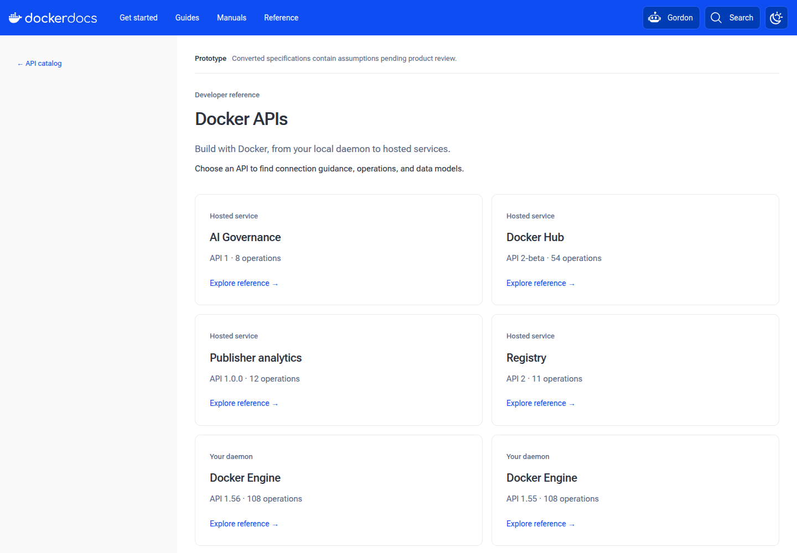
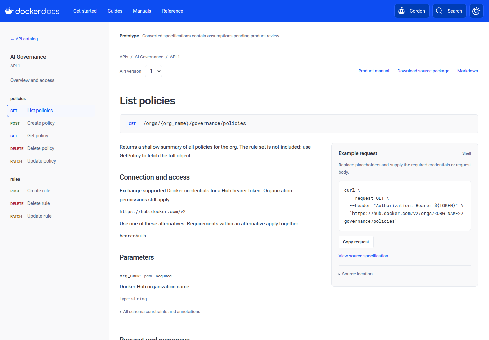

# Unified API documentation prototype findings

The prototype demonstrates a shared reference for all five specification-backed
API families, including two Engine versions. It converts copied specifications,
records each source change, validates the results, and produces HTML, Markdown,
source downloads, navigation, and search through Hugo.

Status: completed dry-run, September 7, 2026. This is a documentation prototype,
not product-owner approval of the converted contracts. No product API requests
were sent, and no authoritative or imported specification was edited.

## Run and inspect the prototype

From the repository root:

```console
./hack/api-docs/run.sh serve
```

Open <http://localhost:1314/api-prototype/>. The complete container build is:

```console
docker buildx bake api-prototype
```

It exports the site and reports under `tmp/api-prototype`. Serve the exported
site with the command in the [tooling README](hack/api-docs/README.md).
Default site builds exclude the prototype. No production URLs or navigation
were migrated.





The catalog and manual entrypoints lead to the same reference. The operation
view exposes effective connection/authentication settings, parameters, body
variants, linked schemas, and request examples. Native controls support version,
media, and example selection. Core reference content remains available without
JavaScript.

## Results by API

The baseline comes from the checked-in [source lock](prototypes/api-docs/source-lock.json).
Each linked ledger contains the exact additions, removals, and replacements,
with evidence and ownership. Before/after pointers are relative to the named
migration stage. Textual patches preserve formatting differences as well.

| Snapshot | Operations | Named schemas | Media/body variants | Recorded changes | Preview exceptions |
| --- | ---: | ---: | ---: | ---: | ---: |
| [Governance](prototypes/api-docs/migrations/governance.json) | 8 | 18 | 52 | 4 | 0 |
| [Hub](prototypes/api-docs/migrations/hub.json) | 54 | 74 | 241 | 157 | 268 |
| [DVP](prototypes/api-docs/migrations/dvp.json) | 12 | 26 | 20 | 14 | 17 |
| [Registry](prototypes/api-docs/migrations/registry.json) | 11 | 0 | 68 | 7 | 4 |
| [Engine 1.56](prototypes/api-docs/migrations/engine-1.56.json) | 108 | 160 | 434 | 1521 | 101 |
| [Engine 1.55](prototypes/api-docs/migrations/engine-1.55.json) | 108 | 160 | 434 | 1521 | 101 |

Registry uses inline schemas; zero named schemas does not mean it lacks schemas.
A media/body variant is a request or response representation, including a
response without declared content.

The pipeline accounts for 301 operations and creates 746 HTML/Markdown page
pairs: the catalog, six overviews, 301 operations, and 438 named schemas.
Source/model comparisons cover complete operation objects, response variants,
headers, and schemas. Original and converted method/path sets match.

The validation step checks 1983 schema roots and performs 1529 example evaluations.
The [491 exact exceptions](prototypes/api-docs/exceptions.json) comprise 397
missing media examples/fixtures, 45 missing parameter descriptions, and 49
example/schema mismatches. These are recorded review items, not passing checks.
The same source example can be evaluated in more than one context.

Strict validation fails with these exceptions. Preview generation accepts only
entries matching the API, source digest, rule, pointer, and diagnostic hash.
Structural errors, unresolved references, and source/output loss remain fatal.
Provisional contract assumptions are separately identified in the migration
ledgers and reference overviews.

## What the prototype established

| Assumption | Result and implication |
| --- | --- |
| One presentation can cover hosted and daemon APIs | Confirmed for the selected corpus. Engine uses an explicit socket connection profile and API version; hosted APIs retain their effective server addresses. |
| A Go preprocessing step integrates with Hugo | Confirmed. A separate Go module prepares model version 1; preview content adapters produce ordinary site pages, Markdown, and searchable content. |
| Source preservation requires more than retaining references | Confirmed. The convenience JSON view normalized timestamp strings. Reading original YAML scalar values preserves their spelling. Regression tests cover this case. |
| Stable IDs are sufficient for stable routing | Incomplete. Hub has both `Error` and `error` schemas. Hugo adapter paths normalize case. Unique internal page keys plus explicit case-preserving URLs prevent collisions. |
| Existing Markdown processing can be reused unchanged | Rejected. The site processing script changed an external `image-index.md` URL inside fenced schema JSON. The preview preserves its Markdown and performs only the required file flattening. |
| Validating the document covers its schemas | Rejected. Hub contains boolean `required` flags inside property definitions. Explicit schema checks found them; the conversion moves them to parent required-property lists. |
| Format conversion determines actual response media | Rejected. Engine conversion required explicit archive-success and JSON-error corrections. HEAD content was removed according to HTTP semantics while retaining status codes and headers. |
| Search can cover schema properties | Confirmed. Browser search for `GwPriority` returns both Engine schema references, with their API versions in the result titles. |

The effective-security model preserves anonymous overrides and AND/OR
alternatives. Tests cover path-level server overrides, parameter replacement,
`QUERY`, boolean schemas, recursive references, reference siblings, external
streaming schemas, named/dynamic references in the evaluator, and false/zero
values. The selected OAS dialect and document schemas are locked locally.

The structural gate uses the locked OAI document schema plus explicit schema
compilation. Vacuum supplies named Docker policy rules. This division avoids
relying on an implicit default ruleset. Contract reports use `oasdiff`, with
additional effective-setting and coverage comparisons. Original Hub's missing
reference can prevent a tool comparison; that failure is retained, and the
mandatory replay ledger remains available.

## Source changes requiring upstream work

| Owner | Changes and decisions |
| --- | --- |
| `docker/governor-services` | Adopt the selected OAS version/dialect and navigation metadata. Correct the token request prose from `password` to `secret`, following Hub's documented operation. Confirm credential support before publishing shared guidance. |
| Hub product owner; specification stored in `docker/docs` | Adopt the recorded missing operation IDs and editorial completions. Correct property-level requiredness and renderer-specific markup. Confirm the provisional `team_repo` base of `repository_info`. Keep SCIM's provisioning-token requirement separate. Resolve missing examples/descriptions and the remaining example mismatches. Establish authoritative ownership and synchronization. |
| DVP product owner; specification stored in `docker/docs` | Correct `type: https`, move path security to operation policies, and move the unsupported root field into an extension. Replace embedded schema-renderer markup with portable links. Retain authentication server overrides. Confirm the legacy login flow rather than silently replacing it with Hub's later flow. |
| Registry product owner; specification stored in `docker/docs` | Confirm the provisional `info.version: 2` and bearer security declaration, including anonymous access alternatives. Complete parameter descriptions and preserve challenge/token guidance, headers, and binary transfer examples. |
| `moby/moby` | Coordinate OAS migration with Go model generation. Review every provisional `x-nullable` interpretation: omission and pointer representation do not prove acceptance of JSON null. Review response media corrections, preserve generation extensions, and reconcile the existing example mismatches. Historical conversion remains a reviewed archival path. |
| `docker/docs` | Own catalog/connection metadata, source import gates, prepared-data interfaces, reference templates, search integration, and migration of URLs and fragment links. Resolve the Markdown processing script behavior independently of this preview. |

All 3224 recorded changes are reproducible. Mechanical changes can be grouped
for review, but the ledgers retain every affected location and value. Existing
operation IDs are preserved; missing IDs are maintained in a separate
[recorded mapping](prototypes/api-docs/operation-ids.json).

The source package for each API contains the converted specification, original
snapshot, ledger, textual patch, source lock, and exceptions. These six specs
have no external references. Multi-file resolution is tested through fixtures;
portable multi-file publication still needs a product-sized integration case.

## Limits exposed by the prototype

The prototype is a foundation for the implementation, not a complete OpenAPI
processor or a production reference design:

- Schema exploration has linked references and bounded structured expansion,
  followed by complete constraint blocks. Complex schema presentation needs
  further design and accessibility review. Full operation JSON preserves
  annotations that lack a dedicated presentation.
- The request generator covers POSIX shell examples, socket connections,
  ordinary path/query/header parameters, and form-style query arrays. Other
  serialization or authentication cases produce instructions rather than
  fabricated working examples. Full request/response annotation policy and
  wire-format testing remain required.
- Format and content annotations are not assertions in this prototype.
  Example/schema validity does not establish actual server behavior, binary
  encoding, or streaming framing. Media examples with known mismatches are
  labeled; the generator avoids using directly identified invalid payloads.
- The evaluator tests advanced references, but broader resource-scope handling,
  complete schema-position discovery, and publication across external resources
  need additional integration fixtures. Callback/webhook navigation is an
  explicit capability error.
- Temporary routes demonstrate navigation and version selection. Production
  IA, historical discoverability, legacy fragment compatibility, and the full
  Engine archive remain implementation work.

## Build and browser evidence

Go regression tests, migration replay, strict-source checks, preview generation,
source/model comparisons, HTML/Markdown checks, and browser checks were run.
The container build and local build both completed. A default Hugo build
completed without prototype HTML, Markdown, or navigation entries.

The [browser checks](hack/api-docs/browser-checks.mjs) cover filtering, keyboard
version selection, clipboard content, reciprocal manual links, media/example
selection, search with version context, a 390-pixel browser window, and content with
JavaScript disabled. These checks are targeted; they are not a full
accessibility audit.

The local measured Hugo/postprocessing/search/output-check stage took about
14 seconds with dependencies prepared; the final container run measured 41 seconds
for that stage. The API subtree occupied 190,452,604 bytes (about 190 MB),
including HTML, Markdown, and source downloads. The build also includes the
rest of the documentation site to exercise integration. Complete contract
blocks and repeated navigation add substantial output; production work should
measure and reduce that cost. These observations are not performance budgets.

The `pagefind` 1.5.2 published Linux binary failed on the tested host's 16 KB memory
pages. An opt-in build of the same release with
`JEMALLOC_SYS_WITH_LG_PAGE=16` passed indexing and browser search. Its first Rust
build took about 98 seconds. The production build remains unchanged.

## Presentation refinement

The September 8 refinement applies the [reference design notes](prototypes/api-docs/DESIGN.md)
to the preview. It retains the Docker Docs page shell and catalog structure,
with a consistent heading scale, 15px reference prose, 14px navigation, and
13px code using the bundled `Roboto Mono` font. The request panel aligns with
the operation introduction; secondary source details use a keyboard-accessible
disclosure. Long endpoint paths wrap between segments without changing their
copied text. Light and dark themes share the site's color tokens.

The complete local preview build and all 13 existing browser checks passed.
Additional [browser checks](prototypes/api-docs/evidence/presentation.json)
covered five representative pages at widths of 390,
768, 1024, 1280, and 1440 pixels in both themes. All 50 combinations retained
13px code and avoided horizontal page overflow. Keyboard focus and the source
location disclosure also passed targeted checks. The screenshots in this report
show the refined presentation; the September 7 build measurements describe the
initial dry-run.

- [Dark operation view](prototypes/api-docs/evidence/operation-dark.png)
- [Mobile operation view](prototypes/api-docs/evidence/operation-mobile.png)
- [Schema view](prototypes/api-docs/evidence/schema.png)

## Implementation sequence after this dry-run

1. Agree the source profile, owners, and the recorded provisional decisions.
   Establish source CI and a process for retiring exact preview exceptions.
   Start Engine generation-toolchain coordination at this stage.
2. Harden the Governance vertical slice into a production component: versioned
   compiler interface, precise schema traversal and resource registry,
   direction-aware examples, accessible schema exploration, and bounded output.
3. Apply the source corrections with Hub, Registry, and DVP owners. Require
   verified authentication/media contracts and reviewed examples before release.
4. Complete Engine's upstream authoring/generation migration and versioned
   presentation, then expand the reviewed archival conversion beyond two versions.
5. Coordinate production catalog/manual navigation and legacy link migration
   with the separate IA effort. Onboard the remaining HTTP references when
   authoritative specifications are available; defer SDK and GraphQL work.

Keep the [inventory](API-DOCUMENTATION-INVENTORY.md),
[architecture](API-DOCUMENTATION-ARCHITECTURE.md), and
[tooling review](API-DOCUMENTATION-TOOLING.md) alongside this report. Source
corrections require implementation evidence and owner review even when the
prototype's static checks pass.
