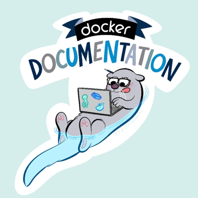

# Docs @ Docker

Welcome to the Docker Documentation repository. This is the source for
[https://docs.docker.com/](https://docs.docker.com/).

Feel free to send us pull requests and file issues. Our docs are completely
open source and we deeply appreciate contributions from the Docker community!

## Provide feedback

We’d love to hear your feedback. Please file documentation issues only in the
docs GitHub repository. You can file a new issue to suggest improvements or if
you see any errors in the existing documentation.

Before submitting a new issue, check whether the issue has already been
reported. You can join the discussion using an emoji, or by adding a comment to
an existing issue. If possible, we recommend that you suggest a fix to the issue
by creating a pull request.

You can ask general questions and get community support through the [Docker
Community Slack](http://dockr.ly/slack). Personalized support is available
through the Docker Pro, Team, and Business subscriptions. See [Docker
Pricing](https://www.docker.com/pricing) for details.

If you have an idea for a new feature or behavior change in a specific aspect of
Docker, or have found a product bug, file that issue in the project's code
repository.

We've made it really easy for you to file new issues.

- Click **New issue** on the docs repository and fill in the details, or
- Click **Request docs changes** in the right column of every page on
  docs.docker.com and add the details.

## Contribute to Docker docs

We value your contribution. We'd like to make it as easy as possible to submit
your contributions to the Docker docs repository. Changes to the docs are
handled through pull requests against the `master` branch. To learn how to
contribute, see our [Contribute section](https://docs.docker.com/contribute/overview/).

### Dev Environment

The fastest inner loop can be done in a Dev Environment container in combination with Visual Studio Code. 

- The source codes will be cloned into a volume with the best file performance inside a container. 
- The repo (763 MB) doesn't need to be uploaded to the build context every time.
- The remote repos for engine, cli, ... don't need to be fetched on every build.

To use the Dev Environment
1. Create a Dev Environment: [Open in Docker Dev Environments](https://open.docker.com/dashboard/dev-envs?url=https://github.com/StefanScherer/docker.github.io/tree/docs-dev-env)
2. Click on the "Open in VScode" button
3. Open a Terminal inside VScode
4. Run `make watch` to start Jekyll in watch mode
5. Open http://localhost:4002 in your browser to see the latest changes

## Copyright and license

Copyright 2013-2022 Docker, inc, released under the Apache 2.0 license.
