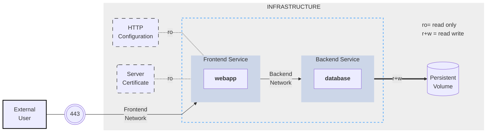

# The Compose application model

The Compose Specification lets you define a platform-agnostic container based application. Such an application is designed as a set of containers which have to both run together with adequate shared resources and communication channels.

Computing components of an application are defined as [services](05-services.md). A service is an abstract concept implemented on platforms by running the same container image, and configuration, one or more times.

Services communicate with each other through [networks](06-networks.md). In the Compose Specification, a network is a platform capability abstraction to establish an IP route between containers within services connected together. Low-level, platform-specific networking options are grouped into the Network definition and may be partially implemented on some platforms.

Services store and share persistent data into [volumes](07-volumes.md). The Specification describes such a persistent data as a high-level filesystem mount with global options. Actual platform-specific implementation details are grouped into the volumes definition and may be partially implemented on some platforms.

Some services require configuration data that is dependent on the runtime or platform. For this, the Specification defines a dedicated [configs](08-configs.md) concept. From a service container point of view, configs are comparable to volumes, in that they are files mounted into the container. But the actual definition involves distinct platform resources and services, which are abstracted by this type.

A [secret](09-secrets.md) is a specific flavor of configuration data for sensitive data that should not be exposed without security considerations. Secrets are made available to services as files mounted into their containers, but the platform-specific resources to provide sensitive data are specific enough to deserve a distinct concept and definition within the Compose specification.

>**Note**
>
> With volumes, configs and secrets you can have a simple declaration at the top-level and then add more platform-specific information at the service level.

A project is an individual deployment of an application specification on a platform. A project's name, set with the top-level [`name`](04-version-and-name.md) attribute, is used to group
resources together and isolate them from other applications or other installation of the same Compose specified application with distinct parameters. If you are creating resources on a platform, you must prefix resource names by project and
set the label `com.docker.compose.project`.

Compose offers a way for users to set a custom project name and override this name, so that the same `compose.yaml` file can be deployed twice on the same infrastructure, without changes, by just passing a distinct name.

Project names must contain only lowercase letters, decimal digits, dashes, and underscores, and must begin with a lowercase letter or decimal digit.

## Illustrative example

The following example illustrates the Compose Specification concepts outlined above. The example is non-normative.

Consider an application split into a frontend web application and a backend service.

The frontend is configured at runtime with an HTTP configuration file managed by infrastructure, providing an external domain name, and an HTTPS server certificate injected by the platform's secured secret store.

The backend stores data in a persistent volume.

Both services communicate with each other on an isolated back-tier network, while the frontend is also connected to a front-tier network and exposes port 443 for external usage.



The example application is composed of the following parts:

- 2 services, backed by Docker images: `webapp` and `database`
- 1 secret (HTTPS certificate), injected into the frontend
- 1 configuration (HTTP), injected into the frontend
- 1 persistent volume, attached to the backend
- 2 networks

```yml
services:
  frontend:
    image: example/webapp
    ports:
      - "443:8043"
    networks:
      - front-tier
      - back-tier
    configs:
      - httpd-config
    secrets:
      - server-certificate

  backend:
    image: example/database
    volumes:
      - db-data:/etc/data
    networks:
      - back-tier

volumes:
  db-data:
    driver: flocker
    driver_opts:
      size: "10GiB"

configs:
  httpd-config:
    external: true

secrets:
  server-certificate:
    external: true

networks:
  # The presence of these objects is sufficient to define them
  front-tier: {}
  back-tier: {}
```

This example illustrates the distinction between volumes, configs and secrets. While all of them are all exposed
to service containers as mounted files or directories, only a volume can be configured for read+write access.
Secrets and configs are read-only. The volume configuration allows you to select a volume driver and pass driver options
to tweak volume management according to the actual infrastructure. Configs and secrets rely on platform services,
and are declared `external` as they are not managed as part of the application lifecycle. Compose uses a platform-specific lookup mechanism to retrieve runtime values.
