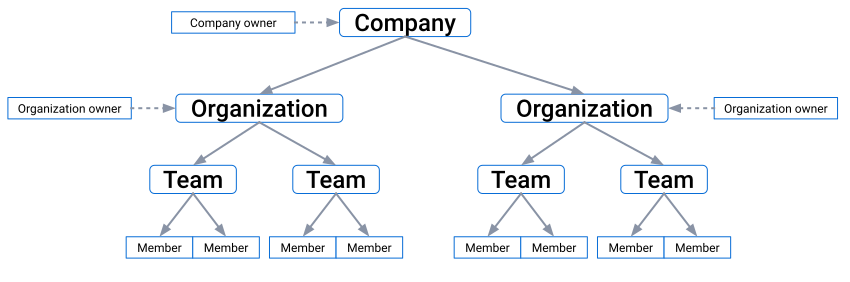



The [Docker Admin](https://admin.docker.com){: target="_blank" rel="noopener" class="_"} console provides administrators with centralized observability, access management, and controls for their company and organizations. To provide these features, Docker uses the following hierarchy and roles.

{: width="800px" }

- Company: A company simplifies the management of Docker organizations and settings. Creating a company is optional and only available to Docker Business subscribers.
  - Company owner: A company can have multiple owners. Company owners have company-wide observability and can manage company-wide settings that apply to all associated organizations. In addition, company owners have the same access as organization owners for all associated organizations.
- Organization: An organization is a collection of teams and repositories. Docker Team and Business subscribers must have at least one organization.
  - Organization owner: An organization can have multiple owners that are members of the owners team. Organization owners have observability into their organization and can manage its users and settings.
- Team: A team is a group of Docker members that belong to an organization. An organization has one team upon creation, the owners team. Organization and company owners can group members into additional teams to configure repository permissions on a per-team basis.
  - Member: A member is a Docker user that's a member of at least one team in an organization.

    <!--start row-->
    

      

        

             

                 
                 

                 <h2 id="set-up-an-org"><a href="/admin/company/">Company administration</a></h2>
                
 Explore how to manage a company in Docker Admin.

        

      

      

        

             

                 
                 

                 <h2 id="set-up-an-org"><a href="/admin/organization/">Organization administration</a></h2>
                
 Learn about organization administration in Docker Admin.

        

      

    

