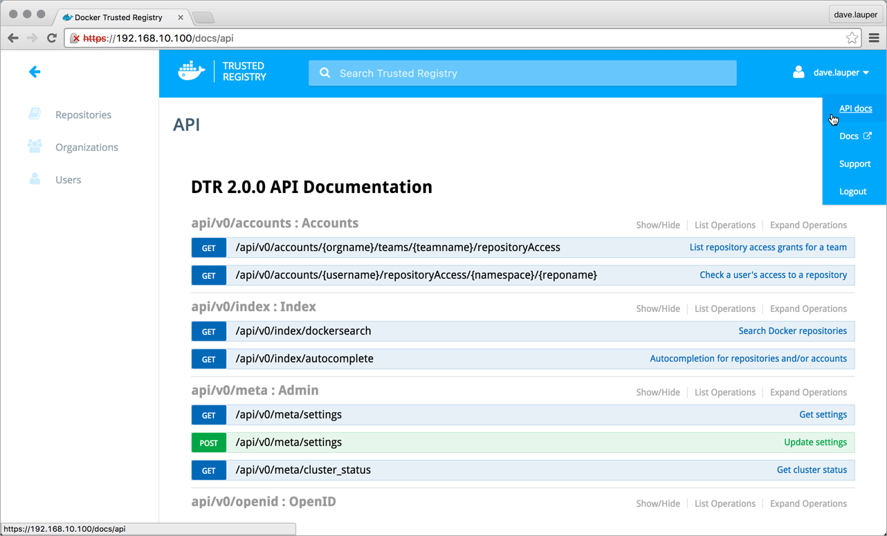

Docker Trusted Registry has an experimental API that you can use to manage
DTR repositories, permissions, and settings.

> This API is still experimental and can change without backwards compatibility.

To get access to interactive documentation, in your **DTR UI**, click
on the **top-right menu** and choose **API docs**.

