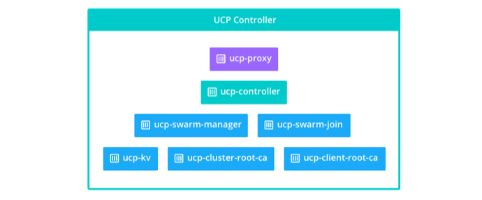

<!--[metadata]>
+++
title = "Architecture"
description = "Learn about the architecture of Docker Universal Control Plane."
keywords = ["docker, ucp, architecture"]
[menu.main]
parent="mn_ucp"
identifier="ucp_architecture"
weight=20
+++
<![end-metadata]-->

# UCP architecture

Docker Universal Control Plane (UCP) helps you manage your container cluster
from a single place.

UCP is a containerized application, so the first step to install UCP is
installing the Commercially Supported (CS) Docker Engine on all the nodes that
are going to be part of the cluster.

After CS Docker Engine is installed, you can install UCP, and join as many
nodes you want to the cluster.

## UCP controller node

When you install Docker UCP on a node, the following containers are started.

| Name                | Description                                                                                                                                                |
|:--------------------|:-----------------------------------------------------------------------------------------------------------------------------------------------------------|
| ucp-proxy           | A TLS proxy. It allows secure access to the local Docker Engine.                                                                                           |
| ucp-controller      | The UCP application. It uses the key-value store for persisting configurations.                                                                            |
| ucp-swarm-manager   | Provides the clustering capabilities. It uses the key-value store for leader election, and keeping track of cluster members.                               |
| ucp-swarm-join      | Heartbeat to record on the key-value store that this node is alive. If the node goes down, this heartbeat stops, and the node is dropped from the cluster. |
| ucp-kv              | Used to store the UCP configurations. Don't use it in your applications, since it's for internal use only.                                                 |
| ucp-cluster-root-ca | A certificate authority to sign the certificates used when joining new nodes, and on administrator client bundles.                                         |
| ucp-client-root-ca  | A certificate authority to sign user bundles. Only used when UCP is installed without an external root CA.                                                 |

## UCP node

When you join a node to a Docker UCP cluster, the following containers are
started.

| Name           | Description                                                                                                                                                |
|:---------------|:-----------------------------------------------------------------------------------------------------------------------------------------------------------|
| ucp-proxy      | A TLS proxy. It allows secure access to the local Docker Engine.                                                                                           |
| ucp-swarm-join | Heartbeat to record on the key-value store that this node is alive. If the node goes down, this heartbeat stops, and the node is dropped from the cluster. |

## Volumes

Docker UCP uses these named volumes for persisting data:

| Volume name                 | Location on host (/var/lib/docker/volumes/) | Description                                                                                                    |
|:----------------------------|:--------------------------------------------|:---------------------------------------------------------------------------------------------------------------|
| ucp-client-root-ca          | ucp-client-root-ca/_data                    | The certificate and key for the UCP root CA. Do not create this volume if you are using your own certificates. |
| ucp-cluster-root-ca         | ucp-cluster-root-ca/_data                   | The certificate and key for the Swarm root CA.                                                                 |
| ucp-controller-client-certs | ucp-controller-client-certs/_data           | The UCP Controller Swarm client certificates for the current node.                                             |
| ucp-controller-server-certs | ucp-controller-server-certs/_data           | The controller certificates for the UCP controllers web server.                                                |
| ucp-kv                      | ucp-kv/_data                                | Key value store persistence.                                                                                   |
| ucp-kv-certs                | ucp-kv-certs/_data                          | The Swarm KV client certificates for the current node (repeated on every node in the cluster).                 |
| ucp-node-certs              | ucp-node-certs/_data                        | The Swarm certificates for the current node (repeated on every node in the cluster).                           |

If you don’t create these volumes, when installing UCP, they are created with
the default volume driver and flags.

## High-availability support
For load balancing and high-availability, you can add more controller nodes
to a UCP cluster. In that case, you’ll have multiple nodes, each running the
same set of containers.

<!--TODO: add diagram with 3 controllers -->

Notice that:

* You can load balance user requests between the controller nodes.
When you make a change to the configuration of one controller node, that
configuration is replicated to the other controllers.
* For high-availability, you should set up 3, 5, or 7 controller nodes.
