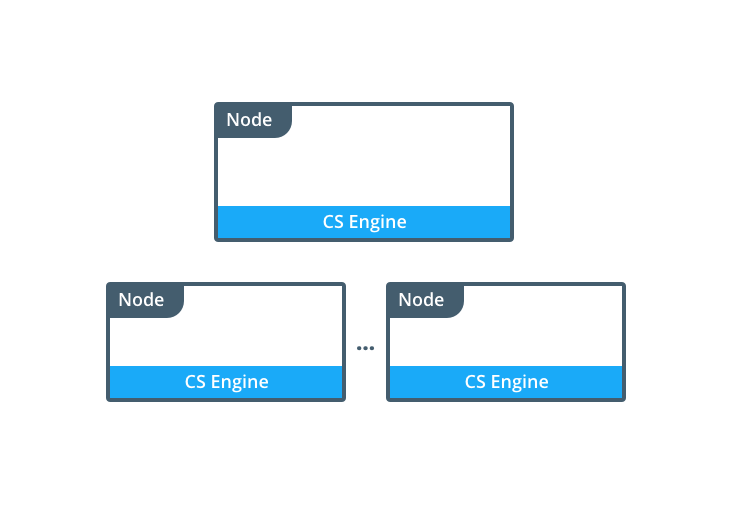
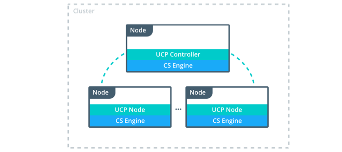

<!--[metadata]>
+++
title = "Architecture"
description = "Learn about the architecture of Docker Trusted Registry."
keywords = ["docker, registry, dtr, architecture"]
[menu.main]
parent="workw_dtr"
identifier="dtr_architecture"
weight=20
+++
<![end-metadata]-->

# DTR architecture

Docker Trusted Registry (DTR) is a Dockerized application that runs
using the Commercially Supported Docker Engine.

<!-- TODO: add architecture diagram -->

## Containers

When you install DTR on a node, the following containers are started:

| Name          | Description                                                                                                                                |
|:--------------|:-------------------------------------------------------------------------------------------------------------------------------------------|
| dtr-api       | Executes the DTR business logic. It serves the DTR web application, and API.                                                               |
| dtr-etcd      | A key-value store for persisting DTR configuration settings. Don't use it in your applications, since it's for internal use only.          |
| dtr-nginx     | Receives http and https requests and proxies them to other DTR components. It listens on ports 80 and 443 of the host where it is running. |
| dtr-registry  | Implements the functionality for pulling and pushing Docker images. It also handles how images are stored.                                 |
| dtr-rethinkdb | A database for persisting repository metadata. Don't use it in your applications, since it's for internal use only.                        |

## Networks

To allow containers to communicate, when installing DTR the following networks
are created:

| Name   | Type    | Description                                                                                                                                                                                          |
|:-------|:--------|:-----------------------------------------------------------------------------------------------------------------------------------------------------------------------------------------------------|
| dtr-br | bridge  | Allows containers in the same node to communicate with each other in a secure way.                                                                                                                   |
| dtr-ol | overlay | Allows containers in different nodes to communicate. This network is used in high-availability installations, to allow etcd and RethinkDB containers to replicate their data across different nodes. |

## Volumes

DTR uses these named volumes for persisting data:

| Volume name  | Location on host (/var/lib/docker/volumes/) | Description                                                                                                  |
|:-------------|:--------------------------------------------|:-------------------------------------------------------------------------------------------------------------|
| dtr-ca       | dtr-ca/_data                                | The volume where the private keys and certificates are stored so that containers can use TLS to communicate. |
| dtr-etcd     | dtr-etcd/_data                              | The volume used by etcd to persist DTR configurations.                                                       |
| dtr-registry | dtr-registry/_data                          | The volume where images are stored, if DTR is configured to store images on the local filesystem.            |
| dtr-rethink  | dtr-rethink/_data                           | The volume used by RethinkDB to persist DTR data, like users and repositories.                               |

If you don’t create these volumes, when installing DTR they are created with
the default volume driver and flags.

## Image storage

By default, Docker Trusted Registry stores images on the filesystem of the host
where it is running.
You can also configure DTR for using these cloud storage backends:

* Amazon S3
* OpenStack Swift
* Microsoft Azure

## High-availability support
For load balancing and high-availability, you can create multiple replicas of
DTR. In that case, you’ll have multiple nodes, each running the
same set of containers.

<!--TODO: add diagram with 3 controllers -->

Notice that:

* You can load balance user requests between the controller nodes.
When you make a change to the configuration of one controller node, that
configuration is replicated to the other controllers.
* For high-availability, you should set up 3, 5, or 7 controller nodes.
