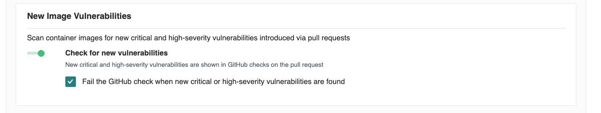
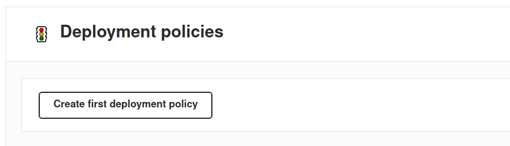
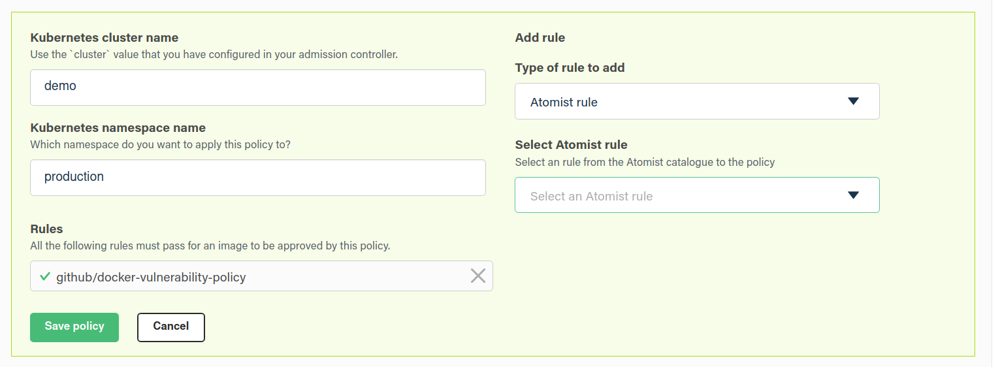



Atomist keeps track of the state of container images by continuously evaluating
rules in your image policy. For example:

- Does the image have the required labels?
- Was the image created by a trusted builder?
- Was the image created from a known git commit revision (SHA)?
- Has the image been scanned for vulnerabilities?
- Does the image contain any vulnerabilities that are not already present in the
  currently running version?

Each workload can define a set of mandatory rules. This allows Atomist to wait
for a new image to have all the necessary rules satisfied, and then signal to a
workload that a new candidate version is ready. This works well with a GitOps
workflow where new candidate images can be pulled into a workload once they are
ready. Failing rules can be made available to developers via GitHub Checks to
indicate why a change was rejected, and these same rules drive tools like
[Kubernetes admission controllers](../integrate/kubernetes.md), to ensure that only images
that fully satisfy your policy are admitted to selected namespaces. The
combination of GitOps controllers, admission controllers, and modular image
policy, gives teams the ability to plug consistent validation into their cloud
native delivery.

## Enable GitHub vulnerability check

Start by checking whether a candidate image has additional vulnerabilities when
compared to other versions already in existing workloads. If you're building an
image from a pull request commit, this policy will also compare vulnerabilities
against any image built from the HEAD commit of your default branch. Enable the
policy by navigating to your
[settings page](https://dso.docker.com/r/auth/policies){: target="blank"
rel="noopener" class=""}.

In the section called `New Image Vulnerabilites`, select the check box that
controls whether a GitHub Check should fail when _new_ vulnerabilities of
critical or high severity are found.

{: width="700px" }

### Choose admission rules

Policies are made up of sets of rules. Atomist comes with some built-in rules,
but GitHub Checks can also be used directly as rules in policies. This makes it
easy to compose policies from GitHub Checks created by other processes, such as
CI/CD systems, to ensure for example, that images have been properly tested,
that commits have been signed and so on.

Now that we are checking images for new vulnerabilities, we can begin requiring
that certain sets of rules pass before an image is ready to be admitted into an
existing workload (for example, see the
[section on Kubernetes admission control](../integrate/kubernetes.md)). We can select
different rules for different environments. For example, let's start with the
requirement that a Kubernetes cluster named `demo` with a namespace `production`
requires the GitHub Check configured above.

From the policy view, click the "Add first deployment policy" and add the new
GitHub Check we created above:

{: width="700px" }

{: width="700px" }
