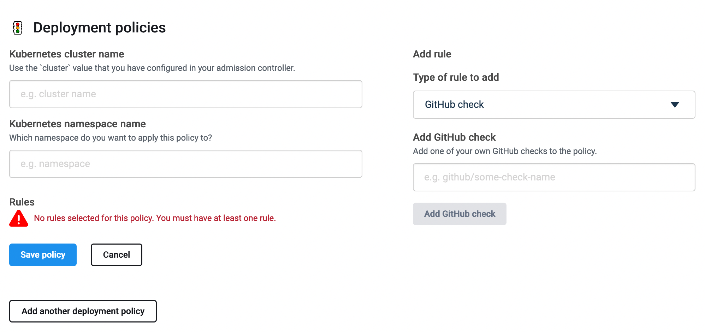



An image policy is a way to determine the quality of a container image. It's
like a test suite for ensuring that the final image is well-formed and
compliant. Images failing to comply with policy can trigger events in your
GitOps or CI/CD workflow, such as:

- Generate a 'failed' GitHub status check for a pull request
- Block the image from being deployed to production

A policy consists of one or more rules, where each rule describes a property
requirement for images. The following are a few example properties that policy
rules can check for:

- Does the image have the required labels?
- Was the image created by a trusted builder?
- Was the image created from a known git commit SHA?
- Has the image been scanned for vulnerabilities?
- Does the image contain any vulnerabilities that are not already present in the
  target branch?

Atomist comes with a set of built-in image policies, but you can also define
your own custom policies.

## Deployment policies

A deployment policy integrates with your continuous deployment pipeline and
Kubernetes cluster. Deployment policies prevent images from being deployed if
they fail a policy check. This is all realized using
[Kubernetes admissions controllers](https://kubernetes.io/docs/reference/access-authn-authz/admission-controllers/).
Atomist signals to Kubernetes that a new candidate version is ready if an image
satisfies the policy rules.

{:
width="700px" }

Deployment policies shine in a GitOps workflow, where new candidate images can
be pulled into a workload once they are ready. The combination of GitOps
controllers, admission controllers, and modular image policy, gives teams the
ability to plug consistent validation into their cloud native delivery.

To use deployment policies, you must first
[create and enable admission controllers](../integrate/kubernetes.md) in your
cluster.

## Built-in policies

The following policies are included in Atomist by default, and can be enabled
for your repositories on the
[settings page](https://dso.docker.com/r/auth/policies){: target="blank"
rel="noopener" class=""}. These built-in policies require that you
[install the Atomist GitHub app](/atomist/integrate/github/#connect-to-github){:
target="blank" rel="noopener" class=""} in your organization.

### New image vulnerabilities

Scan container images for new critical and high-severity vulnerabilities
introduced via pull requests. New vulnerabilities are displayed as a GitHub
status check on the pull request.

### Dockerfile best practices

Avoid common Dockerfile misconfigurations and usage that can cause security and
operational problems.
[Best practice](/develop/develop-images/dockerfile_best-practices/){:
target="blank" rel="noopener" class=""} violations are shown in GitHub checks on
commits.

### Base image tags

Pin base image tags to digests in Dockerfiles and check for supported tags on
Docker official images. Automatically creates a pull request pinning the
Dockerfile to the latest digest for the base image tag being used.

### Secret scanning

Prevent leaking API keys, access tokens, passwords and other sensitive data by
keeping them out of your codebase. The secret scanning policy detects and alerts
you when secrets are committed in your code and configuration in a GitHub
repository. It helps prevent secrets from being exposed by adding a failed
GitHub Check when a secret is detected.

Secrets for the following services are automatically detected:

- AWS
- Facebook
- Google
- Mailchimp
- Mailgun
- PayPal
- Picatic API
- Square
- Stripe
- Twilio
- Twitter

This policy is extendable. Enable detection for secrets of additional service by
adding regular expression patterns.

## Enabling and disabling policies

To view and manage image policies, go to the
[settings page](https://dso.docker.com/r/auth/policies){: target="blank"
rel="noopener" class=""}.
