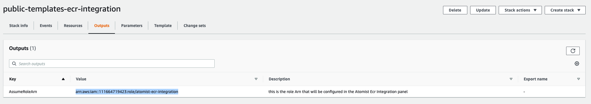
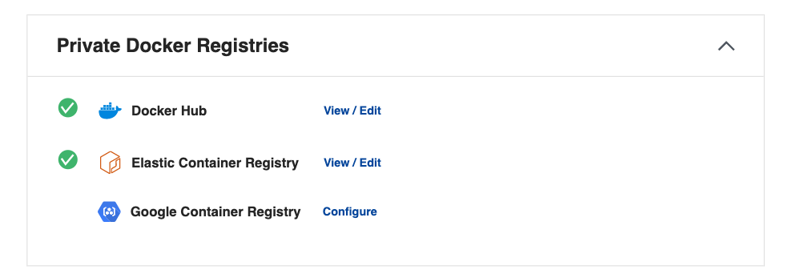
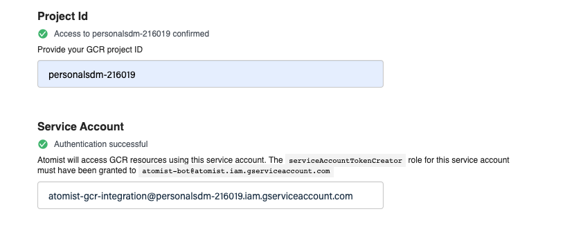



To get started with Atomist, you'll need to:

- Connect Atomist with your container registry
- Link your container images with their Git source

Before you can begin the setup, you need a Docker ID. If you don't already have
one, you can [register here](https://hub.docker.com/signup){: target="blank"
rel="noopener" class=""}.

## Connect container registry

This section describes how to integrate Atomist with your container registry.
Follow the applicable instructions depending on the type of container registry
you use. After completing this setup, Atomist will have read-only access to your
registry, and gets notified about pushed or deleted images.

> Using Docker Hub? 🐳
>
> If you are using Docker Hub as your container registry, you can skip this step
> and go straight to
> [linking images to Git source](#link-images-to-git-repository). Atomist
> integrates seamlessly with your Docker Hub organizations.

<!-- vale off -->
<ul class="nav nav-tabs">
  <li class="active"><a data-toggle="tab" data-target="#tab-ecr" aria-expanded="true">Amazon</a></li>
  <li><a data-toggle="tab" data-target="#tab-ghcr">GitHub</a></li>
  <li><a data-toggle="tab" data-target="#tab-google">Google</a></li>
  <li><a data-toggle="tab" data-target="#tab-jfrog">JFrog</a></li>
</ul>
<!-- vale on -->
<div class="tab-content"><br>
<div id="tab-ecr" class="tab-pane fade in active" markdown="1">
<!-- ECR -->

When setting up an Amazon Elastic Container Registry (ECR) integration with
Atomist, the following AWS resources are required:

- Read-only Identity Access Management (IAM) role, for Atomist to be able to
  access the container registry
- Amazon EventBridge, to notify Atomist of pushed and deleted images

This procedure uses pre-defined CloudFormation templates to create the necessary
IAM role and Amazon EventBridge. This template protects you from
[confused deputy attacks](https://docs.aws.amazon.com/IAM/latest/UserGuide/confused-deputy.html){:
target="blank" rel="noopener" class=""} by ensuring a unique `ExternalId`, along
with the appropriate condition on the IAM role statement.

1. Go to <https://dso.docker.com> and sign in using your Docker ID credentials.
2. Navigate to the **Integrations** tab and select **Configure** next to the
   **Elastic Container Registry** integration.
3. Fill out all the fields, except **Trusted Role ARN**. The trusted role
   identity is known only after applying the CloudFormation template.

   Choose basic auth credentials to protect the endpoint that AWS uses to notify
   Atomist. The URL and the basic auth credentials are parameters to the
   CloudFormation template.

4. Now create the CloudFormation stack. Before creating the stack, AWS asks you
   to enter three parameters.

   - `Url`: the API endpoint copied from Atomist
   - `Username`, `Password`: basic authentication credentials for the endpoint.
     Must match what you entered in the Atomist workspace.

   Use the following **Launch Stack** buttons to start reviewing the details in
   your AWS account.

   > Note
   >
   > Before creating the stack, AWS will ask for acknowledgement that creating
   > this stack requires a capability. This stack creates a role that will grant
   > Atomist read-only access to ECR resources.
   >
   > 

   <div style="text-align: center">
     <table>
       <tr>
         <th>Region</th>
         <th>ecr-integration.template</th>
       </tr>
       <tr>
         <th>us-east-1</th>
         <td>
           <a href="https://console.aws.amazon.com/cloudformation/home?region=us-east-1#/stacks/new?stackName=atomist-public-templates-ecr-integration&templateURL=https://s3.amazonaws.com/atomist-us-east-1/atomist-public-templates/latest/ecr-integration.template">
             
           </a>
         </td>
       </tr>
       <tr>
         <th>us-east-2</th>
         <td>
           <a href="https://console.aws.amazon.com/cloudformation/home?region=us-east-2#/stacks/new?stackName=atomist-public-templates-ecr-integration&templateURL=https://s3.amazonaws.com/atomist-us-east-2/atomist-public-templates/latest/ecr-integration.template">
             
           </a>
         </td>
       </tr>
       <tr>
         <th>us-west-1</th>
         <td>
           <a href="https://console.aws.amazon.com/cloudformation/home?region=us-west-1#/stacks/new?stackName=atomist-public-templates-ecr-integration&templateURL=https://s3.amazonaws.com/atomist-us-west-1/atomist-public-templates/latest/ecr-integration.template">
             
           </a>
         </td>
       </tr>
       <tr>
         <th>us-west-2</th>
         <td>
           <a href="https://console.aws.amazon.com/cloudformation/home?region=us-west-2#/stacks/new?stackName=atomist-public-templates-ecr-integration&templateURL=https://s3.amazonaws.com/atomist-us-west-2/atomist-public-templates/latest/ecr-integration.template">
             
           </a>
         </td>
       </tr>
       <tr>
         <th>eu-west-1</th>
         <td>
           <a href="https://console.aws.amazon.com/cloudformation/home?region=eu-west-1#/stacks/new?stackName=atomist-public-templates-ecr-integration&templateURL=https://s3.amazonaws.com/atomist-eu-west-1/atomist-public-templates/latest/ecr-integration.template">
             
           </a>
         </td>
       </tr>
       <tr>
         <th>eu-west-2</th>
         <td>
           <a href="https://console.aws.amazon.com/cloudformation/home?region=eu-west-2#/stacks/new?stackName=atomist-public-templates-ecr-integration&templateURL=https://s3.amazonaws.com/atomist-eu-west-2/atomist-public-templates/latest/ecr-integration.template">
             
           </a>
         </td>
       </tr>
       <tr>
         <th>eu-west-3</th>
         <td>
           <a href="https://console.aws.amazon.com/cloudformation/home?region=eu-west-3#/stacks/new?stackName=atomist-public-templates-ecr-integration&templateURL=https://s3.amazonaws.com/atomist-eu-west-3/atomist-public-templates/latest/ecr-integration.template">
             
           </a>
         </td>
       </tr>
       <tr>
         <th>eu-central-1</th>
         <td>
           <a href="https://console.aws.amazon.com/cloudformation/home?region=eu-central-1#/stacks/new?stackName=atomist-public-templates-ecr-integration&templateURL=https://s3.amazonaws.com/atomist-eu-central-1/atomist-public-templates/latest/ecr-integration.template">
             
           </a>
         </td>
       </tr>
       <tr>
         <th>ca-central-1</th>
         <td>
           <a href="https://console.aws.amazon.com/cloudformation/home?region=ca-central-1#/stacks/new?stackName=atomist-public-templates-ecr-integration&templateURL=https://s3.amazonaws.com/atomist-ca-central-1/atomist-public-templates/latest/ecr-integration.template">
             
           </a>
         </td>
       </tr>
       <tr>
         <th>ap-southeast-2</th>
         <td>
           <a href="https://console.aws.amazon.com/cloudformation/home?region=ap-southeast-2#/stacks/new?stackName=atomist-public-templates-ecr-integration&templateURL=https://s3.amazonaws.com/atomist-ap-southeast-2/atomist-public-templates/latest/ecr-integration.template">
             
           </a>
         </td>
       </tr>
     </table>
   </div>

5. After creating the stack, copy the **Value** for the **AssumeRoleArn** key
   from the **Outputs** tab in AWS.

   {: width="700px"}

6. Paste the copied **AssumeRoleArn** value into the **Trusted Role ARN** field
   on the Atomist configuration page.

7. Select **Save Configuration**.

   Atomist tests the connection with your ECR registry. A green check mark
   displays beside the integration if a successful connection is made.

   {:
   width="700px"}

</div>
<div id="tab-ghcr" class="tab-pane fade" markdown="1">
<!-- GitHub Container Registry -->

To integrate Atomist with GitHub Container Registry, connect your GitHub
account, and enter a personal access token for Atomist to use when pulling
container images.

1. Go to <https://dso.docker.com> and sign in using your Docker ID credentials.
2. Connect your GitHub account as instructed in the
   [GitHub app page](./integrate/github.md#connect-to-github).
3. Open the **Integrations** tab, and select **Configure** next to the **GitHub
   Container Registry** in the list.
4. Fill out the fields and select **Save Configuration**.

   Atomist requires the **Personal access token** for connecting images to
   private repositories. The token must have the
   [`read:packages` scope](https://docs.github.com/en/packages/learn-github-packages/about-permissions-for-github-packages).

   Leave the **Personal access token** field blank if you only want to index
   images in public repositories.

</div>
<div id="tab-google" class="tab-pane fade" markdown="1">
<!-- Google -->

Setting up an Atomist integration with Google Container Registry and Google
Artifact Registry involves:

- Creating a service account and grant it a read-only access role.
- Creating a PubSub subscription on the `gcr` topic to watch for activity in the
  registry.

To complete the following procedure requires administrator's permissions in the
project.

1. Set the following environment variables. You will use them in the next steps
   when configuring the Google Cloud resources, using the `gcloud` CLI.

   ```bash
   export SERVICE_ACCOUNT_ID="atomist-integration" # can be anything you like
   export PROJECT_ID="YOUR_GCP_PROJECT_ID"
   ```

2. Create the service account.

   ```bash
   gcloud iam service-accounts create ${SERVICE_ACCOUNT_ID} \
       --project ${PROJECT_ID} \
       --description="Atomist Integration Service Account" \
       --display-name="Atomist Integration"
   ```

3. Grant the service account read-only access to the artifact registry.

   The role name differs depending on whether you use Artifact Registry or
   Container Registry:

   - `roles/artifactregistry.reader` for Google Artifact Registry
   - `roles/object.storageViewer` for Google Container Registry

   ```bash
   gcloud projects add-iam-policy-binding ${PROJECT_ID} \
       --project ${PROJECT_ID} \
       --member="serviceAccount:${SERVICE_ACCOUNT_ID}@${PROJECT_ID}.iam.gserviceaccount.com" \
       --role="roles/artifactregistry.reader" # change this if you use GCR
   ```

4. Grant service account access to Atomist.

   ```bash
   gcloud iam service-accounts add-iam-policy-binding "${SERVICE_ACCOUNT_ID}@${PROJECT_ID}.iam.gserviceaccount.com" \
       --project ${PROJECT_ID} \
       --member="serviceAccount:atomist-bot@atomist.iam.gserviceaccount.com" \
       --role="roles/iam.serviceAccountTokenCreator"
   ```

5. Go to <https://dso.docker.com> and sign in with your Docker ID credentials.
6. Navigate to the **Integrations** tab and select **Configure** next to the
   **Google Artifact Registry** integration.
7. Fill out the following fields:

   - **Project ID** is the `PROJECT_ID` used in earlier steps.
   - **Service Account**: The email address of the service account created
     step 2.

8. Select **Save Configuration**. Atomist will test the connection. Green check
   marks indicate a successful connection.

   {:
   width="700px"}

   Next, create a new PubSub subscription on the `gcr` topic in registry. This
   subscription notifies Atomist about new or deleted images in the registry.

9. Copy the URL in the **Events Webhook** field to your clipboard. This will be
   the `PUSH_ENDPOINT_URI` for the PubSub subscription.

10. Define the following three variable values, in addition to the `PROJECT_ID`
    and `SERVICE_ACCOUNT_ID` from earlier:

    - `PUSH_ENDPOINT_URL`: the webhook URL copied from the Atomist workspace.
    - `SERVICE_ACCOUNT_EMAIL`: the service account address; a combination of the
      service account ID and project ID.
    - `SUBSCRIPTION`: the name of the PubSub (can be anything).

    ```bash
    PUSH_ENDPOINT_URI={COPY_THIS_FROM_ATOMIST}
    SERVICE_ACCOUNT_EMAIL="${SERVICE_ACCOUNT_ID}@${PROJECT_ID}.iam.gserviceaccount.com"
    SUBSCRIPTION="atomist-integration-subscription"
    ```

11. Create the PubSub for the `gcr` topic.

    ```bash
    gcloud pubsub subscriptions create ${SUBSCRIPTION} \
      --topic='gcr' \
      --push-auth-token-audience='atomist' \
      --push-auth-service-account="${SERVICE_ACCOUNT_EMAIL}" \
      --push-endpoint="${PUSH_ENDPOINT_URI}"
    ```

When the first image push is successfully detected, a green check mark on the
integration page will indicate that the integration works.

</div>
<div id="tab-jfrog" class="tab-pane fade" markdown="1">
<!-- JFrog Artifactory -->

Atomist can index images in a JFrog Artifactory repository by means of a
monitoring agent.

The agent scans configured repositories at regular intervals, and send newly
discovered images' metadata to the Atomist data plane.

In the following example, `https://hal9000.atomist.com` is a private registry
only visible on an internal network.

```
docker run -ti atomist/docker-registry-broker:latest\
  index-image remote \
  --workspace AQ1K5FIKA \
  --api-key team::6016307E4DF885EAE0579AACC71D3507BB38E1855903850CF5D0D91C5C8C6DC0 \
  --artifactory-url https://hal9000.docker.com \
  --artifactory-repository atomist-docker-local \
  --container-registry-host atomist-docker-local.hal9000.docker.com
  --username admin \
  --password password
```

| Parameter                 | Description                                                                                                     |
| ------------------------- | --------------------------------------------------------------------------------------------------------------- |
| `workspace`               | ID of your Atomist workspace.                                                                                   |
| `api-key`                 | Atomist API key.                                                                                                |
| `artifactory-url`         | Base URL of the Artifactory instance. Must not contain trailing slashes.                                        |
| `artifactory-repository`  | The name of the container registry to watch.                                                                    |
| `container-registry-host` | The hostname associated with the Artifactory repository containing images, if different from `artifactory-url`. |
| `username`                | Username for HTTP basic authentication with Artifactory.                                                        |
| `password`                | Password for HTTP basic authentication with Artifactory.                                                        |

</div>
<hr>
</div>

## Link images to Git repository

Knowing the source repository of an image is a prerequisite for Atomist to
interact with the Git repository. For Atomist to be able to link scanned images
back to a Git repository repository, you must annotate the image at build time.

The image labels that Atomist requires are:

| Label                                | Value                                             |
| ------------------------------------ | ------------------------------------------------- |
| `org.opencontainers.image.revision`  | The commit revision that the image is built for.  |
| `com.docker.image.source.entrypoint` | Path to the Dockerfile, relative to project root. |

For more information about pre-defined OCI annotations, see the
[specification document on GitHub](https://github.com/opencontainers/image-spec/blob/main/annotations.md#pre-defined-annotation-keys).

You can add these labels to images using the built-in Git provenance feature of
Buildx, or set using the `--label` CLI argument.

### Add labels using Docker Buildx

> Beta
>
> Git provenance labels in Buildx is a [Beta](/release-lifecycle.md#beta)
> feature.

To add the image labels using Docker Buildx, set the environment variable
`BUILDX_GIT_LABELS=1`. The Buildx will create the labels automatically when
building the image.

```bash
export BUILDX_GIT_LABELS=1
docker buildx build . -f docker/Dockerfile
```

### Add labels using the label CLI argument

Assign image labels using the `--label` argument for `docker build`.

```bash
docker build . -f docker/Dockerfile -t $IMAGE_NAME \
    --label "org.opencontainers.image.revision=10ac8f8bdaa343677f2f394f9615e521188d736a" \
    --label "com.docker.image.source.entrypoint=docker/Dockerfile"
```

Images built in a CI/CD environment can leverage the built-in environment
variables when setting the Git revision label:

| Build tool                    | Environment variable                                             |
| ----------------------------- | ---------------------------------------------------------------- |
| GitHub Actions                | `${{ github.sha }}`                         |
| GitHub Actions, pull requests | `${{ github.event.pull_request.head.sha }}` |
| GitLab CI/CD                  | `$CI_COMMIT_SHA`                                                 |
| Docker Hub automated builds   | `$SOURCE_COMMIT`                                                 |
| Google Cloud Build            | `$COMMIT_SHA`                                                    |
| AWS CodeBuild                 | `$CODEBUILD_RESOLVED_SOURCE_VERSION`                             |
| Manually                      | `$(git rev-parse HEAD)`                                          |

Consult the documentation for your CI/CD platform to learn which variables to
use.

## Where to go next

Atomist is now tracking bill of materials, packages, and vulnerabilities for
your images! You can view your image scan results on the
[images overview page](https://dso.docker.com/r/auth/overview/images).

Teams use Atomist to protect downstream workloads from new vulnerabilities. It's
also used to help teams track and remediate new vulnerabilities that impact
existing workloads. The following sections describe integrate and configure
Atomist further. For example, to gain visibility into container workload systems
like Kubernetes.

- Connect Atomist with your GitHub repositories by
  [installing the Atomist app](integrate/github.md) for your GitHub
  organization.
- Manage which Atomist features you use in [settings](configure/settings.md).
- Learn about [deployment tracking](integrate/deploys.md) and how Atomist can
  help watch your deployed containers.
- Atomist watches for new advisories from public sources, but you can also
  [add your own internal advisories](configure/advisories.md) for more
  information.
