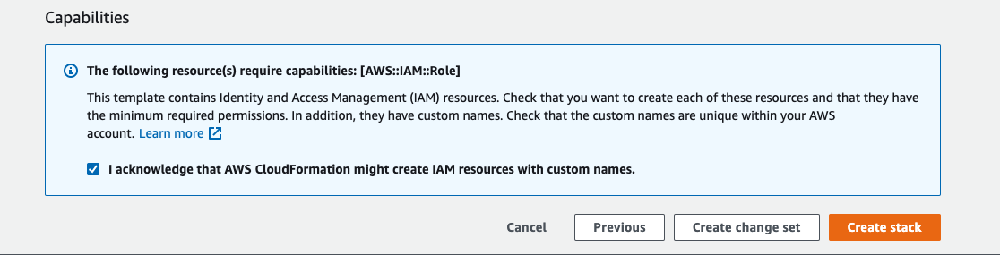



To get started with Atomist, you'll need to:

- Connect Atomist with your container registry
- Link your container images with their Git source

Before you can begin the setup, you’ll need a Docker ID. If you do not already
have one, you can [sign up here](https://hub.docker.com/signup){: target="blank"
rel="noopener" class=""}.

## Connect container registry

For other registry types, follow the applicable instructions below.

After completing this setup, Atomist will have read-only access, and is notified
when images are pushed or deleted. This will enable Atomist to scan, and report
on your images.

<ul class="nav nav-tabs">
  <li><a data-toggle="tab" data-target="#tab-hub">Docker Hub</a></li>
  <li><a data-toggle="tab" data-target="#tab-ecr">Amazon ECR</a></li>
  <li><a data-toggle="tab" data-target="#tab-gar">Google Artifact Registry</a></li>
  <li><a data-toggle="tab" data-target="#tab-ghcr">GitHub Container Registry</a></li>
</ul>
<div class="tab-content"><br>
<div id="tab-hub" class="tab-pane fade in active">
  <p>If you are using Docker Hub as your container registry, you can skip this step
  and <a href="#link-images-with-git-repository">Link images with Git source</a>. Atomist
  integrates seamlessly with your Docker Hub organizations.</p>
</div>
<div id="tab-ecr" class="tab-pane fade" markdown="1">
<!-- ECR -->

When setting up an ECR integration with Atomist, we need to create the following
resources on the AWS side:

- Read-only IAM role, for Atomist to be able to access the container registry
- Amazon EventBridge, to notify Atomist of pushed and deleted images

To help you get started, we have created a public CloudFormation template. This
template will create an IAM role and Amazon EventBridge.

Our CloudFormation templates protects you from
[confused deputy attacks](https://docs.aws.amazon.com/IAM/latest/UserGuide/confused-deputy.html){:
target="blank" rel="noopener" class=""} by ensuring a unique `ExternalId`, along
with the appropriate condition on the IAM role statement.

1. Go to <https://dso.docker.com> and sign in using your Docker ID credentials.
2. Navigate to the **Integrations** tab and click **Configure** next to the
   **Elastic Container Registry** integration.
3. Fill out all the fields, except **Trusted Role ARN**. You will only know the
   role ARN after applying the CloudFormation template.

   Choose basic auth credentials to protect the endpoint that AWS will use to
   notify Atomist. The URL and the basic auth credentials will be used as
   parameters in the CloudFormation template.

4. Now we'll create the CloudFormation stack. Before creating the stack, AWS
   will ask you to enter three parameters.

   - `Url`: the API endpoint copied from Atomist
   - `Username`, `Password`: basic authentication credentials for the endpoint.
     Must match what you entered in the Atomist workspace.

   Click on one of the **Launch Stack** buttons below to start reviewing the
   details in your AWS account.

   > Note
   >
   > Before creating the stack, AWS will ask for acknowledgement that creating
   > this stack requires a capability. This stack creates a role that will grant
   > Atomist read-only access to ECR resources.
   >
   > 

   <div style="text-align: center">
     <table>
       <tr>
         <th>Region</th>
         <th>ecr-integration.template</th>
       </tr>
       <tr>
         <th>us-east-1</th>
         <td>
           <a href="https://console.aws.amazon.com/cloudformation/home?region=us-east-1#/stacks/new?stackName=atomist-public-templates-ecr-integration&templateURL=https://s3.amazonaws.com/atomist-us-east-1/atomist-public-templates/latest/ecr-integration.template">
             
           </a>
         </td>
       </tr>
       <tr>
         <th>us-east-2</th>
         <td>
           <a href="https://console.aws.amazon.com/cloudformation/home?region=us-east-2#/stacks/new?stackName=atomist-public-templates-ecr-integration&templateURL=https://s3.amazonaws.com/atomist-us-east-2/atomist-public-templates/latest/ecr-integration.template">
             
           </a>
         </td>
       </tr>
       <tr>
         <th>us-west-1</th>
         <td>
           <a href="https://console.aws.amazon.com/cloudformation/home?region=us-west-1#/stacks/new?stackName=atomist-public-templates-ecr-integration&templateURL=https://s3.amazonaws.com/atomist-us-west-1/atomist-public-templates/latest/ecr-integration.template">
             
           </a>
         </td>
       </tr>
       <tr>
         <th>us-west-2</th>
         <td>
           <a href="https://console.aws.amazon.com/cloudformation/home?region=us-west-2#/stacks/new?stackName=atomist-public-templates-ecr-integration&templateURL=https://s3.amazonaws.com/atomist-us-west-2/atomist-public-templates/latest/ecr-integration.template">
             
           </a>
         </td>
       </tr>
       <tr>
         <th>eu-west-1</th>
         <td>
           <a href="https://console.aws.amazon.com/cloudformation/home?region=eu-west-1#/stacks/new?stackName=atomist-public-templates-ecr-integration&templateURL=https://s3.amazonaws.com/atomist-eu-west-1/atomist-public-templates/latest/ecr-integration.template">
             
           </a>
         </td>
       </tr>
       <tr>
         <th>eu-west-2</th>
         <td>
           <a href="https://console.aws.amazon.com/cloudformation/home?region=eu-west-2#/stacks/new?stackName=atomist-public-templates-ecr-integration&templateURL=https://s3.amazonaws.com/atomist-eu-west-2/atomist-public-templates/latest/ecr-integration.template">
             
           </a>
         </td>
       </tr>
       <tr>
         <th>eu-west-3</th>
         <td>
           <a href="https://console.aws.amazon.com/cloudformation/home?region=eu-west-3#/stacks/new?stackName=atomist-public-templates-ecr-integration&templateURL=https://s3.amazonaws.com/atomist-eu-west-3/atomist-public-templates/latest/ecr-integration.template">
             
           </a>
         </td>
       </tr>
       <tr>
         <th>eu-central-1</th>
         <td>
           <a href="https://console.aws.amazon.com/cloudformation/home?region=eu-central-1#/stacks/new?stackName=atomist-public-templates-ecr-integration&templateURL=https://s3.amazonaws.com/atomist-eu-central-1/atomist-public-templates/latest/ecr-integration.template">
             
           </a>
         </td>
       </tr>
       <tr>
         <th>ca-central-1</th>
         <td>
           <a href="https://console.aws.amazon.com/cloudformation/home?region=ca-central-1#/stacks/new?stackName=atomist-public-templates-ecr-integration&templateURL=https://s3.amazonaws.com/atomist-ca-central-1/atomist-public-templates/latest/ecr-integration.template">
             
           </a>
         </td>
       </tr>
       <tr>
         <th>ap-southeast-2</th>
         <td>
           <a href="https://console.aws.amazon.com/cloudformation/home?region=ap-southeast-2#/stacks/new?stackName=atomist-public-templates-ecr-integration&templateURL=https://s3.amazonaws.com/atomist-ap-southeast-2/atomist-public-templates/latest/ecr-integration.template">
             
           </a>
         </td>
       </tr>
     </table>
   </div>

5. Once the stack has been created, copy the **Value** for the **AssumeRoleArn**
   key.

   {: width="700px"}

6. Paste the copied **AssumeRoleArn** value into the **Trusted Role ARN** field
   on the Atomist configuration page.

7. Click **Save Configuration**. Atomist will now test the connection with your
   ECR registry. You'll see a green check mark beside the integration if a
   successful connection was made.

   {:
   width="700px"}

</div>
<div id="tab-gar" class="tab-pane fade" markdown="1">
<!-- Google Artifact Registry -->

Setting up an Atomist integration with Google Artifact Registry involves:

- Creating a service account and grant it the `roles/artifactregistry.reader`
  role.
- Creating a PubSub subscription on the `gcr` topic to notify when new images
  are pushed.

To complete the following procedure requires administrator's permissions in the
Google Artifact Registry project.

1. Set the following variables in your shell session. They will be used in
   subsequent steps when configuring the Google Cloud resources, using the
   `gcloud` CLI. The `SERVICE_ACCOUNT_ID` can be set to whatever you'd like.

   ```bash
   export SERVICE_ACCOUNT_ID="atomist-gar-integration"
   export PROJECT_ID="YOUR_GCP_PROJECT_ID"
   ```

2. Create the service account.

   ```bash
   gcloud iam service-accounts create ${SERVICE_ACCOUNT_ID} \
       --project ${PROJECT_ID} \
       --description="Atomist GAR Integration Service Account" \
       --display-name="Atomist GAR Integration"
   ```

3. Grant the service account read-only access to the artifact registry.

   ```bash
   gcloud projects add-iam-policy-binding ${PROJECT_ID} \
       --project ${PROJECT_ID} \
       --member="serviceAccount:${SERVICE_ACCOUNT_ID}@${PROJECT_ID}.iam.gserviceaccount.com" \
       --role="roles/artifactregistry.reader"
   ```

4. Grant service account access to Atomist.

   ```bash
   gcloud iam service-accounts add-iam-policy-binding "${SERVICE_ACCOUNT_ID}@${PROJECT_ID}.iam.gserviceaccount.com" \
       --project ${PROJECT_ID} \
       --member="serviceAccount:atomist-bot@atomist.iam.gserviceaccount.com" \
       --role="roles/iam.serviceAccountTokenCreator"
   ```

5. Go to <https://dso.docker.com> and sign in using your Docker ID credentials.
6. Navigate to the **Integrations** tab and click **Configure** next to the
   **Google Artifact Registry** integration.
7. Fill out the following fields:

   - **Project ID** is the `PROJECT_ID` used in previous steps.
   - **Service Account**: The email address of the service account created
     step 2.

8. Click **Save Configuration**. Atomist will test the connection. You'll see
   some green check marks when a connection has been established.

   {:
   width="700px"}

   Next, we will create a new PubSub subscription on the `gcr` topic in Google
   Artifact Registry. This subscription will notify Atomist when new images are
   pushed to the registry.

9. Copy the URL in the **GCR Events Webhook** field to your clipboard. This will
   be the `PUSH_ENDPOINT_URI` for the PubSub subscription.

10. Define the following three variable values, in addition to the `PROJECT_ID`
    and `SERVICE_ACCOUNT_ID` from earlier:

    - `PUSH_ENDPOINT_URL`: the webhook URL copied from the Atomist workspace.
    - `SERVICE_ACCOUNT_EMAIL`: the service account address; a combination of the
      service account ID and project ID.
    - `SUBSCRIPTION`: the name of the PubSub to be created (can be anything).

    ```bash
    PUSH_ENDPOINT_URI={COPY_THIS_FROM_ATOMIST}
    SERVICE_ACCOUNT_EMAIL="${SERVICE_ACCOUNT_ID}@${PROJECT_ID}.iam.gserviceaccount.com"
    SUBSCRIPTION="atomist-gar-integration-subscription"
    ```

11. Create the PubSub for the `gcr` topic.

    ```bash
    gcloud pubsub subscriptions create ${SUBSCRIPTION} \
      --topic='gcr' \
      --push-auth-token-audience='atomist' \
      --push-auth-service-account="${SERVICE_ACCOUNT_EMAIL}" \
      --push-endpoint="${PUSH_ENDPOINT_URI}"
    ```

When the first image push is successfully detected, a green check mark on the
integration page will indicate that the webhook event was received and that the
integration works.

</div>
<div id="tab-ghcr" class="tab-pane fade" markdown="1">
<!-- GitHub Container Registry -->

To integrate Atomist with GitHub Container Registry, connect your GitHub
account, and enter a personal access token for Atomist to use when pulling
container images.

1. Go to <https://dso.docker.com> and sign in using your Docker ID credentials.
2. Connect your GitHub account as instructed in the
   [GitHub app page](./integrate/github.md#connect-to-github). Install the app
   into the GitHub account that contains your GitHub Container Registry.
3. Open the [**Integrations**](https://dso.docker.com/r/auth/integrations){:
   target="blank" rel="noopener" class=""} tab, and click the **Configure** link
   next to the **GitHub Container Registry** in the list of integrations.
4. Fill out the fields and click **Save Configuration**.

   The **Personal access token** is required for scanning images in private
   repositories. The token must have the
   [`read:packages` scope](https://docs.github.com/en/packages/learn-github-packages/about-permissions-for-github-packages).

   You can leave the **Personal access token** field blank if you only want to
   scan images in public repositories.

</div>
<hr>
</div>

## Link images to Git repository

Knowing the source repository of an image is a prerequisite for Atomist to
interact with the Git repository, such as adding scan results as a status check
in pull requests. For Atomist to be able to link scanned images to a Git
repository repository, the image must be annotated with labels at build time.

The image labels that Atomist requires are:

| Label                                | Value                                             |
| ------------------------------------ | ------------------------------------------------- |
| `org.opencontainers.image.revision`  | The commit revision that the image is built for.  |
| `org.opencountainers.image.source`   | HTTP(S) address of the project.                   |
| `com.docker.image.source.entrypoint` | Path to the Dockerfile, relative to project root. |

Labels can be added to an image using either the `--label` CLI argument, or the
`LABEL` command in the Dockerfile.

```bash
docker build . -f docker/Dockerfile -t $IMAGE_NAME \
    --label "org.opencontainers.image.revision=10ac8f8bdaa343677f2f394f9615e521188d736a" \
    --label "org.opencontainers.image.source=https://github.com/org/repo" \
    --label "com.docker.image.source.entrypoint=docker/Dockerfile"
```

Adding these labels using the CLI is recommended. When building your Docker
images on a CI/CD platform, you can leverage the built-in environment variables
to create labels. For example, if you build your images using GitHub Actions:



```bash
docker build . -f docker/Dockerfile -t $IMAGE_NAME \
    --label "org.opencontainers.image.revision=${{ github.sha }}" \
    --label "org.opencontainers.image.source=${{ github.server_url }}/${{ github.repository }}" \
    --label "com.docker.image.source.entrypoint=docker/Dockerfile"
```



Consult the documentation for your CI/CD platform to learn which variables to
use.

## Where to go next

Atomist is now tracking new container images! Bill of materials, packages, and
vulnerabilities are being tracked by Atomist. You can view your image scan
results on the
[images overview page](https://dso.docker.com/r/auth/overview/images).

Teams use Atomist to protect downstream workloads from new vulnerabilities. It's
also used to help teams track and remediate new vulnerabilities that impact
existing workloads. In the next sections, we'll look at how teams can use
Atomist to gain visibility into container workload systems like Kubernetes.

- Connect Atomist with your GitHub repositories by
  [installing the Atomist app](./integrate/github.md) for your GitHub
  organization.
- Manage which Atomist features should be enabled
  [settings](./configure/settings.md).
- Atomist watches for new advisories from public sources, but you can also add
  your own internal advisories. Refer to [advisories](configure/advisories.md)
  for more information.
- Use [Kubernetes admission controllers](integrate/kubernetes.md) to ensure that
  images conform to your policy before being admitted into different clusters or
  namespaces.
- Set up [deployment policies](configure/deployment-policies.md) with rules that
  will run whenever a new image is pushed to your registry
