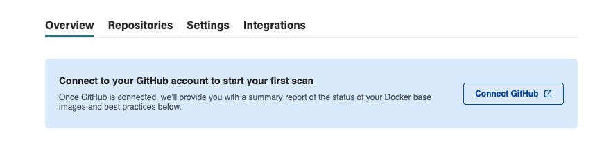
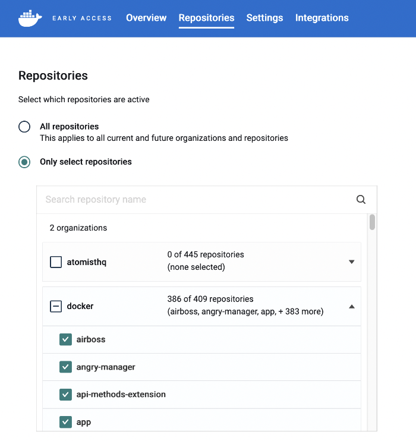



When installed for a GitHub organization, the Atomist GitHub app links
repository activity to images. This enables Atomist to relate image tags and
digests directly to specific commits in the source repository. It also opens up
the possibility to incorporate image analysis in your Git workflow. For example,
by adding analysis checks to pull request, or automatically raising pull
requests for updating and pinning base image versions.

Install the GitHub app in the organization that contains the source code
repositories for your Docker images.

## Connect to GitHub

1. Go to <https://dso.docker.com/> and sign in using your Docker ID.
2. Open the **Repositories** tab.
3. Select **Connect to GitHub** and follow the authorization flow. This installs
   the
   [Atomist GitHub App](https://github.com/apps/atomist "Atomist GitHub App"){: target="blank" rel="noopener" class=""}.

   {: width="700px" }

4. Install the app.

   > **Note**
   >
   > If your GitHub account is a member of one or more organizations, GitHub
   > prompts you to choose which account to install the app into. Select the
   > account that contains the source repositories for your images.

   After installing the app, GitHub redirects you back to Atomist.

5. In the repository selection menu, select what repositories you want Atomist
   to start watching.

   {: width="500px" }

   If you are just looking to evaluate Atomist, start by selecting a few
   repositories during evaluation. Once you are comfortable using Atomist, you
   can switch on the integration for all repositories. Selecting **All
   repositories** also includes any repository created in the future.

   > **Important**
   >
   > If Atomist detects `FROM` commands in Dockerfiles in the selected
   > repositories, it begins raising automated pull requests. The pull requests
   > update the Dockerfile `FROM`-line to specify the image versions (as
   > digests).
   {: .important }

6. Select **Save selection**.

Atomist is now connected with your GitHub repositories and is be able to link
image analyses with Git commits.

## Manage repository access

If you wish to add or remove repository access for Atomist, go to the
**Repositories** page.

- Select **All repositories** if you want enable Atomist for all connected
  organizations and repositories.
- Select **Only select repositories** if you want to provision access to only a
  subset of repositories.

## Disconnect from GitHub

You might want to disconnect from GitHub when:

- You want to change which GitHub organization or account connected to your
  Atomist workspace.

  To do so, disconnect the old GitHub organization or account first. Then,
  follow the instructions for [connecting to GitHub](#connect-to-github) for the
  new GitHub organization or account.

- You want to remove Atomist access to a GitHub organization or account when you
  no longer use Atomist.

To disconnect a GitHub account:

1.  Go to **Repositories** and select the **Disconnect** link. This removes the
    connection to your GitHub organization or account.
2.  Go to the
    [GitHub Applications settings page](https://github.com/settings/installations){:
    target="blank" rel="noopener" class=""}, then:

3.  Find **atomist** on the Installed GitHub Apps tab.
4.  Select **Configure**

5.  Select **Uninstall**. This removes the installation of the Atomist GitHub
    App from your GitHub organization or account.

6.  Find **atomist** on the **Authorized GitHub Apps** tab.
7.  Select **Revoke**.

    This removes the authorization of the Atomist GitHub App from your GitHub
    organization or account.
