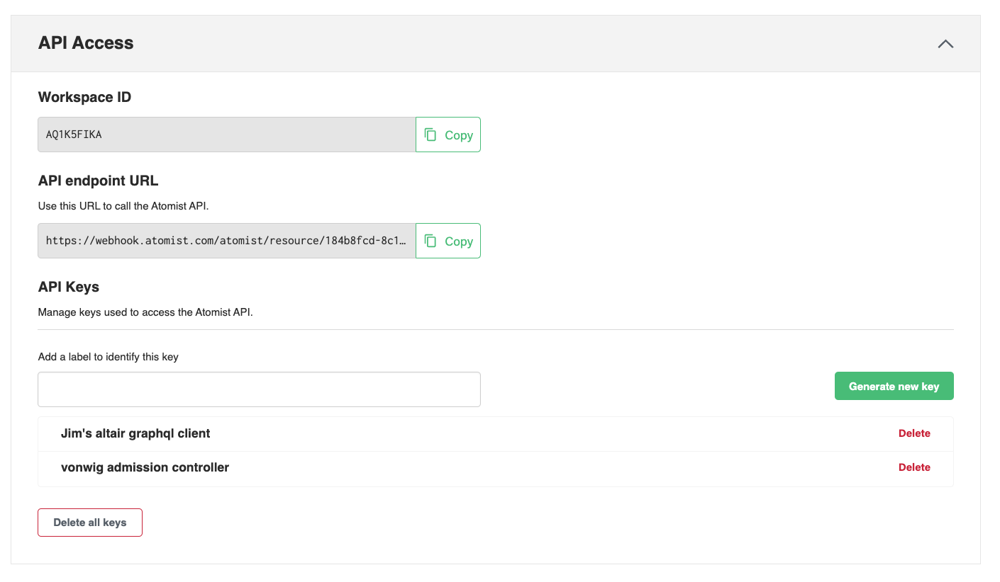



This page describes how to enable GitOps with Atomist, using GitHub and
[Flux](https://fluxcd.io/){: target="blank" rel="noopener" class=""}.

This procedure involves:

1. Creating or selecting an existing GitHub repository to use.
2. Adding Flux to your Kubernetes cluster
3. Adding Kustomize configuration to the repository
4. Enable automatic deployment of new image versions

## Choose a repository

Choose either an existing GitHub repository, or create a new one. This will be
the repository that will contain the Kubernetes specifications synchronized with
your cluster.

You'll need the name of the repository, the name of the organization, and a
personal access token with permissions to access the repository.

Export the following environment variables. They will be used in the steps that
follow.

```bash
export GITHUB_USER={account-name}
export GITHUB_TOKEN={personal-access-token}
export GITHUB_REPO={repository-name}
```

## Install Flux in your Kubernetes cluster

Requires environment variables `GITHUB_USER` and `GITHUB_TOKEN` to be set. Use
the `--personal` flag if you're using your personal account, or leave this flag
out if you're using a shared GitHub organization.

```bash
flux bootstrap github \
   --owner=$GITHUB_USER \
   --repository=fleet-infra \
   --branch=main \
   --path=./clusters/my-cluster \
   --personal # personal accounts only
```

## Add at least one `kustomization.yaml` file

In a typical scenario, we are looking for candidate images that are _ready_ to
be pulled into the cluster. A Kubernetes deployment spec would have an entry
that looks like this.

```yaml
spec:
  containers:
    - image: gcr.io/project/service1
```

A `kustomization.yaml` that references this `deployment.yaml` file can update
the `newTag` entry whenever a new image is ready.

```yaml
apiVersion: kustomize.config.k8s.io/v1beta1
kind: Kustomization
namespace: production
resources:
  - deployment.yaml
images:
  - name: gcr.io/project/service1
    newTag: v161
```

In this example, an image from a repository named `gcr.io/project/service1` can
now be updated via the Flux Kustomize Controller.

If you're using the `$GITHUB_USER/$GITHUB_REPO` from above, then the
`kustomization.yaml` and the `deployment.yaml` files must be committed to a
sub-directory of `/clusters/my-cluster` (this was the value passed to `--path`
above). For example you could commit these to
`/clusters/my-cluster/service1_base`.

## Configure automatic updates for this git repository

Now that Flux is monitoring this repository, any updates to the
`kustomization.yaml` file in the default branch ref, will be synchronized by
your cluster.

Every repository containing configurable kustomization.yaml files must be
included in the array of repository slugs. Create a JSON file (for example,
`repos.json`) and record the names of any GitHub repositories containing
kustomization.yaml files you might want to automatically update.

```bash
cat <<'EOF' > repos.json
{"repos": ["user-or-org/repos-name"]}
EOF
```

## Enable automatic deployment of new versions

Now execute the following scripts to enable the automatic image updates:

```bash
ATOMIST_WORKSPACE_ID={your-workspace-id}
ATOMIST_API_KEY={your-api-key}
```

{: width="700px"}

```bash
cat <<'EOF' > policy.graphql
mutation setPolicy($rules: [String!]!) {
  setConfigurationParameter(
    name: "deploy-integration",
    namespace: "atomist",
    parameter: {stringArray:
                {name: "gitops-repos",
                 value: $repos},
    configurationName: "policy-cfg")
  {
    configured {
      skills {id}
    }
  }
}
EOF

curl -X POST \
     -d '{"query": "'"$(sed 's/"/\\"/g' < policy.graphql)"'", "variables": '"$(< repos.json)"'}' \
     -H "Authorization: Bearer ${ATOMIST_API_KEY}" \
     -H "Content-Type: application/json" \
     https://automation.atomist.com/graphql/team/${ATOMIST_WORKSPACE_ID}
```
