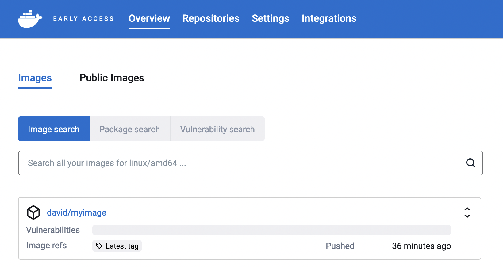
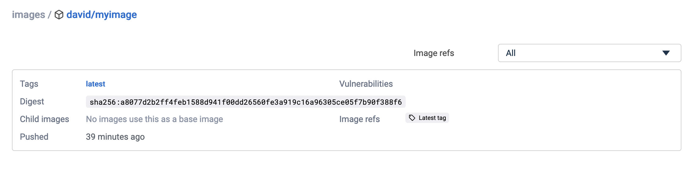
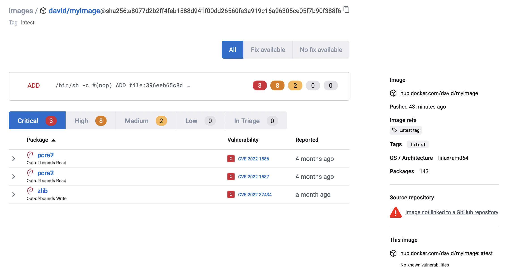



The quickest way to try Atomist is to run it on your local images, as a CLI
tool. Trying it locally eliminates the need of having to integrate with and
connect to a remote container registry. The CLI uses your local Docker daemon
directly to upload the Software Bill of Materials (SBOM) to the Atomist control
plane for analysis.

## Prerequisites

Before you can begin the setup, you need a Docker ID. If you don't already have
one, you can [register here](https://hub.docker.com/signup){: target="blank"
rel="noopener" class=""}.

## Steps

> Note
>
> Only use this CLI-based method of indexing images for testing or trial
> purposes. For further evaluation or production use, integrate Atomist with
> your container registry. See [get started](./get-started.md).

1. Go to the [Atomist website](https://dso.docker.com){: target="blank"
   rel="noopener" class=""} and sign in using your Docker ID.
2. Open the **Integrations** tab.
3. Under **API Keys**, create a new API key.
4. In your terminal of choice, invoke the Atomist CLI tool using `docker run`.
   Update the following values:

   - `--workspace`: the workspace ID found on the **Integrations** page on the
     Atomist website.
   - `--api-key`: the API key you just created.
   - `--image`: the Docker image that you want to index.

   ```bash
   docker run \
      -v /var/run/docker.sock:/var/run/docker.sock \
      -ti atomist/docker-registry-broker:latest \
      index-image local \
      --workspace AQ1K5FIKA \
      --api-key team::6016307E4DF885EAE0579AACC71D3507BB38E1855903850CF5D0D91C5C8C6DC0 \
      --image docker.io/david/myimage:latest
   ```

   > Note
   >
   > The image must have a tag (for example, `myimage:latest`) so that you are
   > able to identify the image later.

   The output should be similar to the following:

   ```bash
   [info] Starting session with correlation-id c12e08d3-3bcc-4475-ab21-7114da599eaf
   [info] Starting atomist/docker-vulnerability-scanner-skill 'index_image' (1f99caa) atomist/skill:0.12.0-main.44 (fe90e3c) nodejs:16.15.0
   [info] Indexing image python:latest
   [info] Downloading image
   [info] Download completed
   [info] Indexing completed
   [info] Mapped packages to layers
   [info] Indexing completed successfully
   [info] Transacting image manifest for docker.io/david/myimage:latest with digest sha256:a8077d2b2ff4feb1588d941f00dd26560fe3a919c16a96305ce05f7b90f388f6
   [info] Successfully transacted entities in team AQ1K5FIKA
   [info] Image URL is https://dso.atomist.com/AQ1K5FIKA/overview/images/myimage/digests/sha256:a8077d2b2ff4feb1588d941f00dd26560fe3a919c16a96305ce05f7b90f388f6
   [info] Transacting SBOM...
   [info] Successfully transacted entities in team AQ1K5FIKA
   [info] Transacting SBOM...
   ```

5. When the command exits, open the
   [Atomist web UI](https://dso.docker.com/r/auth/overview/images){:
   target="blank" rel="noopener" class=""}, where you should see the image in
   the list.

   {:
   width="700px"}

6. Select the image name. This gets you to the list of image tags.

   {: width="700px"}

   Since this is your first time indexing this image, the list only has one tag
   for now. When you integrate Atomist with your container registry, images and
   tags show up in this list automatically.

7. Select the tag name. This shows you the insights for this tag.

   {:
   width="700px"}

   In this view, you can see how many vulnerabilities this image has, their
   severity levels, whether there is a fix version available, and more.

## Where to go next

The tutorial ends here. Take some time to explore the different data views that
Atomist presents about your image. When you're ready, head to the
[get started guide](./get-started.md) to learn how to start integrating Atomist
in your software supply chain.
