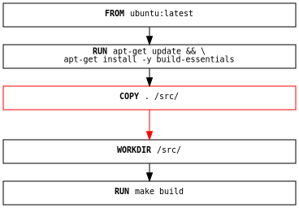
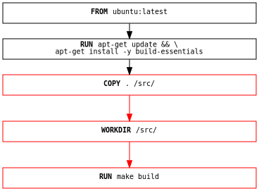

It's very unlikely you end up just building a docker image once - most of the
time, you'll want to build it again at some point, whether that's for the next
release of your software, or, more likely, on your local development machine
for testing. Because building images is a frequent operation, docker provides
several tools to speed up your builds for when you inevitably need to run them
again.

The main approach to improving your build's speed is to take advantage of
docker's build cache.

## How does the build cache work?

Docker's build cache is quite simple to understand - first, remember the
instructions that make up your Dockerfile, for example, in this build which
might be used to create a C/C++ program:

```dockerfile
FROM ubuntu:latest

RUN apt-get update && apt-get install -y build-essentials
COPY . /src/
WORKDIR /src/
RUN make build
```

Each instruction in this Dockerfile (roughly) translates into a layer in your
final image. You can think of layers in a stack, with each layer adding more
content to the filesystem on top of the layer before it:

{:.invertible}


Now, if one of the layers changes, somewhere - for example, suppose you make a
change to your C/C++ program in `main.c`. After this change, the `COPY` command
will have to run again, so that the layer changes, so the cache for that layer
has been invalidated.

{:.invertible}

But since we have a change to that file, we now need to run our `make build`
step again, so that those changes are built into our program. So since our
cache for `COPY` was invalidated, we also have to invalidate the cache for all
the layers after it, including our `RUN make build`, so that it will run again:

{:.invertible}

That's pretty much all there is to understand the cache - once there's a change
in a layer, then all the layers after it will need to be rebuilt as well (even
if they wouldn't build anything differently, they still need to re-run).

> **Note**
>
> Suppose you have a `RUN apt-get update && apt-get upgrade -y` step in your
> Dockerfile to upgrade all the software packages in your Debian-based image to
> the latest version.
>
> Unfortunately, this doesn't mean that the images you build are *always* up to
> date! If you built the image a week ago, then the results of your `apt-get`
> will get cached, and re-used if you re-run it now! The only way to force a
> re-run is to make sure that a layer before it has changed, for example, by
> making sure you have the latest version of the image used in `FROM`.

## How can I use the cache efficiently?

Now that we've seen how the cache works, we can look at how to best take
advantage of the cache to get the best results. While the cache will
automatically work on any docker build that you run, you can often refactor
your Dockerfile to get even better performance and save precious seconds (or
even minutes) off of your builds!

### Order your layers

Putting the commands in your Dockerfile into a logical order is a great place
to start. Because a change in an earlier step will rebuild all the later steps,
we want to make sure that we put our most expensive steps near the beginning,
and our most frequently changing steps near the end, to avoid unnecessarily
rebuilding layers that haven't changed much.

Let's take a simple example, a Dockerfile snippet that runs a javascript build
from the source files in the current directory:

```dockerfile
FROM node
WORKDIR /app
COPY . .
RUN npm install
RUN npm build
```

We can examine why this isn't very efficient. If we update our `package.json`
file, we'll install all of our dependencies and run the build from scratch, as
intended. But, if we update `src/main.js`, then we'll install all of our
dependencies again - even if nothing has changed!

We can improve this, to only install dependencies the relevant files have
changed:

```dockerfile
FROM node
WORKDIR /app
COPY package.json yarn.lock .
RUN npm install
COPY . .
RUN npm build
```

What we've done is to divide up our `COPY` command to only copy over our
`package.json` and `yarn.lock` before the `npm install` - this means that we'll
only re-run `npm install` if those files change, instead of any of the files
in our local directory!

### Keep layers small

One of the easiest things you can do to keep your images building quickly is to
just put less stuff into your build! This keeps your image layers thin and
lean, which means that not only will your cache stay smaller, but there should
be fewer things that could be out-of-date and need rebuilding!

To get started, here are a few tips and tricks:

- Don't `COPY` unnecessary files into your build environment!

  Running a command like `COPY . /src` will `COPY` your entire build context
  into the image! If you've got logs, package manager artifacts, or even
  previous build results in your current directory, those will also be copied
  over, which will make your image larger than it needs to be (especially as
  those files are usually not helpful)!
  
  You can avoid copying these files over by `COPY`ing only the files and
  directories that you want, for example, you might only just want a `Makefile`
  and your `src` directory - if that's all you need, then you can split up your
  `COPY` into `COPY ./Makefile /src` and `COPY ./src /src`. If you do want the
  entire current directory, but want to ignore the unnecessary files in it, you
  can setup your [`.dockerignore` file](https://docs.docker.com/engine/reference/builder/#dockerignore-file),
  to make sure that those files won't be copied over!

- Use your package manager wisely!

  No matter what operating system or programming language you choose to use as
  your build's base image, most docker images have some sort of package manager
  to help install software into your image. For example, `debian` has `apt`,
  `alpine` has `apk`, `python` has `pip`, `node` has `npm`, etc, etc.

  When installing packages be careful! Make sure to only install the packages
  that you need - if you're not going to use them, don't install them. Remember
  that this might be a different list for your local development environment
  and your production environment. You can use multi-stage builds (which we'll
  cover later) to split these up efficiently.

- Try using the `RUN` command dedicated cache!

  The `RUN` command supports a specialized cache, which can be used when you
  need a more fine-grained cache between runs. For example, when installing
  packages, you don't always need to fetch all of your packages from the
  internet each time, you only need the ones that have changed!

  To solve this problem, you can use `RUN --mount type=cache`. For example, for
  your `debian`-based image you might use the following:

  ```dockerfile
  RUN \
      --mount=type=cache,target=/var/cache/apt \
      apt-get update && apt-get install -y git
  ```

  The use of the explicit cache with the `--mount` flag keeps the contents of
  the `target` directory preserved between builds - so when this layer needs to
  be rebuilt, then it'll be able to use `apt`'s own cache in `/var/cache/apt`.

### Minimize the number of layers

Keeping your layers small is a good step to getting quick builds - the logical
next step is to reduce the number of layers that you have! Fewer layers mean
that you have less to rebuild, when something in your Dockerfile changes, so
your build will complete faster!

Here are some more tips you can use:

- Use an appropriate base image!

  Docker provides over 170 pre-built [official images](https://hub.docker.com/search?q=&image_filter=official)
  for almost every common development scenario! For example, if you're building
  a Java web server, then while you could install `java` into any image you
  like, it's much quicker (and easier to manage updates) if you use a dedicated
  image, for example, [`openjdk`](https://hub.docker.com/_/openjdk/). Even if
  there's not an official image for what you might want, Docker provides images
  from [verified publishers](https://hub.docker.com/search?q=&image_filter=store)
  and [open source partners](https://hub.docker.com/search?q=&image_filter=open_source)
  that can help you on your way, and the community often produces third-party
  images to use as well.
  
  These pre-built stop you from needing to manually install and manage the
  software, which allows you to save valuable build time as well as disk space.

- Use multi-stage builds to run builds in parallel!

  <!-- x-link to multi-stage builds once we have some reworked content for that --> 

  Multi-stage builds let you split up your Dockerfile into multiple distinct
  stages, and then provide the tools to combine them all back together again.
  The docker builder will work out dependencies between the stages and run them
  using the most efficient strategy, even allowing you to run multiple commands at the
  same time in this way!
  
  To use a multi-stage build, you can simply use multiple `FROM` commands. For
  example, suppose you want to build a simple web server that serves HTML from
  your `docs` directory in Git:
  
  ```dockerfile
  FROM alpine as git
  RUN apk add git
  
  FROM git as fetch
  WORKDIR /repo
  RUN git clone https://github.com/your/repository.git .
  
  FROM nginx as site
  COPY --from=fetch /repo/docs/ /usr/share/nginx/html
  ```
  
  This build has 3 stages - `git`, `fetch` and `site`. In this example, we've
  used `git` as the base for the `fetch` stage, and also used `COPY`'s `--from`
  flag to copy the data from the `docs/` directory into the NGINX server
  directory.
  
  Each stage has only a few instructions, and when possible, docker will run
  these stages in parallel. Additionally, only the final instructions in the
  `site` stage will end up as layers in our image, so we won't have our entire
  `git` history embedded into the final result, which helps keep our images
  small and secure.

- Combine your commands together wherever possible!

  Most commands in your Dockerfile support being joined together, so that they
  can do multiple things all at once! For example, it's fairly common to see
  `RUN` commands being used like this:

  ```dockerfile
  RUN echo "the first command"
  RUN echo "the second command"
  ```

  But actually, we can run both of these commands inside a single `RUN`, which
  means that they will share the same cache! We can do this by using the `&&`
  shell operator to run one command after another:

  ```dockerfile
  RUN echo "the first command" && echo "the second command"
  # or to split to multiple lines
  RUN echo "the first command" && \
      echo "the second command"
  ```

  We can also use [heredocs]() to simplify complex multiline scripts (note the
  `set -e` command to exit immediately after any command fails, instead of
  continuing):

  ```dockerfile
  RUN <<EOF
  set -e
  echo "the first command"
  echo "the second command"
  EOF
  ```

## Other resources

For more information on using cache to do efficient builds:

<!-- x-link to dedicated cache exporter content once that's written -->

- [Export your build cache](https://github.com/moby/buildkit#export-cache)
