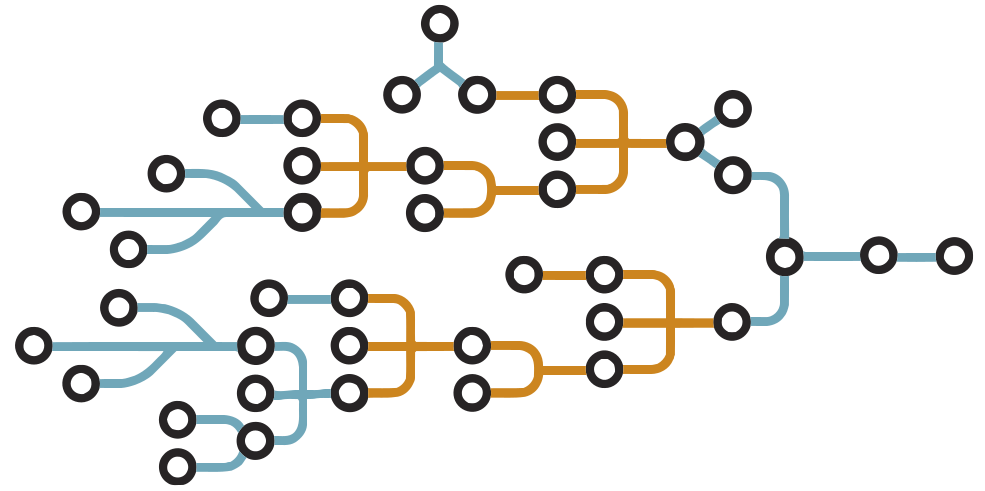

## Overview

[BuildKit](https://github.com/moby/buildkit){:target="_blank" rel="noopener" class="_"}
is an improved backend to replace the legacy builder. It comes with new and much
improved functionality for improving your builds' performance and the
reusability of your Dockerfiles. It also introduces support for handling more
complex scenarios:

- Detect and skip executing unused build stages
- Parallelize building independent build stages
- Incrementally transfer only the changed files in your build context between builds
- Detect and skip transferring unused files in your build context
- Use [Dockerfile frontend](dockerfile-frontend.md) implementations with many new features
- Avoid side effects with rest of the API (intermediate images and containers)
- Prioritize your build cache for automatic pruning

Apart from many new features, the main areas BuildKit improves on the current
experience are performance, storage management, and extensibility. From the
performance side, a significant update is a new fully concurrent build graph
solver. It can run build steps in parallel when possible and optimize out
commands that don't have an impact on the final result. We have also optimized
the access to the local source files. By tracking only the updates made to these
files between repeated build invocations, there is no need to wait for local
files to be read or uploaded before the work can begin.

## LLB

At the core of BuildKit is a [Low-Level Build (LLB)](https://github.com/moby/buildkit#exploring-llb){:target="_blank" rel="noopener" class="_"}
definition format. LLB is an intermediate binary format that allows developers
to extend BuildKit. LLB defines a content-addressable dependency graph that can
be used to put together very complex build definitions. It also supports
features not exposed in Dockerfiles, like direct data mounting and nested
invocation.

{:class="invertible" style="width:60%"}

Everything about execution and caching of your builds is defined in LLB. The
caching model is entirely rewritten compared to the legacy builder. Rather than
using heuristics to compare images, LLB directly tracks the checksums of build
graphs and content mounted to specific operations. This makes it much faster,
more precise, and portable. The build cache can even be exported to a registry,
where it can be pulled on-demand by subsequent invocations on any host.

LLB can be generated directly using a [golang client package](https://pkg.go.dev/github.com/moby/buildkit/client/llb)
that allows defining the relationships between your build operations using Go
language primitives. This gives you full power to run anything you can imagine,
but will probably not be how most people will define their builds. Instead,
most users would use a frontend component, or LLB nested invocation, to run
a prepared set of build steps.

## Frontend

A frontend is a component that takes a human-readable build format and converts
it to LLB so BuildKit can execute it. Frontends can be distributed as images,
and the user can target a specific version of a frontend that is guaranteed to
work for the features used by their definition.

For example, to build a [Dockerfile](../../engine/reference/builder.md) with
BuildKit, you would [use an external Dockerfile frontend](dockerfile-frontend.md).

## Getting started

BuildKit is enabled by default for all users on [Docker Desktop](../../desktop/index.md).
If you have installed Docker Desktop, you don't have to manually enable
BuildKit. If you are running Docker on Linux, you can enable BuildKit either by
using an environment variable or by making BuildKit the default setting.

To set the BuildKit environment variable when running the `docker build`
command, run:

```console
$ DOCKER_BUILDKIT=1 docker build .
```

>**Note**
>
> Buildx always enables BuildKit.

To enable docker BuildKit by default, set daemon configuration in `/etc/docker/daemon.json`
feature to `true` and restart the daemon. If the `daemon.json` file doesn't
exist, create new file called `daemon.json` and then add the following to the
file.

```json
{
  "features": {
    "buildkit" : true
  }
}
```

And restart the Docker daemon.

> **Warning**
>
> BuildKit only supports building Linux containers. Windows support is tracked
> in [`moby/buildkit#616`](https://github.com/moby/buildkit/issues/616){:target="_blank" rel="noopener" class="_"}
{: .warning}
