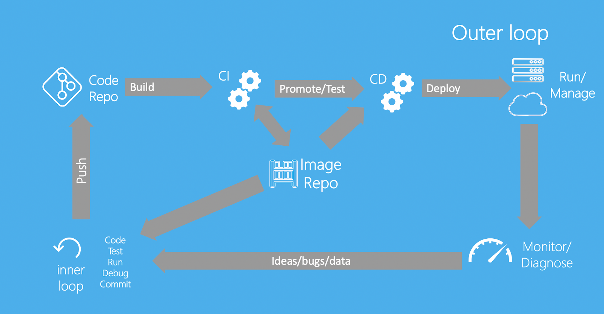

According to the [2020 Jetbrains developer survey](https://www.jetbrains.com/lp/devecosystem-2020/){:target="_blank" rel="noopener" class="_"} , 44% of developers are now using some form of continuous integration and deployment with Docker containers. We understand that a large number of developers have got this set up using Docker Hub as their container registry for part of their workflow. This guide contains some best practices for doing this and provides guidance on how to get started.

We have also heard feedback that given the changes [Docker introduced](https://www.docker.com/blog/scaling-docker-to-serve-millions-more-developers-network-egress/){:target="_blank" rel="noopener" class="_"} relating to network egress and the number of pulls for free users, that there are questions around the best way to use Docker Hub as part of CI/CD workflows without hitting these limits. This guide covers best practices that improve your experience and uses a sensible consumption of Docker Hub which mitigates the risk of hitting these limits, and contains tips on how to increase the limits depending on your use case.

## Inner and outer loops

To get started, one of the most important things when working with Docker and any CI/CD is to understand when you need to test with the CI, and when you can do this locally. At Docker, we think about how developers work in terms of their inner loop (code, build, run, test) and their outer loop (push changes, CI build, CI test, deployment).

Before you think about optimizing your CI/CD, it is important to think about your inner loop and how it relates to the outer loop (the CI). We know that most users don't prefer 'debugging through the CI’. Therefore, it is better if your inner loop and outer loop are as similar as possible. We recommend that you run unit tests as part of your `docker build` command by adding a target for them in your Dockerfile. This way, as you are making changes and rebuilding locally, you can run the same unit tests you would run in the CI on your local machine using a simple command.

The blog post [Go development with Docker](https://www.docker.com/blog/tag/go-env-series/){:target="_blank" rel="noopener" class="_"} is a great example of how you can use tests in your Docker project and re-use them in the CI. This also creates a shorter feedback loop on issues and reduces the amount of pulls and builds your CI needs to do.

## Optimizing CI/CD deployments

Once you get into your actual outer loop and Docker Hub, there are a few things you can do to get the most of your CI and deliver the fastest Docker experience.

First and foremost, stay secure. When you are setting up your CI, ensure you are using a Docker Hub access token, rather than your password.

  > **Note**
  >
  > You can create new access tokens from your [Security](https://hub.docker.com/settings/security){:target="_blank" rel="noopener" class="_"}  page on Docker Hub.

Once you have created access tokens and have added it to a secrets store on your platform, you need to consider when to push and pull in your CI/CD, along with where from, depending on the change you are making.

The first thing you can do to reduce the build time and reduce your number of calls is make use of the **build cache** to reuse layers you have already pulled. You can do this on many platforms by using buildX (buildkits) caching functionality and whatever cache your platform provides. For example, see [Optimizing the GitHub Actions workflow using build cache](../github-actions#optimizing-the-workflow).

The other change you may want to make is only have your release images go to Docker Hub. This would mean setting up functions to push your PR images to a more local image store to be quickly pulled and tested, rather than promoting them all the way up to production.

## Next steps

We know there are a lot more tips and tricks for using Docker in CI, however, we think these are some of the important things, considering the recent Docker Hub rate limit updates.

  > **Note**
  >
  > If you are still experiencing issues with pull limits after you are authenticated, you can consider upgrading to either a [Pro or a Team account](https://www.docker.com/pricing){:target="_blank" rel="noopener" class="_"} .

For information on how to configure GitHub Actions CI/CD pipeline, see [Configure GitHub Actions](github-actions.md).
