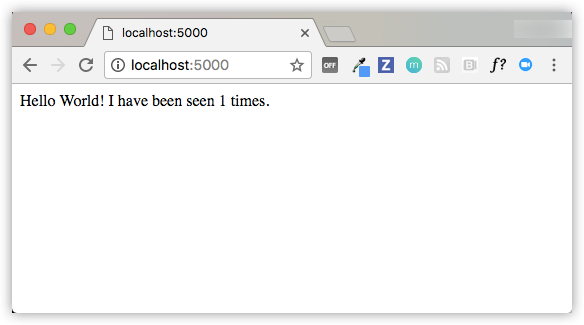
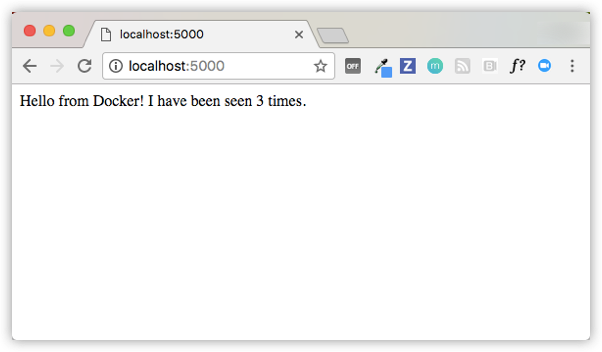

On this page you build a simple Python web application running on Docker
Compose. The application uses the Flask framework and maintains a hit counter in
Redis. While the sample uses Python, the concepts demonstrated here should be
understandable even if you're not familiar with it.

## Prerequisites

Make sure you have already installed both [Docker Engine](../get-docker.md)
and [Docker Compose](install.md). You don't need to install Python or Redis, as
both are provided by Docker images.

## Step 1: Setup

Define the application dependencies.

1.  Create a directory for the project:

        $ mkdir composetest
        $ cd composetest

2.  Create a file called `app.py` in your project directory and paste this in:

        import time

        import redis
        from flask import Flask

        app = Flask(__name__)
        cache = redis.Redis(host='redis', port=6379)


        def get_hit_count():
            retries = 5
            while True:
                try:
                    return cache.incr('hits')
                except redis.exceptions.ConnectionError as exc:
                    if retries == 0:
                        raise exc
                    retries -= 1
                    time.sleep(0.5)


        @app.route('/')
        def hello():
            count = get_hit_count()
            return 'Hello World! I have been seen {} times.\n'.format(count)


      In this example, `redis` is the hostname of the redis container on the
      application's network. We use the default port for Redis, `6379`.

      > Handling transient errors
      >
      > Note the way the `get_hit_count` function is written. This basic retry
      > loop lets us attempt our request multiple times if the redis service is
      > not available. This is useful at startup while the application comes
      > online, but also makes our application more resilient if the Redis
      > service needs to be restarted anytime during the app's lifetime. In a
      > cluster, this also helps handling momentary connection drops between
      > nodes.


3.  Create another file called `requirements.txt` in your project directory and
    paste this in:

        flask
        redis

## Step 2: Create a Dockerfile

In this step, you write a Dockerfile that builds a Docker image. The image
contains all the dependencies the Python application requires, including Python
itself.

In your project directory, create a file named `Dockerfile` and paste the
following:

    FROM python:3.7-alpine
    WORKDIR /code
    ENV FLASK_APP app.py
    ENV FLASK_RUN_HOST 0.0.0.0
    RUN apk add --no-cache gcc musl-dev linux-headers
    COPY requirements.txt requirements.txt
    RUN pip install -r requirements.txt
    EXPOSE 5000
    COPY . .
    CMD ["flask", "run"]

This tells Docker to:

* Build an image starting with the Python 3.7 image.
* Set the working directory to `/code`.
* Set environment variables used by the `flask` command.
* Install gcc and other dependencies
* Copy `requirements.txt` and install the Python dependencies.
* Add metadata to the image to describe that the container is listening on port 5000
* Copy the current directory `.` in the project to the workdir `.` in the image.
* Set the default command for the container to `flask run`.

For more information on how to write Dockerfiles, see the
[Docker user guide](../develop/index.md)
and the [Dockerfile reference](/engine/reference/builder/).


## Step 3: Define services in a Compose file

Create a file called `docker-compose.yml` in your project directory and paste
the following:

    version: '3'
    services:
      web:
        build: .
        ports:
          - "5000:5000"
      redis:
        image: "redis:alpine"

This Compose file defines two services: `web` and `redis`. 

### Web service

The `web` service uses an image that's built from the `Dockerfile` in the current directory.
It then binds the container and the host machine to the exposed port, `5000`. This example service uses the default port for 
the Flask web server, `5000`.

### Redis service

The `redis` service uses a public [Redis](https://registry.hub.docker.com/_/redis/) 
image pulled from the Docker Hub registry.

## Step 4: Build and run your app with Compose

1.  From your project directory, start up your application by running `docker-compose up`.

    ```
    $ docker-compose up
    Creating network "composetest_default" with the default driver
    Creating composetest_web_1 ...
    Creating composetest_redis_1 ...
    Creating composetest_web_1
    Creating composetest_redis_1 ... done
    Attaching to composetest_web_1, composetest_redis_1
    web_1    |  * Running on http://0.0.0.0:5000/ (Press CTRL+C to quit)
    redis_1  | 1:C 17 Aug 22:11:10.480 # oO0OoO0OoO0Oo Redis is starting oO0OoO0OoO0Oo
    redis_1  | 1:C 17 Aug 22:11:10.480 # Redis version=4.0.1, bits=64, commit=00000000, modified=0, pid=1, just started
    redis_1  | 1:C 17 Aug 22:11:10.480 # Warning: no config file specified, using the default config. In order to specify a config file use redis-server /path/to/redis.conf
    web_1    |  * Restarting with stat
    redis_1  | 1:M 17 Aug 22:11:10.483 * Running mode=standalone, port=6379.
    redis_1  | 1:M 17 Aug 22:11:10.483 # WARNING: The TCP backlog setting of 511 cannot be enforced because /proc/sys/net/core/somaxconn is set to the lower value of 128.
    web_1    |  * Debugger is active!
    redis_1  | 1:M 17 Aug 22:11:10.483 # Server initialized
    redis_1  | 1:M 17 Aug 22:11:10.483 # WARNING you have Transparent Huge Pages (THP) support enabled in your kernel. This will create latency and memory usage issues with Redis. To fix this issue run the command 'echo never > /sys/kernel/mm/transparent_hugepage/enabled' as root, and add it to your /etc/rc.local in order to retain the setting after a reboot. Redis must be restarted after THP is disabled.
    web_1    |  * Debugger PIN: 330-787-903
    redis_1  | 1:M 17 Aug 22:11:10.483 * Ready to accept connections
    ```

    Compose pulls a Redis image, builds an image for your code, and starts the
    services you defined. In this case, the code is statically copied into the image at build time.

2.  Enter http://localhost:5000/ in a browser to see the application running.

    If you're using Docker natively on Linux, Docker Desktop for Mac, or Docker Desktop for
    Windows, then the web app should now be listening on port 5000 on your
    Docker daemon host. Point your web browser to http://localhost:5000 to
    find the `Hello World` message. If this doesn't resolve, you can also try
    http://127.0.0.1:5000.

    If you're using Docker Machine on a Mac or Windows, use `docker-machine ip
    MACHINE_VM` to get the IP address of your Docker host. Then, open
    `http://MACHINE_VM_IP:5000` in a browser.

    You should see a message in your browser saying:

    ```
    Hello World! I have been seen 1 times.
    ```

    

3.  Refresh the page.

    The number should increment.

    ```
    Hello World! I have been seen 2 times.
    ```

    

4.  Switch to another terminal window, and type `docker image ls` to
    list local images.

    Listing images at this point should return `redis` and `web`.

    ```
    $ docker image ls
    REPOSITORY              TAG                 IMAGE ID            CREATED             SIZE
    composetest_web         latest              e2c21aa48cc1        4 minutes ago       93.8MB
    python                  3.4-alpine          84e6077c7ab6        7 days ago          82.5MB
    redis                   alpine              9d8fa9aa0e5b        3 weeks ago         27.5MB
    ```

    You can inspect images with `docker inspect <tag or id>`.

5.  Stop the application, either by running `docker-compose down`
from within your project directory in the second terminal, or by
hitting CTRL+C in the original terminal where you started the app.

## Step 5: Edit the Compose file to add a bind mount

Edit `docker-compose.yml` in your project directory to add a
[bind mount](../storage/bind-mounts.md) for the `web` service:

    version: '3'
    services:
      web:
        build: .
        ports:
          - "5000:5000"
        volumes:
          - .:/code
        environment:
          FLASK_ENV: development
      redis:
        image: "redis:alpine"

The new `volumes` key mounts the project directory (current directory) on the
host to `/code` inside the container, allowing you to modify the code on the
fly, without having to rebuild the image. The `environment` key sets the
`FLASK_ENV` environment variable, which tells `flask run` to run in development
mode and reload the code on change. This mode should only be used in development.

## Step 6: Re-build and run the app with Compose

From your project directory, type `docker-compose up` to build the app with the updated Compose file, and run it.

```
$ docker-compose up
Creating network "composetest_default" with the default driver
Creating composetest_web_1 ...
Creating composetest_redis_1 ...
Creating composetest_web_1
Creating composetest_redis_1 ... done
Attaching to composetest_web_1, composetest_redis_1
web_1    |  * Running on http://0.0.0.0:5000/ (Press CTRL+C to quit)
...
```

Check the `Hello World` message in a web browser again, and refresh to see the
count increment.

> Shared folders, volumes, and bind mounts
>
> * If your project is outside of the `Users` directory (`cd ~`), then you
need to share the drive or location of the Dockerfile and volume you are using.
If you get runtime errors indicating an application file is not found, a volume
mount is denied, or a service cannot start, try enabling file or drive sharing.
Volume mounting requires shared drives for projects that live outside of
`C:\Users` (Windows) or `/Users` (Mac), and is required for _any_ project on
Docker Desktop for Windows that uses [Linux containers](../docker-for-windows/index.md#switch-between-windows-and-linux-containers).
For more information, see [File sharing](../docker-for-mac/index.md#file-sharing) on Docker
for Mac, and the general examples on how to
> [Manage data in containers](../storage/volumes.md).
>
> * If you are using Oracle VirtualBox on an older Windows OS, you might encounter an issue with shared folders as described in this [VB trouble
ticket](https://www.virtualbox.org/ticket/14920). Newer Windows systems meet the
requirements for [Docker Desktop for Windows](../docker-for-windows/install.md) and do not
need VirtualBox.
{: .important}

## Step 7: Update the application

Because the application code is now mounted into the container using a volume,
you can make changes to its code and see the changes instantly, without having
to rebuild the image.

1.  Change the greeting in `app.py` and save it. For example, change the `Hello World!` message to `Hello from Docker!`:

    ```
    return 'Hello from Docker! I have been seen {} times.\n'.format(count)
    ```

2.  Refresh the app in your browser. The greeting should be updated, and the
    counter should still be incrementing.

    

## Step 8: Experiment with some other commands

If you want to run your services in the background, you can pass the `-d` flag
(for "detached" mode) to `docker-compose up` and use `docker-compose ps` to
see what is currently running:

    $ docker-compose up -d
    Starting composetest_redis_1...
    Starting composetest_web_1...

    $ docker-compose ps
    Name                 Command            State       Ports
    -------------------------------------------------------------------
    composetest_redis_1   /usr/local/bin/run         Up
    composetest_web_1     /bin/sh -c python app.py   Up      5000->5000/tcp

The `docker-compose run` command allows you to run one-off commands for your
services. For example, to see what environment variables are available to the
`web` service:

    $ docker-compose run web env

See `docker-compose --help` to see other available commands. You can also install [command completion](completion.md) for the bash and zsh shell, which also shows you available commands.

If you started Compose with `docker-compose up -d`, stop
your services once you've finished with them:

    $ docker-compose stop

You can bring everything down, removing the containers entirely, with the `down`
command. Pass `--volumes` to also remove the data volume used by the Redis
container:

    $ docker-compose down --volumes

At this point, you have seen the basics of how Compose works.


## Where to go next

- Next, try the quick start guide for [Django](django.md),
  [Rails](rails.md), or [WordPress](wordpress.md)
- [Explore the full list of Compose commands](reference/index.md)
- [Compose configuration file reference](compose-file/index.md)
- To learn more about volumes and bind mounts, see [Manage data in Docker](../storage/index.md)
