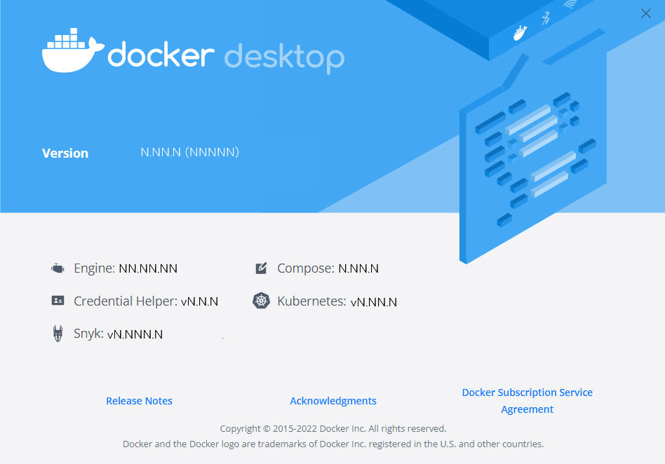

On this page you can find information on how to get and install Compose.

## Install Compose

If you have Docker Desktop, you've got a full Docker installation, including Compose.

You can check this by clicking on **About Docker Desktop** from the Docker menu {: .inline}.

{:width="750px"}

### New Docker Installation

If you haven’t yet installed Docker Desktop:



| Platform       | Docker Desktop                 |
|:---------------|:------------------------------:|
|Linux (64-bit)  |{{ yes }} [Install](../../desktop/install/linux-install.md)|
|Mac             |{{ yes }} [Install](../../desktop/install/mac-install.md)|
|Windows         |{{ yes }} [Install](../../desktop/install/windows-install.md)|

### Pre-existing Docker Installation

If you have a Docker installation on Linux to which you want to add the Compose plugin, you can choose one of these options:

* [Install using the repository](./linux.md#install-using-the-repository)
* [Install the plugin manually](./linux.md#install-the-plugin-manually)

### Other install scenarios

For other options, see [Other install scenarios](./other.md).

## Where to go next

- [Getting Started](../gettingstarted.md)
- [Command line reference](../../reference/index.md)
- [Compose file reference](../compose-file/index.md)
- [Sample apps with Compose](../samples-for-compose.md)

## Feedback

We'd love to hear from you about the improvements we've recently made to the Docker Compose installation instructions. Let us know what you think by completing this short [survey](https://survey.alchemer.com/s3/7002962/Compose-Install-Documentation-Feedback){:target="_blank" rel="noopener" class="_"}.