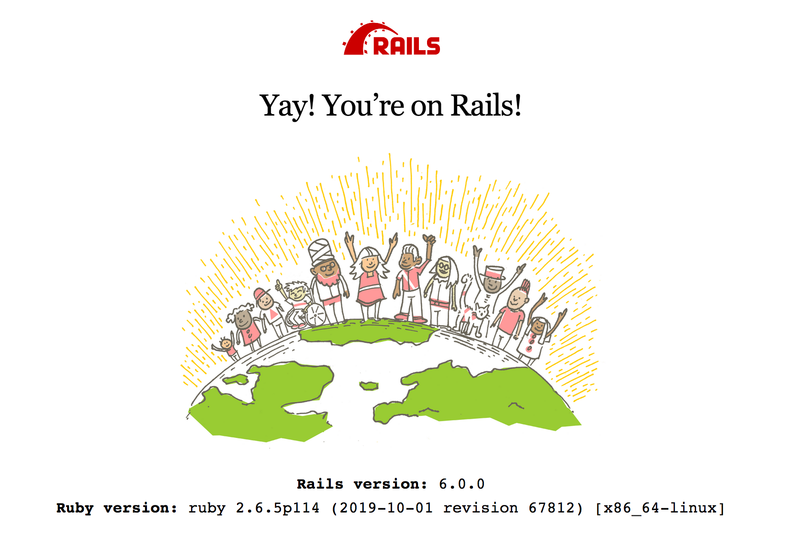

This Quickstart guide shows you how to use Docker Compose to set up and run
a Rails/MySQL app. Before starting, [install Compose](install.md).

### Define the project


Start by setting up the files needed to build the app. The app will run inside a Docker container containing its dependencies. Defining dependencies is done using a file called `Dockerfile`. To begin with, the 
Dockerfile consists of:

    FROM ruby:2.7
    RUN apt-get update -qq && apt-get install -y curl apt-transport-https wget nodejs default-mysql-client
    RUN curl -sS https://dl.yarnpkg.com/debian/pubkey.gpg | apt-key add - && \
      echo "deb https://dl.yarnpkg.com/debian/ stable main" | tee /etc/apt/sources.list.d/yarn.list && \
      apt-get update -qq && apt-get install -y yarn
    RUN mkdir /myapp
    WORKDIR /myapp
    COPY Gemfile /myapp/Gemfile
    COPY Gemfile.lock /myapp/Gemfile.lock
    RUN bundle install
    COPY . /myapp

    # Add a script to be executed every time the container starts.
    COPY entrypoint.sh /usr/bin/
    RUN chmod +x /usr/bin/entrypoint.sh
    ENTRYPOINT ["entrypoint.sh"]
    EXPOSE 3000

    # Start the main process.
    CMD ["rails", "server", "-b", "0.0.0.0"]

That'll put your application code inside an image that builds a container
with Ruby, Bundler and all your dependencies inside it. For more information on
how to write Dockerfiles, see the [Docker user guide](../get-started/index.md)
and the [Dockerfile reference](/engine/reference/builder/).

Next, create a bootstrap `Gemfile` which just loads Rails. It'll be overwritten
in a moment by `rails new`.

    source 'https://rubygems.org'
    gem 'rails', '~>6.0.0'

Create an empty `Gemfile.lock` to build our `Dockerfile`.

    touch Gemfile.lock

Next, provide an entrypoint script to fix a Rails-specific issue that
prevents the server from restarting when a certain `server.pid` file pre-exists.
This script will be executed every time the container gets started.
`entrypoint.sh` consists of:

```bash
#!/bin/bash
set -e

# Remove a potentially pre-existing server.pid for Rails.
rm -f /myapp/tmp/pids/server.pid

# Then exec the container's main process (what's set as CMD in the Dockerfile).
exec "$@"
```

Create a `.env` file.
Describe what you want to set as environment variables, and set them to the `docker-compose.yml`.
Used by containers by referring to them in an `emvironment` or by specifying them in an `env_file` if you will be able to.
Please refer to [this page](https://docs.docker.com/compose/environment-variables/) for details on how to set the environment variables.

    DB_ROOT_PASSWORD=mysql_root_password
    DB_USER=myapp
    DB_PASSWORD=myapp_password
    DB_PORT=3306


Finally, `docker-compose.yml` is where the magic happens. This file describes
the services that comprise your app (a database and a web app), how to get each
one's Docker image (the database just runs on a pre-made MySQL8.0 image, and
the web app is built from the current directory), and the configuration needed
to link them together and expose the web app's port.

    version: '3'
    services:
      db:
        image: mysql:8.0
        volumes:
          - db-data:/var/lib/mysql
        environment:
          - MYSQL_ROOT_PASSWORD=${DB_ROOT_PASSWORD}
          - MYSQL_USER=${DB_USER}
          - MYSQL_PASSWORD=${DB_PASSWORD}
        volumes:
          - db-data:/var/lib/mysql
        command: --default-authentication-plugin=mysql_native_password
        ports:
          - ${DB_PORT}:3306
      web:
        build: .
        env_file: .env
        command: bash -c "rm -f tmp/pids/server.pid && bundle exec rails s -p 3000 -b '0.0.0.0'"
        volumes:
          - .:/myapp
        ports:
          - "3000:3000"
        depends_on:
          - db
    volumes:
      db-data:

>**Tip**: You can use either a `.yml` or `.yaml` extension for this file.

### Build the project

With those files in place, you can now generate the Rails skeleton app
using [docker-compose run](reference/run.md):

    docker-compose run web rails new . --force --no-deps --database=mysql --webpacker --skip-test

First, Compose builds the image for the `web` service using the
`Dockerfile`. Then it runs `rails new` inside a new container, using that
image. Once it's done, you should have generated a fresh app.

List the files.

```bash
$ ls -la
total 776
drwxr-xr-x   30 vmb  staff     960  6 14 17:21 ./
drwxr-xr-x   15 vmb  staff     480  6 14 17:07 ../
-rw-r--r--    1 vmb  staff       9  6 14 17:19 .browserslistrc
-rw-r--r--    1 vmb  staff      91  6 14 17:07 .env
drwxr-xr-x   13 vmb  staff     416  6 14 17:14 .git/
-rw-r--r--    1 vmb  staff     771  6 14 17:19 .gitignore
-rw-r--r--    1 vmb  staff      11  6 14 17:14 .ruby-version
-rw-r--r--    1 vmb  staff     823  6 14 17:07 Dockerfile
-rw-r--r--    1 vmb  staff    1726  6 14 17:14 Gemfile
-rw-r--r--    1 vmb  staff    4858  6 14 17:19 Gemfile.lock
-rw-r--r--    1 vmb  staff     374  6 14 17:14 README.md
-rw-r--r--    1 vmb  staff     227  6 14 17:14 Rakefile
drwxr-xr-x   11 vmb  staff     352  6 14 17:14 app/
-rw-r--r--    1 vmb  staff    1722  6 14 17:19 babel.config.js
drwxr-xr-x   10 vmb  staff     320  6 14 17:19 bin/
drwxr-xr-x   18 vmb  staff     576  6 14 17:19 config/
-rw-r--r--    1 vmb  staff     130  6 14 17:14 config.ru
drwxr-xr-x    3 vmb  staff      96  6 14 17:14 db/
-rw-r--r--    1 vmb  staff     581  6 14 17:07 docker-compose.yml
-rw-r--r--    1 vmb  staff     202  6 14 17:07 entrypoint.sh
drwxr-xr-x    4 vmb  staff     128  6 14 17:14 lib/
drwxr-xr-x    4 vmb  staff     128  6 14 17:19 log/
drwxr-xr-x  775 vmb  staff   24800  6 14 18:17 node_modules/
-rw-r--r--    1 vmb  staff     314  6 14 18:17 package.json
-rw-r--r--    1 vmb  staff     224  6 14 17:19 postcss.config.js
drwxr-xr-x    9 vmb  staff     288  6 14 17:14 public/
drwxr-xr-x    3 vmb  staff      96  6 14 17:14 storage/
drwxr-xr-x    7 vmb  staff     224  6 14 17:19 tmp/
drwxr-xr-x    3 vmb  staff      96  6 14 17:14 vendor/
-rw-r--r--    1 vmb  staff  329959  6 14 18:17 yarn.lock
```

If you are running Docker on Linux, the files `rails new` created are owned by
root. This happens because the container runs as the root user. If this is the
case, change the ownership of the new files.

```bash
sudo chown -R $USER:$USER .
```

If you are running Docker on Mac or Windows, you should already have ownership
of all files, including those generated by `rails new`.

Now that you’ve got a new Gemfile, you need to build the image again. (This, and
changes to the `Gemfile` or the Dockerfile, should be the only times you’ll need
to rebuild.)

    docker-compose build


### Connect the database

The app is now bootable, but you're not quite there yet. By default, Rails
expects a database to be running on `localhost` - so you need to point it at the
`db` container instead. You also need to change the database and username to
align with the defaults set by the `postgres` image.

Replace the contents of `config/database.yml` with the following:

```none
default: &default
  adapter: mysql2
  encoding: utf8mb4
  pool: <%= ENV.fetch("RAILS_MAX_THREADS") { 5 } %>
  username: <%= ENV['DB_USER'] %>
  password: <%= ENV['DB_PASSWORD'] %>
  host: db

development:
  <<: *default
  database: myapp_development

test:
  <<: *default
  database: myapp_test

production:
  <<: *default
  database: myapp_production
  username: myapp
  password: <%= ENV['MYAPP_DATABASE_PASSWORD'] %>
```

You can now boot the app with [docker-compose up](reference/up.md):

    docker-compose up

If all's well, you should see some MySQL output.

```bash
...
db_1   | 2020-06-14T08:13:37.437475Z 0 [System] [MY-010116] [Server] /usr/sbin/mysqld (mysqld 8.0.20) starting as process 1
db_1   | 2020-06-14T08:13:37.468468Z 1 [System] [MY-013576] [InnoDB] InnoDB initialization has started.
db_1   | 2020-06-14T08:13:37.926219Z 1 [System] [MY-013577] [InnoDB] InnoDB initialization has ended.
db_1   | 2020-06-14T08:13:38.144866Z 0 [System] [MY-011323] [Server] X Plugin ready for connections. Socket: '/var/run/mysqld/mysqlx.sock' bind-address: '::' port: 33060
db_1   | 2020-06-14T08:13:38.272678Z 0 [Warning] [MY-010068] [Server] CA certificate ca.pem is self signed.
db_1   | 2020-06-14T08:13:38.277202Z 0 [Warning] [MY-011810] [Server] Insecure configuration for --pid-file: Location '/var/run/mysqld' in the path is accessible to all OS users. Consider choosing a different directory.
db_1   | 2020-06-14T08:13:38.314726Z 0 [System] [MY-010931] [Server] /usr/sbin/mysqld: ready for connections. Version: '8.0.20'  socket: '/var/run/mysqld/mysqld.sock'  port: 3306  MySQL Community Server - GPL.
```

Grant privileges to the MySQL user created by `.env`.

    docker-compose exec db mysql -uroot -p -e"GRANT ALL PRIVILEGES ON *.* TO 'myapp'@'%';FLUSH PRIVILEGES;"
    Enter password:

Finally, you need to create the database. In another terminal, run:

    docker-compose run web rails db:create

Here is an example of the output from that command:

```none
vmb at snapair in ~/sandbox/rails
$ docker-compose run web rails db:create
Starting rails_db_1 ... done
Created database 'myapp_development'
Created database 'myapp_test'
```

### View the Rails welcome page!

That's it. Your app should now be running on port 3000 on your Docker daemon.

On Docker Desktop for Mac and Docker Desktop for Windows, go to `http://localhost:3000` on a web
browser to see the Rails Welcome.

If you are using [Docker Machine](../machine/overview.md), then `docker-machine ip
MACHINE_VM` returns the Docker host IP address, to which you can append the port
(`<Docker-Host-IP>:3000`).



### Stop the application

To stop the application, run [docker-compose down](reference/down.md) in
your project directory. You can use the same terminal window in which you
started the database, or another one where you have access to a command prompt.
This is a clean way to stop the application.

```none
vmb at snapair in ~/sandbox/rails
$ docker-compose down
Stopping rails_web_1 ... done
Stopping rails_db_1 ... done
Removing rails_web_run_1 ... done
Removing rails_web_1 ... done
Removing rails_db_1 ... done
Removing network rails_default

```

### Restart the application

To restart the application run `docker-compose up` in the project directory.

### Rebuild the application

If you make changes to the Gemfile or the Compose file to try out some different
configurations, you need to rebuild. Some changes require only
`docker-compose up --build`, but a full rebuild requires a re-run of
`docker-compose run web bundle install` to sync changes in the `Gemfile.lock` to
the host, followed by `docker-compose up --build`.

Here is an example of the first case, where a full rebuild is not necessary.
Suppose you simply want to change the exposed port on the local host from `3000`
in our first example to `3001`. Make the change to the Compose file to expose
port `3000` on the container through a new port, `3001`, on the host, and save
the changes:

```none
ports: - "3001:3000"
```

Now, rebuild and restart the app with `docker-compose up --build`.

Inside the container, your app is running on the same port as before `3000`, but
the Rails Welcome is now available on `http://localhost:3001` on your local
host.

## More Compose documentation

- [User guide](index.md)
- [Installing Compose](install.md)
- [Getting Started](gettingstarted.md)
- [Get started with Django](django.md)
- [Get started with WordPress](wordpress.md)
- [Command line reference](reference/index.md)
- [Compose file reference](compose-file/index.md)
- [Environment variables in Compose](environment-variables.md)
