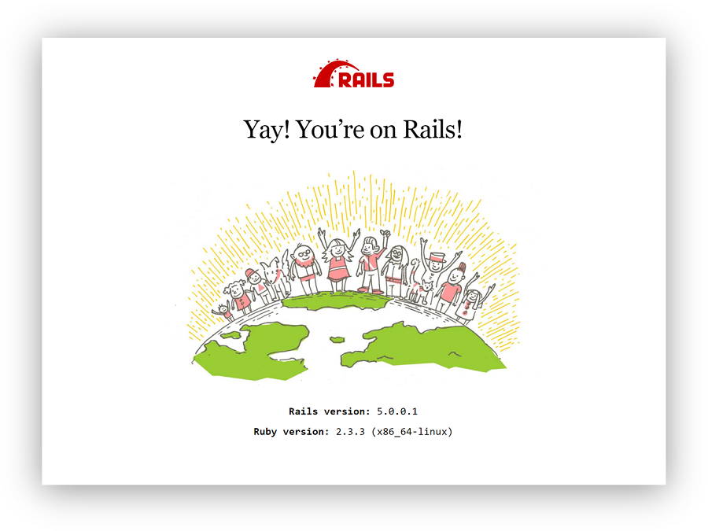

This Quickstart guide shows you how to use Docker Compose to set up and run
a Rails/PostgreSQL app. Before starting, [install Compose](install.md).

### Define the project


Start by setting up the files needed to build the app. App will run inside a Docker container containing its dependencies. Defining dependencies is done using a file called `Dockerfile`. To begin with, the 
Dockerfile consists of:

    FROM ruby:2.6
    RUN curl -sS https://dl.yarnpkg.com/debian/pubkey.gpg | apt-key add - && \
        echo "deb https://dl.yarnpkg.com/debian/ stable main" | tee /etc/apt/sources.list.d/yarn.list
    RUN apt-get update -qq && apt-get install -y nodejs yarn postgresql-client
    RUN mkdir /myapp
    WORKDIR /myapp

    COPY package.json /myapp/package.json
    COPY yarn.lock /myapp/yarn.lock
    RUN yarn install

    COPY Gemfile /myapp/Gemfile
    COPY Gemfile.lock /myapp/Gemfile.lock
    RUN bundle install

    COPY . /myapp

    # Add a script to be executed every time the container starts.
    COPY entrypoint.sh /usr/bin/
    RUN chmod +x /usr/bin/entrypoint.sh
    ENTRYPOINT ["entrypoint.sh"]
    EXPOSE 3000

    # Start the main process.
    CMD ["rails", "server", "-b", "0.0.0.0"]

That'll put your application code inside an image that builds a container
with Ruby, Bundler, Yarn and all your dependencies inside it. For more
information on how to write Dockerfiles, see the [Docker user
guide](/engine/tutorials/dockerimages.md#building-an-image-from-a-dockerfile)
and the [Dockerfile reference](/engine/reference/builder.md).

Next, create a bootstrap `Gemfile` which just loads Rails. It'll be overwritten
in a moment by `rails new`.

    source 'https://rubygems.org'
    gem 'rails', '~>6'

Now create an empty `package.json`.

    {
      "name": "myapp",
      "private": true,
      "version": "0.1.0"
    }

Create an empty `Gemfile.lock` and `yarn.lock` to build our
`Dockerfile`.

    touch Gemfile.lock yarn.lock

Next, provide an entrypoint script to fix a Rails-specific issue that
prevents the server from restarting when a certain `server.pid` file pre-exists.
This script will be executed every time the container gets started.
`entrypoint.sh` consists of:

```bash
#!/bin/bash
set -e

# Remove a potentially pre-existing server.pid for Rails.
rm -f /myapp/tmp/pids/server.pid

# Then exec the container's main process (what's set as CMD in the Dockerfile).
exec "$@"
```

Finally, `docker-compose.yml` is where the magic happens. This file describes
the services that comprise your app (a database and a web app), how to get each
one's Docker image (the database just runs on a pre-made PostgreSQL image, and
the web app is built from the current directory), and the configuration needed
to link them together and expose the web app's port.

    version: '3'
    services:
      db:
        image: postgres
        volumes:
          - ./tmp/db:/var/lib/postgresql/data
      web:
        build: .
        command: bash -c "rm -f tmp/pids/server.pid && bundle exec rails s -p 3000 -b '0.0.0.0'"
        volumes:
          - .:/myapp
        ports:
          - "3000:3000"
        depends_on:
          - db

>**Tip**: You can use either a `.yml` or `.yaml` extension for this file.

### Build the project

With those files in place, you can now generate the Rails skeleton app
using [docker-compose run](/compose/reference/run/):

    docker-compose run --no-deps web rails new . --force --database=postgresql

First, Compose builds the image for the `web` service using the
`Dockerfile`. Then it runs `rails new` inside a new container, using that
image. Once it's done, you should have generated a fresh app.

List the files.

```bash
$ ls -l
total 704
-rw-r--r--    1 vmb  staff     631 Nov  1 21:23 Dockerfile
-rw-r--r--    1 vmb  staff    1971 Nov  1 21:24 Gemfile
-rw-r--r--    1 vmb  staff    5501 Nov  1 21:24 Gemfile.lock
-rw-r--r--    1 vmb  staff     374 Nov  1 21:24 README.md
-rw-r--r--    1 vmb  staff     227 Nov  1 21:24 Rakefile
drwxr-xr-x   11 vmb  staff     374 Nov  1 21:24 app
-rw-r--r--    1 vmb  staff    1876 Nov  1 21:24 babel.config.js
drwxr-xr-x   10 vmb  staff     340 Nov  1 21:24 bin
drwxr-xr-x   18 vmb  staff     612 Nov  1 21:24 config
-rw-r--r--    1 vmb  staff     130 Nov  1 21:24 config.ru
drwxr-xr-x    3 vmb  staff     102 Nov  1 21:24 db
-rw-r--r--    1 vmb  staff     305 Nov  1 21:23 docker-compose.yml
-rw-r--r--    1 vmb  staff     202 Nov  1 21:23 entrypoint.sh
drwxr-xr-x    4 vmb  staff     136 Nov  1 21:24 lib
drwxr-xr-x    4 vmb  staff     136 Nov  1 21:24 log
drwxr-xr-x  761 vmb  staff   25874 Nov  1 21:27 node_modules
-rw-r--r--    1 vmb  staff     332 Nov  1 21:27 package.json
-rw-r--r--    1 vmb  staff     224 Nov  1 21:24 postcss.config.js
drwxr-xr-x    9 vmb  staff     306 Nov  1 21:24 public
drwxr-xr-x    3 vmb  staff     102 Nov  1 21:24 storage
drwxr-xr-x   12 vmb  staff     408 Nov  1 21:24 test
drwxr-xr-x    6 vmb  staff     204 Nov  1 21:24 tmp
drwxr-xr-x    3 vmb  staff     102 Nov  1 21:24 vendor
-rw-r--r--    1 vmb  staff  310018 Nov  1 21:27 yarn.lock
```

If you are running Docker on Linux, the files `rails new` created are owned by
root. This happens because the container runs as the root user. If this is the
case, change the ownership of the new files.

```bash
sudo chown -R $USER:$USER .
```

If you are running Docker on Mac or Windows, you should already have ownership
of all files, including those generated by `rails new`.

Now that you’ve got a new `Gemfile` and `package.json`, you need to build the
image again. (This, and changes to the `Gemfile`, `package.json`, or the
Dockerfile, should be the only times you’ll need to rebuild.)

    docker-compose build


### Connect the database

The app is now bootable, but you're not quite there yet. By default, Rails
expects a database to be running on `localhost` - so you need to point it at the
`db` container instead. You also need to change the database and username to
align with the defaults set by the `postgres` image.

Replace the contents of `config/database.yml` with the following:

```none
default: &default
  adapter: postgresql
  encoding: unicode
  host: db
  username: postgres
  password:
  pool: 5

development:
  <<: *default
  database: myapp_development


test:
  <<: *default
  database: myapp_test
```

You can now boot the app with [docker-compose up](/compose/reference/up/):

    docker-compose up

If all's well, you should see some PostgreSQL output.

```bash
rails_db_1 is up-to-date
Creating rails_web_1 ... done
Attaching to rails_db_1, rails_web_1
db_1   | PostgreSQL init process complete; ready for start up.
db_1   |
db_1   | 2018-03-21 20:18:37.437 UTC [1] LOG:  listening on IPv4 address "0.0.0.0", port 5432
db_1   | 2018-03-21 20:18:37.437 UTC [1] LOG:  listening on IPv6 address "::", port 5432
db_1   | 2018-03-21 20:18:37.443 UTC [1] LOG:  listening on Unix socket "/var/run/postgresql/.s.PGSQL.5432"
db_1   | 2018-03-21 20:18:37.726 UTC [55] LOG:  database system was shut down at 2018-03-21 20:18:37 UTC
db_1   | 2018-03-21 20:18:37.772 UTC [1] LOG:  database system is ready to accept connections
```

Finally, you need to create the database. In another terminal, run:

    docker-compose run web rails db:create

Here is an example of the output from that command:

```none
vmb at snapair in ~/sandbox/rails
$ docker-compose run web rails db:create
Starting rails_db_1 ... done
Created database 'myapp_development'
Created database 'myapp_test'
```

### View the Rails welcome page!

That's it. Your app should now be running on port 3000 on your Docker daemon.

On Docker Desktop for Mac and Docker Desktop for Windows, go to `http://localhost:3000` on a web
browser to see the Rails Welcome.

If you are using [Docker Machine](/machine/overview.md), then `docker-machine ip
MACHINE_VM` returns the Docker host IP address, to which you can append the port
(`<Docker-Host-IP>:3000`).



### Stop the application

To stop the application, run [docker-compose down](/compose/reference/down/) in
your project directory. You can use the same terminal window in which you
created the database, or another one where you have access to a command prompt.
This is a clean way to stop the application.

```none
vmb at snapair in ~/sandbox/rails
$ docker-compose down
Stopping rails_web_1 ... done
Stopping rails_db_1 ... done
Removing rails_web_run_1 ... done
Removing rails_web_1 ... done
Removing rails_db_1 ... done
Removing network rails_default

```

### Restart the application

To restart the application run `docker-compose up` in the project directory.

### Rebuild the application

If you make changes to the `Gemfile`, `package.json`, or the Compose file to try
out some different configurations, you need to rebuild. Some changes require
only `docker-compose up --build`, but a full rebuild requires a re-run of
`bundle install` and `yarn install`, followed by the `build` command:

    docker-compose run web bundle install
    docker-compose run web yarn install
    docker-compose up --build

Here is an example of the first case, where a full rebuild is not necessary.
Suppose you simply want to change the exposed port on the local host from `3000`
in our first example to `3001`. Make the change to the Compose file to expose
port `3000` on the container through a new port, `3001`, on the host, and save
the changes:

```none
ports: - "3001:3000"
```

Now, rebuild and restart the app with `docker-compose up --build`.

Inside the container, your app is running on the same port as before `3000`, but
the Rails Welcome is now available on `http://localhost:3001` on your local
host.

## More Compose documentation

- [User guide](index.md)
- [Installing Compose](install.md)
- [Getting Started](gettingstarted.md)
- [Get started with Django](django.md)
- [Get started with WordPress](wordpress.md)
- [Command line reference](./reference/index.md)
- [Compose file reference](compose-file.md)
