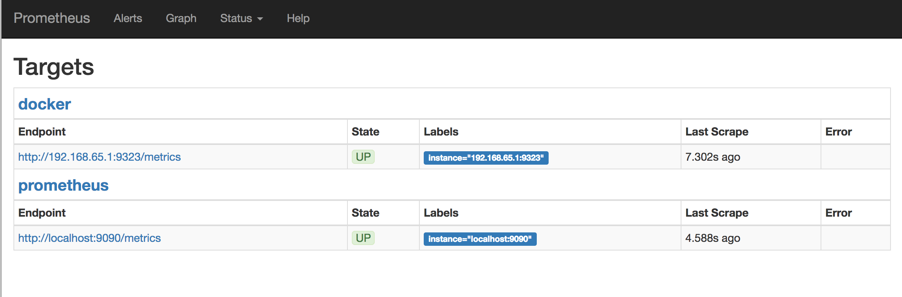
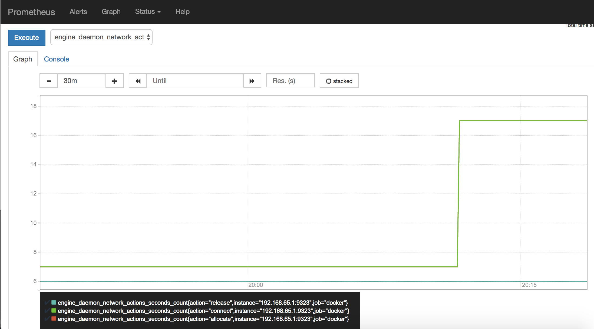

[Prometheus](https://prometheus.io/) is an open-source systems monitoring and
alerting toolkit. You can configure Docker as a Prometheus target. This topic
shows you how to configure Docker, set up Prometheus to run as a Docker
container, and monitor your Docker instance using Prometheus.

> **Warning**: The available metrics and the names of those metrics are in
> active development and may change at any time.

Currently, you can only monitor Docker itself. You cannot currently monitor your
application using the Docker target.


## Configure Docker

To configure the Docker daemon as a Prometheus target, you need to specify the
`metrics-address`. The best way to do this is via the `daemon.json`, which is
located at one of the following locations by default. If the file does not
exist, create it.

- **Linux**: `/etc/docker/daemon.json`
- **Windows Server**: `C:\ProgramData\docker\config\daemon.json`
- **Docker Desktop for Mac / Docker Desktop for Windows**: Click the Docker icon in the toolbar,
  select **Preferences**, then select **Daemon**. Click **Advanced**.

If the file is currently empty, paste the following:

```json
{
  "metrics-addr" : "127.0.0.1:9323",
  "experimental" : true
}
```

If the file is not empty, add those two keys, making sure that the resulting
file is valid JSON. Be careful that every line ends with a comma (`,`) except
for the last line.

Save the file, or in the case of Docker Desktop for Mac or Docker Desktop for Windows, save the
configuration. Restart Docker.

Docker now exposes Prometheus-compatible metrics on port 9323.

## Configure and run Prometheus

Prometheus runs as a Docker service on a Docker swarm.

> **Prerequisites**
>
> 1.  One or more Docker engines are joined into a Docker swarm, using `docker swarm init`
>     on one manager and `docker swarm join` on other managers and worker nodes.
>
> 2.  You need an internet connection to pull the Prometheus image.


Copy one of the following configuration files and save it to
`/tmp/prometheus.yml` (Linux or Mac) or `C:\tmp\prometheus.yml` (Windows). This
is a stock Prometheus configuration file, except for the addition of the Docker
job definition at the bottom of the file. Docker Desktop for Mac and Docker Desktop for Windows
need a slightly different configuration.

<ul class="nav nav-tabs">
<li class="active"><a data-toggle="tab" data-target="#linux-config" data-group="linux">Docker for Linux</a></li>
<li><a data-toggle="tab" data-target="#mac-config" data-group="mac">Docker Desktop for Mac</a></li>
<li><a data-toggle="tab" data-target="#win-config" data-group="win">Docker Desktop for Windows</a></li>
</ul>

<div class="tab-content">
<div id="linux-config" class="tab-pane fade in active" markdown="1">

```yml
# my global config
global:
  scrape_interval:     15s # Set the scrape interval to every 15 seconds. Default is every 1 minute.
  evaluation_interval: 15s # Evaluate rules every 15 seconds. The default is every 1 minute.
  # scrape_timeout is set to the global default (10s).

  # Attach these labels to any time series or alerts when communicating with
  # external systems (federation, remote storage, Alertmanager).
  external_labels:
      monitor: 'codelab-monitor'

# Load rules once and periodically evaluate them according to the global 'evaluation_interval'.
rule_files:
  # - "first.rules"
  # - "second.rules"

# A scrape configuration containing exactly one endpoint to scrape:
# Here it's Prometheus itself.
scrape_configs:
  # The job name is added as a label `job=<job_name>` to any timeseries scraped from this config.
  - job_name: 'prometheus'

    # metrics_path defaults to '/metrics'
    # scheme defaults to 'http'.

    static_configs:
      - targets: ['localhost:9090']

  - job_name: 'docker'
         # metrics_path defaults to '/metrics'
         # scheme defaults to 'http'.

    static_configs:
      - targets: ['localhost:9323']
```

</div><!-- linux -->
<div id="mac-config" class="tab-pane fade" markdown="1">

```yml
# my global config
global:
  scrape_interval:     15s # Set the scrape interval to every 15 seconds. Default is every 1 minute.
  evaluation_interval: 15s # Evaluate rules every 15 seconds. The default is every 1 minute.
  # scrape_timeout is set to the global default (10s).

  # Attach these labels to any time series or alerts when communicating with
  # external systems (federation, remote storage, Alertmanager).
  external_labels:
      monitor: 'codelab-monitor'

# Load rules once and periodically evaluate them according to the global 'evaluation_interval'.
rule_files:
  # - "first.rules"
  # - "second.rules"

# A scrape configuration containing exactly one endpoint to scrape:
# Here it's Prometheus itself.
scrape_configs:
  # The job name is added as a label `job=<job_name>` to any timeseries scraped from this config.
  - job_name: 'prometheus'

    # metrics_path defaults to '/metrics'
    # scheme defaults to 'http'.

    static_configs:
      - targets: ['host.docker.internal:9090'] # Only works on Docker Desktop for Mac

  - job_name: 'docker'
         # metrics_path defaults to '/metrics'
         # scheme defaults to 'http'.

    static_configs:
      - targets: ['docker.for.mac.host.internal:9323']
```

</div><!-- mac -->
<div id="win-config" class="tab-pane fade" markdown="1">

```yml
# my global config
global:
  scrape_interval:     15s # Set the scrape interval to every 15 seconds. Default is every 1 minute.
  evaluation_interval: 15s # Evaluate rules every 15 seconds. The default is every 1 minute.
  # scrape_timeout is set to the global default (10s).

  # Attach these labels to any time series or alerts when communicating with
  # external systems (federation, remote storage, Alertmanager).
  external_labels:
      monitor: 'codelab-monitor'

# Load rules once and periodically evaluate them according to the global 'evaluation_interval'.
rule_files:
  # - "first.rules"
  # - "second.rules"

# A scrape configuration containing exactly one endpoint to scrape:
# Here it's Prometheus itself.
scrape_configs:
  # The job name is added as a label `job=<job_name>` to any timeseries scraped from this config.
  - job_name: 'prometheus'

    # metrics_path defaults to '/metrics'
    # scheme defaults to 'http'.

    static_configs:
      - targets: ['host.docker.internal:9090'] # Only works on Docker Desktop for Windows

  - job_name: 'docker'
         # metrics_path defaults to '/metrics'
         # scheme defaults to 'http'.

    static_configs:
      - targets: ['192.168.65.1:9323']
```

</div><!-- windows -->
</div><!-- tabs -->


Next, start a single-replica Prometheus service using this configuration.

<ul class="nav nav-tabs">
<li class="active"><a data-toggle="tab" data-target="#linux-run" data-group="linux">Docker for Linux</a></li>
<li><a data-toggle="tab" data-target="#mac-run" data-group="mac">Docker Desktop for Mac</a></li>
<li><a data-toggle="tab" data-target="#win-run" data-group="win">Docker Desktop for Windows or Windows Server</a></li>
</ul>

<div class="tab-content">

<div id="linux-run" class="tab-pane fade in active" markdown="1">

```bash
$ docker service create --replicas 1 --name my-prometheus \
    --mount type=bind,source=/tmp/prometheus.yml,destination=/etc/prometheus/prometheus.yml \
    --publish published=9090,target=9090,protocol=tcp \
    prom/prometheus
```

</div><!-- linux -->
<div id="mac-run" class="tab-pane fade" markdown="1">

```bash
$ docker service create --replicas 1 --name my-prometheus \
    --mount type=bind,source=/tmp/prometheus.yml,destination=/etc/prometheus/prometheus.yml \
    --publish published=9090,target=9090,protocol=tcp \
    prom/prometheus
```

</div><!-- mac -->
<div id="win-run" class="tab-pane fade" markdown="1">

```powershell
PS C:\> docker service create --replicas 1 --name my-prometheus
    --mount type=bind,source=C:/tmp/prometheus.yml,destination=/etc/prometheus/prometheus.yml
    --publish published=9090,target=9090,protocol=tcp
    prom/prometheus
```

</div><!-- windows -->
</div><!-- tabs -->

Verify that the Docker target is listed at http://localhost:9090/targets/.



You can't access the endpoint URLs directly if you use Docker Desktop 
for Mac or Docker Desktop for Windows.

## Use Prometheus

Create a graph. Click the **Graphs** link in the Prometheus UI. Choose a metric
from the combo box to the right of the **Execute** button, and click
**Execute**. The screenshot below shows the graph for
`engine_daemon_network_actions_seconds_count`.


The above graph shows a pretty idle Docker instance. Your graph might look
different if you are running active workloads.

To make the graph more interesting, create some network actions by starting
a service with 10 tasks that just ping Docker non-stop (you can change the
ping target to anything you like):

```bash
$ docker service create \
  --replicas 10 \
  --name ping_service \
  alpine ping docker.com
```

Wait a few minutes (the default scrape interval is 15 seconds) and reload
your graph.



When you are ready, stop and remove the `ping_service` service, so that you
are not flooding a host with pings for no reason.

```bash
$ docker service remove ping_service
```

Wait a few minutes and you should see that the graph falls back to the idle
level.


## Next steps

- Read the [Prometheus documentation](https://prometheus.io/docs/introduction/overview/){: target="_blank" class="_" }
- Set up some [alerts](https://prometheus.io/docs/alerting/overview/){: target="_blank" class="_" }
