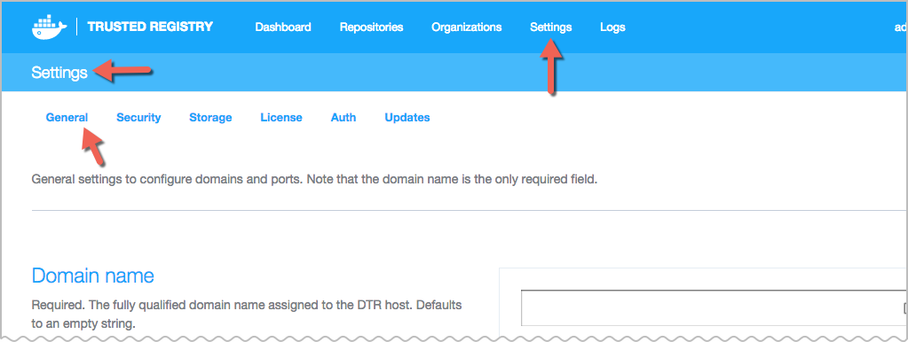
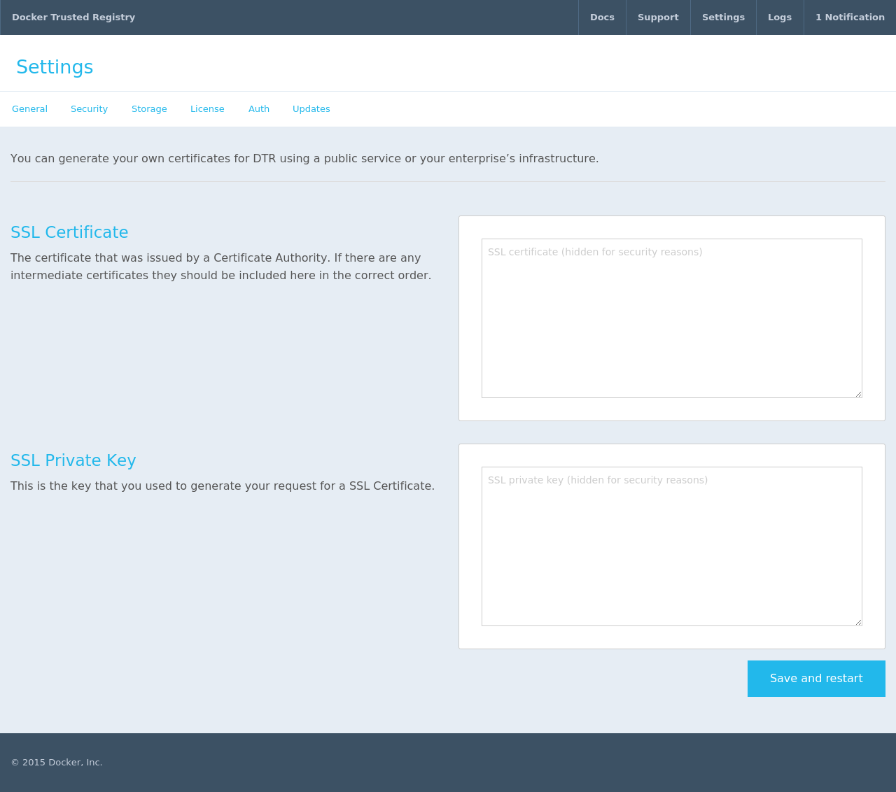
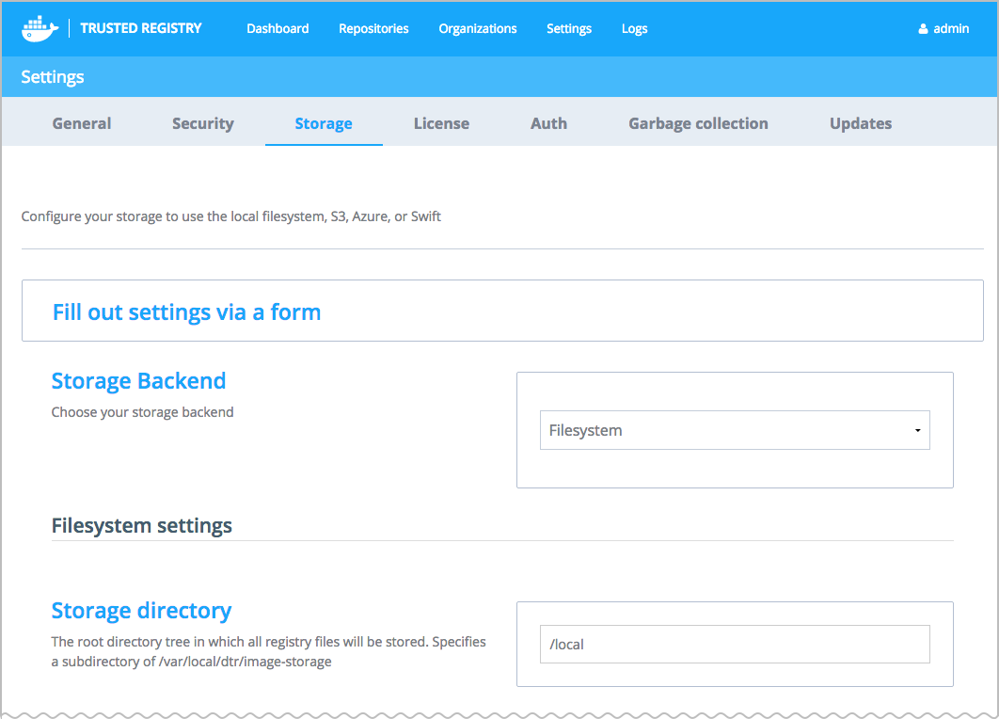
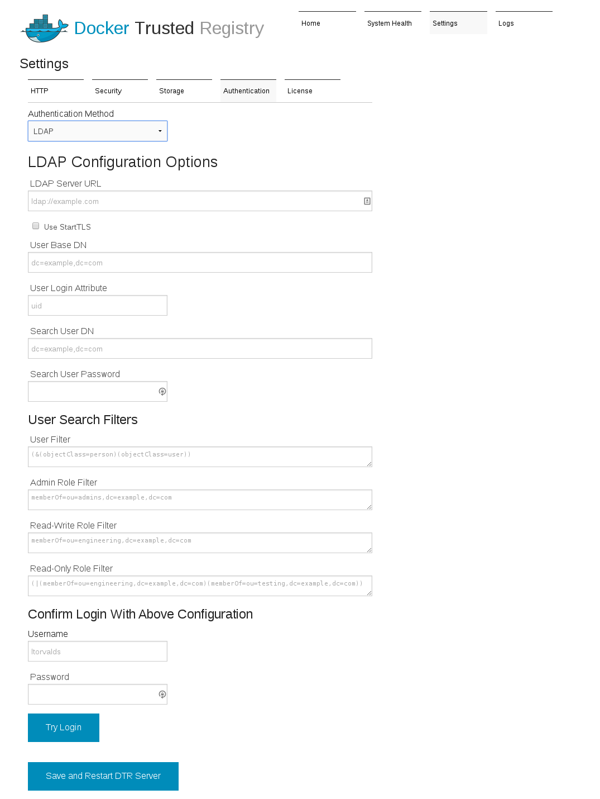

+++
title = "Configuration options"
description = "Configuration instructions for Docker Trusted Registry"
keywords = ["docker, documentation, about, technology, understanding, enterprise, hub,  registry"]
[menu.main]
parent="workw_dtr"
weight=5
+++


# Configure Docker Trusted Registry

When you first install Docker Trusted Registry, you need to configure it. Use
this documentation to configure your settings so it can run in your environment.

## Overview

To start, navigate to the Trusted Registry user interface (UI) > Settings, to
view configuration options. Configuring is grouped by the following:

* General Settings (for example, ports and proxies)
* Security settings
* Storage settings
* License
* Authentication settings
* Garbage collection
* Updates
* Docker daemon (this is set from the Trusted Registry CLI and not the UI)


Saving changes you've made to settings will restart various services, as follows:

 * General settings: full Docker Trusted Registry restart
 * License change: full Docker Trusted Registry restart
 * SSL change: Nginx reload
 * Storage config: only registries restart
 * Authentication config: no restart

## General settings



Each setting on this page is explained in the Docker Trusted Registry UI.

* *Domain Name*: **required**. By default it is an empty string. It is the fully qualified domain name assigned to the Docker Trusted Registry host.
* *HTTP Port*: defaults to 80 and is used as the entry point for the image storage service. To see load balancer status, you can query
http://&lt;dtr-host&gt;/load_balancer_status.
* *HTTPS Port*: defaults to 443, used as the secure entry point for the image storage service.
* *HTTP proxy*: defaults to an empty string, proxy server for HTTP requests.
* *HTTPS proxy*: defaults to an empty string, proxy server for HTTPS requests.
* *No proxy*: defaults to an empty string, proxy bypass for HTTP and HTTPS requests.
* *Upgrade checking*: enables or disables automatic checking for the Trusted Registry software updates.

If you need the Trusted Registry to re-generate a self-signed certificate at
some point, you can change the domain name. Whenever the domain name does not
match the current certificate, a new self-signed certificate is generated
for the new domain. This also works with IP addresses.

### Configure Notary

> **Note**: The Trusted Registry's integration of Docker Notary is an experimental feature. The use of a Notary server with Trusted Registry is not officially supported.

To use Docker Notary, first deploy your own Notary server and then integrate
with your Trusted Registry through the Settings page. Then, you'll need to
configure your Docker clients to use trust. The Trusted Registry proxies
requests to Notary, so you don't need to explicitly trust Notary's certificate
from the docker client.

Once you enable Notary integration and configure your Docker clients, your
organization can push and pull trusted images. After pushing images in this
configuration to the Trusted Registry, you can see which image tags were signed
by viewing the appropriate repositories through Trusted Registry's web
interface.

To deploy a Notary server follow the instructions at [Deploying
Notary](/engine/security/trust/deploying_notary.md). You can deploy a Notary
server on the same machine as the Trusted Registry. If you do this, you can
connect to the Notary server directly using the IP address of the `docker0`
interface. The interface's address is typically `172.17.42.1`. Read more about
[Docker Networking](/engine/userguide/networking/index.md) to learn about the
`docker0` interface. You can also connect using the machine's external IP
address and port combination provided you expose the proper port.  

Once you've deployed your Notary server, do the following:

1. Return to the Trusted Registry in your browser and configure the following
options:

  * *Notary Server*: This is the domain name or IP address where you deployed the Notary server.   

  * *Notary Verify TLS*: This is off by default and you should verify that your connection to Notary works with this turned off before trying to enable it. If Notary's certificate is signed by a public Certificate Authority, you can turn this on and it should work given that the domain name (or IP) matches the one in the certificate.

  * *Notary TLS Root CA*: If you don't use a publicly signed certificate but still want to have a secure connection between
  the Trusted Registry and Notary, then put the root Certificate Authority's certificate in this field. You can also use a self signed certificate at this location.

2. Once you've configured the Notary settings, save them. After you save, the Trusted Registry tries to connect to Notary to confirm that the address is correct. It configures itself as a reverse proxy to the Notary server to make it easier for clients to automatically use the correct Notary server.

3. Configure your Docker client to use content trust operations.

    To configure your Docker client to be able to push signed images to Docker
    Trusted Registry refer to the CLI Reference's [Environment Variables
    Section](/engine/reference/commandline/cli.md#environment-variables) and
    [Notary Section](/engine/reference/commandline/cli.md#Notary).

    This requires you to set the `DOCKER_CONTENT_TRUST` variable and configure
    your system to trust Docker Trusted Registry's TLS certificate if it doesn't
    already.

4. Use a client to push an image with trust.

5. Verify the image is signed by visiting the image repository's page through
the Trusted Registry interface.


## Security



* *SSL Certificate*: Used to enter the hash (string) from the SSL Certificate.
This cert must be accompanied by its private key, entered below.
* *SSL Private Key*: The hash from the private key associated with the provided
SSL Certificate (as a standard x509 key pair).

In order to run, the Trusted Registry requires encrypted communications through HTTPS/SSL between (a) the Trusted Registry and your Docker Engine(s), and (b) between your web browser and the Trusted Registry admin server. There are a few options for setting this up:

1. You can use the self-signed certificate Docker Trusted Registry generates by default.
2. You can generate your own certificates using a public service or your enterprise's infrastructure. See the [Generating SSL certificates](#generating-ssl-certificates) section for the options available.

If you are generating your own certificates, you can install them by following the instructions for
[Adding your own registry certificates to Docker Trusted Registry](#adding-your-own-registry-certificates-to-dtr).

However, if you choose to use the Trusted Registry-generated certificates, or
the certificates you generate yourself are not trusted by your client Docker
hosts, you will need to do one of the following:

* [Install](#installing-registry-certificates-on-client-docker-daemons) a registry certificate on all of your client Docker daemons, or

* Set your [client Docker daemons](#if-you-can-t-install-the-certificates) to run with an unconfirmed connection to the registry.

### Generate SSL certificates

There are three basic approaches to generating certificates:

1.  Most enterprises will have private key infrastructure (PKI) in place to
generate keys. Consult with your security team or whomever manages your private
key infrastructure. If you have this resource available, Docker recommends you
use it.

2. If your enterprise can't provide keys, you can use a public Certificate
Authority (CA) like "InstantSSL.com" or "RapidSSL.com" to generate a
certificate. If your certificates are generated using a globally trusted
Certificate Authority, you won't need to install them on all of your
client Docker daemons.

3. Use the self-signed registry certificate generated by Docker Trusted
Registry, and install it onto the client Docker daemon hosts as seen in the
following section.

### Add your own registry certificates

Whichever method you use to generate certificates, once you have them you can
set up your Trusted Registry server to use them.

1. Navigate to Settings > Security, and put the SSL Certificate text
(including all intermediate Certificates, starting with the host) into the "SSL
Certificate" edit box, and the previously generated Private key into the "SSL
Private Key" edit box.

2. Click Save, and then wait for the Trusted Registry Admin site to restart
and reload. It should now be using the new certificate. Once the Security page has reloaded, it displays `#` hashes instead of the
certificate text you pasted.

If your certificate is signed by a chain of Certificate Authorities that are
already trusted by your Docker daemon servers, you can skip the following
"Install registry certificates" step.

### Install registry certificates on client Docker daemons

If your certificates do not have a trusted Certificate Authority, you will need
to install them on each client Docker daemon host.

The procedure for installing the Trusted Registry certificates on each
Linux distribution has slightly different steps.

You can test this certificate using `curl`:

```
$ curl https://dtr.yourdomain.com/v2/
curl: (60) SSL certificate problem: self signed certificate
```

For details see: http://curl.haxx.se/docs/sslcerts.html

Curl performs SSL certificate verification by default, using a "bundle" of
Certificate Authority (CA) public keys (CA certs). If the default bundle file
isn't adequate, you can specify an alternate file using the `--cacert` option.
If this HTTPS server uses a certificate signed by a CA represented in the
bundle, the certificate verification probably failed due to a problem with the
certificate. For example, it might be expired, or the name might not match the
domain name in the URL.

If you'd like to turn off curl's verification of the certificate, use
 the -k (or --insecure) option.

```
$ curl --cacert /usr/local/etc/dtr/ssl/server.pem https://dtr.yourdomain.com/v2/
{"errors":[{"code":"UNAUTHORIZED","message":"access to the requested resource is not authorized","detail":null}]}
```

Continue by following the steps corresponding to your chosen OS. Run the following commands on the Trusted Registry host.

#### Ubuntu/Debian

```
    $ export DOMAIN_NAME=dtr.yourdomain.com
    $ openssl s_client -connect $DOMAIN_NAME:443 -showcerts </dev/null 2>/dev/null | openssl x509 -outform PEM | sudo tee /usr/local/share/ca-certificates/$DOMAIN_NAME.crt
    $ sudo update-ca-certificates
    Updating certificates in /etc/ssl/certs... 1 added, 0 removed; done.
    Running hooks in /etc/ca-certificates/update.d....done.
    $ sudo service docker restart
    docker stop/waiting
    docker start/running, process 29291
```

#### RHEL/Centos

```
    $ export DOMAIN_NAME=dtr.yourdomain.com
    $ openssl s_client -connect $DOMAIN_NAME:443 -showcerts </dev/null 2>/dev/null | openssl x509 -outform PEM | sudo tee /etc/pki/ca-trust/source/anchors/$DOMAIN_NAME.crt
    $ sudo update-ca-trust
    $ sudo /bin/systemctl restart docker.service
```

#### Docker Machine and Boot2Docker

You'll need to make some persistent changes using `bootsync.sh` in your
Boot2Docker-based virtual machine (as documented in [local customization](https://github.com/boot2docker/boot2docker/blob/master/doc/FAQ.md#local-customisation-with-persistent-partition)). To do this:

1. `docker-machine ssh dev` to enter the VM
2. `vi /var/lib/boot2docker/bootsync.sh` creates it if it doesn't exist, or edit it if it does.
3. Install the CA cert (or the auto-generated cert) by adding the following code to your `/var/lib/boot2docker/bootsync.sh`:

        ```
        #!/bin/sh

        cat /var/lib/boot2docker/server.pem >> /etc/ssl/certs/ca-certificates.crt
        ```

4. Next get the certificate from the new Docker Trusted Registry server using:

    ```
    $ openssl s_client -connect dtr.yourdomain.com:443 -showcerts </dev/null 2>/dev/null | openssl x509 -outform PEM | sudo tee -a /var/lib/boot2docker/server.pem
    ```

    If your certificate chain is complicated, you can use the changes in [Pull request 807](https://github.com/boot2docker/boot2docker/pull/807/files)

5. Either reboot your virtual machine, or run the following commands to
install the server certificate. Restart the Docker daemon.

    ```
    $ sudo chmod 755 /var/lib/boot2docker/bootsync.sh
    $ sudo /var/lib/boot2docker/bootsync.sh
    $ sudo /etc/init.d/docker restart`.
    ```

### If you can't install the certificates

If for some reason you can't install the certificate chain on a client Docker
host, or your certificates do not have a global CA, you can configure your
Docker daemon to run in "insecure" mode. This is done by adding an extra flag,
`--insecure-registry host-ip|domain-name`, to your client Docker daemon startup
flags. You'll need to restart the Docker daemon for the change to take effect.

This flag means that the communications between your Docker client and the Trusted Registry server are still encrypted, but the client Docker daemon is not
confirming that the Registry connection is not being hijacked or diverted.

If you enter a "Domain Name" into the Security settings, it needs to be DNS
resolvable on any client daemons that are running in `insecure-registry`
mode.

To set the flag, perform the following directions for your operating system.

#### Ubuntu

On Ubuntu 14.04 LTS, customize the Docker daemon configuration with the
`/etc/defaults/docker` file.

Open or create the `/etc/defaults/docker` file, and add the
`--insecure-registry` flag to the `DOCKER_OPTS` setting (which may need to be
added or uncommented) as follows:

```
DOCKER_OPTS="--insecure-registry dtr.yourdomain.com"
```

Then restart the Docker daemon with `sudo service docker restart`.

#### RHEL/Centos

On RHEL/Centos, customize the Docker daemon configuration with the
`/etc/sysconfig/docker` file.

Open or create the `/etc/sysconfig/docker` file, and add the
`--insecure-registry` flag to the `OPTIONS` setting (which may need to be
added or uncommented) as follows:

```
OPTIONS="--insecure-registry dtr.yourdomain.com"
```

Then restart the Docker daemon with `sudo service docker restart`.

### Docker Machine and Boot2Docker

In your Boot2Docker-based virtual machine, customize the Docker daemon
configuration with the `/var/lib/boot2docker/profile` file.

Open or create the `/var/lib/boot2docker/profile` file, and add an `EXTRA_ARGS`
setting as follows:

```
EXTRA_ARGS="--insecure-registry dtr.yourdomain.com"
```

Then restart the Docker daemon with `sudo /etc/init.d/docker restart`.

## Configure your image storage

Docker Trusted Registry image storage can be configured to use the default local
filesystem, or a cloud service such as S3 or Azure.

To set up storage settings, navigate to the Trusted Registry dashboard > Settings > Storage.

See the [Registry configuration](http://docs.docker.com/registry/configuration/)
documentation for the full options specific to each driver. Storage drivers can
be added or customized through the [Docker Registry storage driver
API](http://docs.docker.com/registry/storagedrivers/#storage-driver-api).



After you select your preferred image storage method from the drop-down menu
near the top of the page, the UI changes to reflect the configuration settings
appropriate to the selected method. You can either use the storage specific
input boxes to configure the most common settings for local filesystem, S3, or
Azure storage backends, or use the full Yaml configuration file upload to have
more detailed control. Changing your storage backend requires you to restart the
Trusted Registry.

You can view the current `storage.yaml` file on your Docker Trusted Registry
Docker host in the `/usr/local/etc/dtr/` directory.

### Filesystem settings

The [filesystem storage backend](/registry/configuration.md#filesystem)
has only one setting, the "Storage directory", the subdirectory of
`/var/local/dtr/image-storage` in which all registry files are stored. The
default value of `/local` means the files are stored in
`/var/local/dtr/image-storage/local`.

### S3 settings

If you select the [S3 storage backend](/registry/configuration.md#s3), then you
need to set  "AWS region", "Bucket name", "Access Key", and "Secret Key".

### Azure settings

Set the "Account name", "Account key", "Container", and "Realm" on the [Azure storage backend](/registry/configuration.md#azure) page.

### Openstack Swift settings

View the [openstack Swift settings](/registry/configuration.md#openstack-swift)
documentation so that you can set up your storage settings: authurl, username,
password, container, tenant, tenantid, domain, domainid, insecureskipverify,
region, chunksize, and prefix.

### Yaml configuration file

If the previous Quick setup options are not sufficient to configure your
Registry options, you can upload a YAML file. The schema of this file is
identical to that used by the [Registry](http://docs.docker.com/registry/configuration/).

If you are using the file system driver to provide local image storage, you need
to specify a root directory which gets mounted as a sub-path of
`/var/local/dtr/image-storage`. The default value of this root directory is
`/local`, so the full path to it is `/var/local/dtr/image-storage/local`.

## Authentication

Use the Authentication settings to control access to the Trusted Registry web
admin tool and to the Trusted Registry.

The current authentication methods are `None`, `Managed` and `LDAP`.

If you have issues logging into the Docker Trusted Registry admin web interface after changing the authentication settings, you may need to use the [emergency access to the Docker Trusted Registry admin web interface](adminguide.md#emergency-access-to-dtr).

### No authentication

No or `None` authentication means that everyone can access your Trusted Registry
web administration site. This is the default setting when you first install the
Trusted Registry. One of your first configuration tasks is to switch your
authentication to either managed or LDAP so you can create the Trusted Registry
administrator. Until you do so, you can't create repos nor push or pull images.

### Managed authentication

With `Managed` authentication, the Trusted Registry admin can manually control users' access by setting username/password pairs. The admin can then [use the API](http://docs.docker.com/apidocs/v1.3.3/) to give these users global "admin", "read-write" or "read-only" privileges while assigning them Organization, Team, or User repository access. The admin can also set privileges though the UI.

When you create users and assign their roles through the API, you do not need
to assign those users roles using the Trusted Registry admin UI.

* Choose the appropriate button to add one user, or to upload a CSV file containing username, password pairs, and selection boxes for "admin",
"read-write", and "read-only" roles.
* You can also create, or allow others to create the username, password pair using the
 [Account API](http://docs.docker.com/apidocs/v1.3.3/#!/accounts/func1_0).

### LDAP authentication

Use LDAP authentication to integrate your Trusted Registry into your
organization's existing LDAP user and authentication database.

To improve the performance of the Trusted Registry's Access Control Lists,
User and Group membership data is synced into Docker Trusted Registry's database
at a configurable *LDAP Sync Interval*. User passwords are not transferred
during syncing. The Trusted Registry defers to the LDAP server to validate
username/password pairs.

LDAP syncing creates new users that that do not already exist in the Trusted Registry. Any existing users that are not found by the LDAP sync are marked as inactive. You can also sync team membership with the LDAP group. This is performed after you have finished configuring your settings.

Because connecting to LDAP involves existing infrastructure external to the
Trusted Registry and Docker, you need to gather the details required to
configure the Trusted Registry for your organization's particular LDAP
implementation.

You can test that you have the correct LDAP server information by connecting to
the LDAP server from inside a Docker container running on the same server as
your Docker Trusted Registry:

If the LDAP server is configured to use *StartTLS*, then you need to
add `-Z` to the `ldapsearch` following command example.

```
docker run --rm -it svendowideit/ldapsearch -h <LDAP Server hostname> -b <User Base DN> -D <Search User DN> -w <Search User Password>
```

The result of this query should be a (very) long list. If you get an
authentication error, then the details you have are not sufficient. Contact
your organization's LDAP team.

The *User Login Attribute* key setting must match the field used in the LDAP
server for the user's login-name. On OpenLDAP, it's generally `uid`, and on
Microsoft Active Directory servers, it's `sAMAccountName`. The `ldapsearch`
output should allow you to confirm which setting you need.



#### LDAP Configuration options

* *Admin Password*: **required** use this password to login as the user `admin` in case Docker Trusted Registry is unable to authenticate you using your LDAP server. This account may be used to login to the Trusted Registry and correct identity and authentication settings.
* *LDAP Server URL*: **required** defaults to null, LDAP server URL (e.g., - ldap://example.com)
* *Use StartTLS*: defaults to unchecked, check to enable StartTLS
* *User Base DN*: **required** defaults to null, user base DN in the form (e.g., - dc=example,dc=com)
* *User Login Attribute*: **required** defaults to null, user login attribute (e.g., - uid or sAMAccountName)
* *Search User DN*: **required** defaults to null, search user DN (for example,   domain\username)
* *Search User Password*: **required** defaults to null, search user password
* *LDAP Sync Interval*: **required** defaults to 1h0m0s, sets the interval for Docker Trusted Registry to sync with the LDAP database.
* *User Search Filter*: Users on your LDAP server are synced to Docker Trusted Registry's local database using this search filter. Objects in LDAP that match
this filter and have a valid "User Login Attribute" are created as a local user
with the "User Login Attribute" as their username. Only these users are able to
login to the Trusted Registry.
* *Admin LDAP DN*: **required** This field is used to identify the group object on your LDAP server which is synced to the system administrators list.
* *Admin Group Member Attribute*: **required** This value matches the name of the attribute on this group object which corresponds to the Distinguished Name
of the group member objects.

##### Confirm login with current configuration

Test your current LDAP configuration before saving it by entering a test
username and password.   Click Try Login. If the login succeeds, your
configuration is working.

## Docker daemon logs

Both the Trusted Registry and the Docker daemon collect and store log messages. To limit duplication of the Docker daemon logs, add the following parameters in a Trusted Registry CLI to the Docker daemon and then restart the daemon.

`docker daemon --log-opt max-size 100m max-file=1`

To learn about Trusted Registry logs, view the [Logs tab](adminguide.md) in the admin guide documentation.

## See also

* To use Docker Trusted Registry, see the [User guide](userguide.md).
* View [admin tasks](adminguide.md).
* To upgrade, see the [Upgrade guide](install/upgrade.md).
* To see previous changes and fixes, refer to the [release notes](release-notes.md).
* For information on getting support for Docker Trusted Registry, go to [Support information](support.md).
