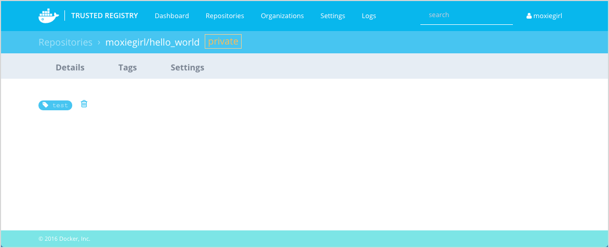
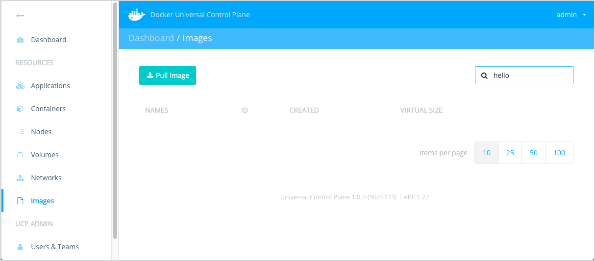

<!--[metadata]>
+++
aliases = [ "/ucp/dtr-integration/"]
title = "Integrate with Docker Trusted Registry"
description = "Integrate UCP with Docker Trusted Registry"
keywords = ["trusted, registry, integrate, UCP, DTR"]
[menu.main]
parent="mn_ucp_configuration"
identifier="ucp_integrate_dtr"
weight=10
+++
<![end-metadata]-->


# Integrate with Docker Trusted Registry

This page explains how to integrate Universal Control Plane (UCP) with the
Docker Trusted Registry (DTR). Trusted Registry is a image storage and
management service that you can install within your company's private
infrastructure.

## Prerequisites

You must have already installed DTR on your infrastructure before performing
this procedure. The DTR server and the UCP controller must be able to
communicate over your network infrastructure.

The Universal Control Plane and Trusted Registry are both part of the Docker
Datacenter solution. This means the license you use for UCP works with DTR or,
if you have a DTR license, it also works with UCP.

## Step 1. (Optional) Prepare a cert script

If you are using a self-signed or third-party CA with the Trusted Registry, you
need to the prepare a `cert_create.sh` script. You'll use this script to install
the self-signed cert on the nodes in your UCP cluster.

1. Create a file called `cert_create.sh` with your favorite editor.

2. Add the following to content to the file.

        DTR_HOST="<dtr-fully-qualified-domain-name>"
        sudo mkdir -p /etc/docker/certs.d/${DTR_HOST}
        openssl s_client -host ${DTR_HOST} -port 443 </dev/null 2>/dev/null | openssl x509 -CAform PEM | sudo tee /etc/docker/certs.d/${DTR_HOST}/ca.crt

3.  Replace the `<dtr-fully-qualified-domain-name>` value with the fully qualified DNS
    value for your DTR instance.

4. Save and close the `cert_create.sh` file.

5. Set execute permission on the file.

        $ chmod 755 cert_create.sh


## Step 2. Add the UCP cert to the Trusted Registry

In this step, you configure DTR and UCP to communicate. To do this you need an
admin level certificate bundle for UCP or terminal access to the UCP controller.
This setup also requires restarting the Docker Trusted Registry server.

1. Log into or connect to the UCP primary controller.

2. Generate the UCP certificates using the `ucp dump-certs` command.

    This command generates the certificates for the Swarm cluster.

        $ docker run --rm -it --name ucp -v /var/run/docker.sock:/var/run/docker.sock docker/ucp dump-certs  --cluster -ca > /tmp/cluster-root-ca.pem

3. Cat the `cluster-root-ca.pem` file.

        $ cat /tmp/cluster-root-ca.pem

4. Copy the UCP cluster's root CA.

    This example illustrates what you should copy, your installation certificate
    will be different.

        -----BEGIN CERTIFICATE-----
        MIIFGDCCAwCgAwIBAgIIIQjwMnZnj2gwDQYJKoZIhvcNAQENBQAwGDEWMBQGA1UE
        AxMNU3dhcm0gUm9vdCBDQTAeFw0xNjAyMTAxNzQzMDBaFw0yMTAyMDgxNzQzMDBa
        MBgxFjAUBgNVBAMTDVN3YXJtIFJvb3QgQ0EwggIiMA0GCSqGSIb3DQEBAQUAA4IC
        DwAwggIKAoICAQC5UtvO/xju7INdZkXA9TG7T6JYo1CIf5yZz9LZBDrexSAx7uPi
        7b5YmWGUA26VgBDvAFuLuQNRy/OlITNoFIEG0yovw6waLcqr597ox9d9jeaJ4ths
        ...<output snip>...
        2wDuqlzByRVTO0NL4BX0QV1J6LFtrlWU92WxTcOV8T7Zc4mzQNMHfiIZcHH/p3+7
        cRA7HVdljltI8UETcrEvTKb/h1BiPlhzpIfIHwMdA2UScGgJlaH7wA0LpeJGWtUc
        AKrb2kTIXNQq7phH
        -----END CERTIFICATE-----

5. Login to the Trusted Registry dashboard as a user.

6. Choose **Settings > General** page.

7. Locate the **Auth Bypass TLS Root CA** field.

8. Paste the UCP root CA you copied in step 4 above into this field.

9. Scroll to the bottom of the page and press **Save and restart**.


## Step 3. Add the Trusted Registry cert to UCP

You must integrate the Trusted Registry with UCP by installing the Trusted
Registry CA into your UCP.

1. Log into UCP.

2. Choose **Settings > DTR**.

3. Enter the URL of your Trusted Registry in the **URL** field.

4. Do not set the **Insecure** option.

   Regardless of whether you are using self-signed, external third-party, or
   internal certificates, setting this value means that traffic between the
   Trusted Registry and UCP is encrypted but unverified. Setting **Insecure** is
   not recommended as it makes your installation vulnerable to man-in-the-middle
   attacks.

5. (Optional) Upload the Trusted Registry root CA certificate.

    If your Trusted Registry installation is using an external, 3rd-party root
    CA you can skip this step. If your registry is using internal, corporate or
    a self-signed root CA, you *must* follow this step. To create the Trusted
    Registry root CA file:

    a. Run the following command from a machine (Linux/Mac) capable of connecting to your DTR node:

        openssl s_client -host <dtr-fully-qualified-domain-name> -port 443 </dev/null 2>/dev/null | openssl x509 -CAform PEM | tee /tmp/dtr.pem

      For example:

        $ openssl s_client -host ec2-54-187-154-87.us-west-2.compute.amazonaws.com -port 443 </dev/null 2>/dev/null | openssl x509 -CAform PEM | tee /tmp/dtr.pem

    b. Upload the `dtr.pem` file you just created.

      

6. Press **Update Registry** to save your changes.

7. (Optional) Install the Trusted Registry certificate on every UCP node in your cluster.

    This step ensures that the UCP nodes trust the registry's root CA. If your
    Trusted Registry installation is using an external, 3rd-party root CA
    you can skip this step. If your registry is using internal, corporate or a
    self-signed root CA, you *must* follow this step.

    a. Log into a UCP node using an account with `sudo` privileges.

    b. Copy the `cert_create.sh`to the node.

    c. Run the `cert_create.sh` on the node.

        $ sudo cert_create.sh

    d. Verify the cert was created.

        $ sudo cat /etc/docker/certs.d/<dtr-fully-qualified-domain-name>/ca.crt


## Step 4. Create a test repository

Before you can confirm you integration, you need to make sure you have a test
repository on the Trusted Registry.

1. Log into the Trusted Registry.

2. Choose **Repositories**.

3. Choose **New repository**.

4. Create a private repository called `hello_world` under your username.

    

5. Press **Save**.

6. Go to the **Settings** page and look for the **Domain name**.

    You'll use name value in the next section, write it down or remember it.

## Step 5. Confirm the integration

The best way to confirm the integration is to push and pull an image from a UCP
node to your test repository. In this procedure, you must use a username and
password combination that exists on both the Trusted Registry and UCP.

1. Connect to the terminal on a UCP node via an authorized UCP certificate
bundle.

2. Pull Docker's `hello-world` image.

        $ docker pull hello-world
        Using default tag: latest
        latest: Pulling from library/hello-world
        03f4658f8b78: Pull complete
        a3ed95caeb02: Pull complete
        Digest: sha256:8be990ef2aeb16dbcb9271ddfe2610fa6658d13f6dfb8bc72074cc1ca36966a7
        Status: Downloaded newer image for hello-world:latest

3. List the `hello-world` image.

        $ docker images
        REPOSITORY              TAG                 IMAGE ID            CREATED             SIZE
        ...<output snipped>...
        hello-world             latest              690ed74de00f        4 months ago        960 B

4. Retag the `hello-world` image with a new tag.

    The syntax for tagging an image is:

        docker tag <image-name> <dtr-domain-name>/<username>/<image-name>:<tag>

    Make sure to replace `<username>` with your actual username and the <ID>
    with the ID of the `hello-world` image you pulled.

        $ docker tag hello-world mydtr.company.com/moxiegirl/hello_world:test

5. List the new image.


        $ docker images
        REPOSITORY                        TAG                 IMAGE ID            CREATED             SIZE
        ...<output snipped>...
        hello-world                       latest              690ed74de00f        4 months ago        960 B
        mydtr.company.com/admin/hello_world   test                690ed74de00f        4 months ago        960 B

6. Login into the DTR instance from the command line.

    The example below uses `mydtr.company.com` as the URL for the DTR instance.
    Your's will be different.  

        $  docker login mydtr.company.com

    Provide your username, password, and email when prompted.

7. Push your newly tagged image to the DTR instance.

    The following is an example only, substitute your DTR URL and username when
    you run this command.            

        $ docker push mydtr.company.com/moxiegirl/hello_world:test
        The push refers to a repository [mydtr.company.com/moxiegirl/hello_world]
        5f70bf18a086: Pushed
        b652ec3a27e7: Pushed
        test: digest: sha256:6febc57b05c1a791edd184fd3480a33aaa63949573daa5d1bd17bb5f75477b82 size: 1941

8. Log into the Trusted Registry and confirm your repository contains the image your pushed.

    

9. Log into UCP.

10. Choose **Images** and search for `hello`.

    

11. Delete any `hello-world` or `hello_world` image.

    This step ensures the next step goes to the Trusted Registry. Once you are sure you no longer have any of your test images in UCP, go onto the next step.

12. While still on **Images**, choose **Pull Image**

13. Enter the name of your test image and press **Pull**.

    


## Troubleshooting section

This section details common problems you can encounter when working with the DTR /
UCP integration.

### Pull completes but no image is pulled

Currently, UCP does not return pull errors in the UI. If you do not get an image
with the **Pull Images** operation, check the UCP controller logs.

### Unknown authority error on push

Example:

```
% docker push mydtr.acme.com/jdoe/myrepo:latest
The push refers to a repository [mydtr.acme.com/jdoe/myrepo]
unable to ping registry endpoint https://mydtr.acme.com/v0/
v2 ping attempt failed with error: Get https://mydtr.acme.com/v2/: x509: certificate signed by unknown authority
v1 ping attempt failed with error: Get https://mydtr.acme.com/v1/_ping: x509: certificate signed by unknown authority
```

Review the trust settings in DTR and make sure they are correct. Try repasting
the first PEM block from the `chain.pem` file.

### Authentication required

Example:

```
% docker push mydtr.acme.com/jdoe/myrepo:latest
The push refers to a repository [mydtr.acme.com/jdoe/myrepo]
5f70bf18a086: Preparing
2c84284818d1: Preparing
unauthorized: authentication required
```

You must login before you can push to DTR.
