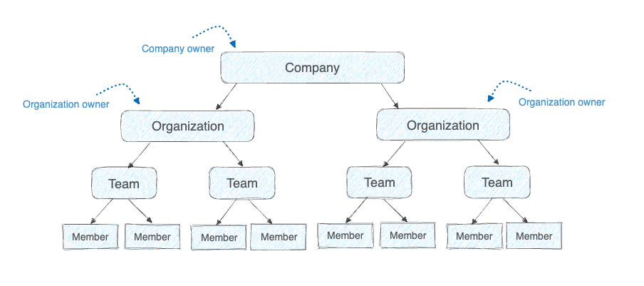



The [Docker Admin](https://admin.docker.com) console provides administrators with centralized observability, access management, and controls for their company and organizations. To provide these features, Docker uses the following hierarchy and roles.

- Company: A company simplifies the management of Docker organizations and settings. Creating a company is optional and only available to Docker Business subscribers.
  - Company owner: A company can have multiple owners. Company owners have company-wide observability and can manage company-wide settings that apply to all associated organizations. In addition, company owners have the same access as organization owners for all associated organizations.
- Organization: An organization is a collection of teams and repositories. Docker Team and Business subscribers must have at least one organization.
  - Organization owner: An organization can have multiple owners. Organization owners have observability into their organization and can manage its users and settings.
- Team: A team is a group of Docker members that belong to an organization. Organization and company owners can group members into additional teams to configure repository permissions on a per-team basis. Using teams to group members is optional.
- Member: A member is a Docker user that's a member of an organization. Organization and company owners can assign roles to members to define their permissions.

