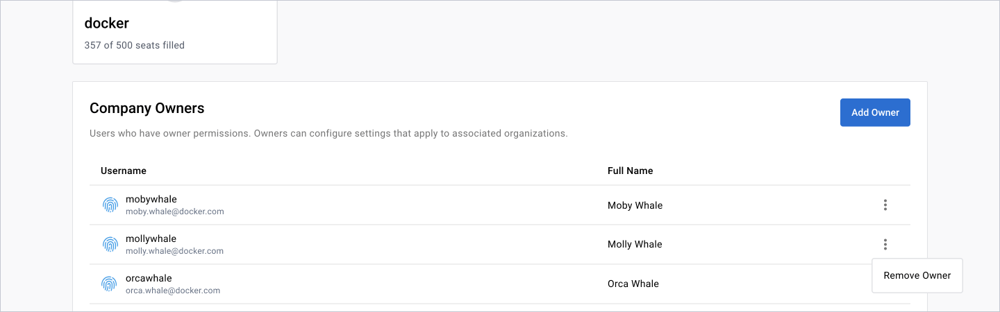

As a company owner, you can configure [Single Sign-on (SSO)](../../security/for-admins/single-sign-on/_index.md) and [System for Cross-domain Identity Management (SCIM)](../../security/for-admins/scim.md) for all organizations under the company.




## Add a company owner

1. Sign in to [Docker Hub](https://hub.docker.com/), navigate to the **Organizations** page, and select your company.
2. In the **Overview** tab, select **Add owner** and enter their Docker ID or email address.
3. After you find the user, select **Add company owner**.

Once you've selected **Add Owner**, you can view the user in the **Company owners** table.

## Remove a company owner

1. Sign in to [Docker Hub](https://hub.docker.com/), navigate to the **Organizations** page, and select your company.
2. In the **Overview** tab, find the company owner you want to remove.
3. Select the **Action** icon and remove the owner.

    






## Add a company owner

1. Sign in to the [Admin Console](https://admin.docker.com).
2. In the left navigation, select your company in the drop-down menu.
3. Select **Company owners**.
4. Select **Add owner**.
5. Specify the user's Docker ID to search for the user.
6. After you find the user, select **Add company owner**.

## Remove a company owner

1. Sign in to the [Admin Console](https://admin.docker.com).
2. In the left navigation, select your company in the drop-down menu.
3. Select **Company owners**.
4. Select the **Action** icon in the row of the company owner that your want to remove.
5. Select **Remove as company owner**.


