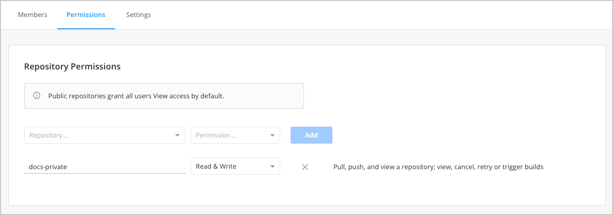

You can manage teams for your organization in Docker Hub.

A team is a group of Docker users that belong to an organization. An
organization can have multiple teams. An
organization owner can then create new teams and add members to an existing team
using their Docker ID or email address and by selecting a team the user should be part of. Members aren't required to be part of a team to be associated with an organization.

The organization owner can add additional organization owners to help them
manage users, teams, and repositories in the organization by assigning them the owner role.

## Create a team

1. Go to **Organizations** in Docker Hub, and select your organization.
2. Select the **Teams** tab and then select **Create Team**.
3. Fill out your team's information and select **Create**.
4. [Add members to your team](members.md#add-a-member-to-a-team)

## Organization owner

An organization owner is an administrator who is responsible to manage
repositories and add team members to the organization. They have full access to
private repositories, all teams, billing information, and org settings. An org
owner can also specify [permissions](#permissions-reference) for each team in
the organization. Only an org owner can enable [SSO](../../security/for-admins/single-sign-on/_index.md)
for
the organization. When SSO is enabled for your organization, the org owner can
also manage users. Docker can auto-provision Docker IDs for new end-users or
users who'd like to have a separate Docker ID for company use through SSO
enforcement.

The org owner can also add additional org owners to help them manage users, teams, and repositories in the organization.

## Configure repository permissions for a team

Organization owners can configure repository permissions on a per-team basis.
For example, you can specify that all teams within an organization have "Read and
Write" access to repositories A and B, whereas only specific teams have "Admin"
access. Note that org owners have full administrative access to all repositories within the organization.

To give a team access to a repository

1. Navigate to **Organizations** in Docker Hub, and select your organization.
2. Select the **Teams** tab and select the team that you'd like to configure repository access to.
3. Select the **Permissions** tab and select a repository from the
   **Repository** drop-down.
4. Choose a permission from the **Permissions** drop-down list and select
   **Add**.

    

Organization owners can also assign members the editor role to grant partial administrative access. See [Roles and permissions](../../security/for-admins/roles-and-permissions.md) for more about the editor role.

### Permissions reference

- `Read-only` access lets users view, search, and pull a private repository in the same way as they can a public repository.
- `Read & Write` access lets users pull, push, and view a repository. In addition, it lets users view, cancel, retry or trigger builds
- `Admin` access lets users pull, push, view, edit, and delete a
  repository. You can also edit build settings, and update the repositories description, collaborators rights, public/private visibility, and delete.

Permissions are cumulative. For example, if you have "Read & Write" permissions,
you automatically have "Read-only" permissions:

| Action | Read-only | Read & Write | Admin |
|:------------------:|:---------:|:------------:|:-----:|
| Pull a Repository | ✅ | ✅ | ✅ |
| View a Repository | ✅ | ✅ | ✅ |
| Push a Repository | ❌ | ✅ | ✅ |
| Edit a Repository | ❌ | ❌ | ✅ |
| Delete a Repository | ❌ | ❌ | ✅ |
| Update a Repository Description | ❌ | ❌ | ✅ |
| View Builds | ✅ | ✅ | ✅ |
| Cancel Builds | ❌ | ✅ | ✅ |
| Retry Builds | ❌ | ✅ | ✅ |
| Trigger Builds | ❌ | ✅ | ✅ |
| Edit Build Settings | ❌ | ❌ | ✅ |

> **Note**
>
> A user who hasn't verified their email address only has
> `Read-only` access to the repository, regardless of the rights their team
> membership has given them.

## View a team's permissions for all repositories

To view a team's permissions across all repositories:

1. Open **Organizations** > **_Your Organization_** > **Teams** > **_Team Name_**.
2. Select the **Permissions** tab, where you can view the repositories this team can access.

## Videos

You can also check out the following videos for information about creating Teams
and Organizations in Docker Hub.

- [Overview of organizations](https://www.youtube-nocookie.com/embed/G7lvSnAqed8)
- [Create an organization](https://www.youtube-nocookie.com/embed/b0TKcIqa9Po)
- [Working with Teams](https://www.youtube-nocookie.com/embed/MROKmtmWCVI)
- [Create Teams](https://www.youtube-nocookie.com/embed/78wbbBoasIc)