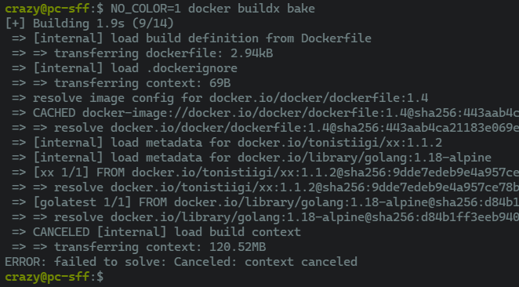

BuildKit and Buildx have support for modifying the colors that are used to
output information to the terminal. You can set the environment variable
`BUILDKIT_COLORS` to something like `run=123,20,245:error=yellow:cancel=blue:warning=white`
to set the colors that you would like to use:

Setting `NO_COLOR` to anything will disable any colorized output as recommended
by [no-color.org](https://no-color.org/){:target="blank" rel="noopener" class=""}:

> **Note**
>
> Parsing errors will be reported but ignored. This will result in default
> color values being used where needed.

See also [the list of pre-defined colors](https://github.com/moby/buildkit/blob/master/util/progress/progressui/colors.go){:target="blank" rel="noopener" class=""}.
