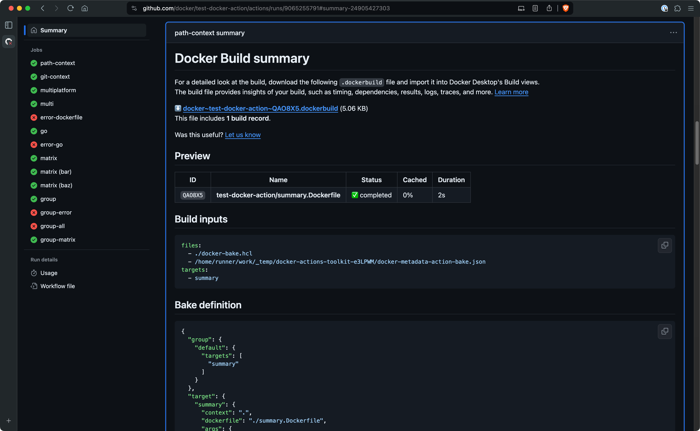
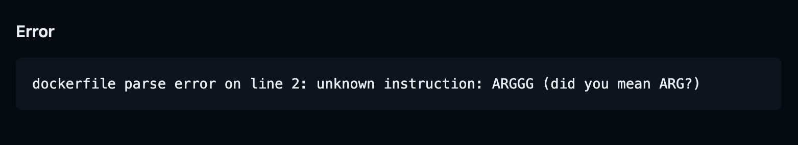

Docker's GitHub Actions for building and pushing images generate a job summary
for your build that outlines the execution and materials used:

- A summary showing the Dockerfile used, the build duration, and cache utilization
- Inputs for the build, such as build arguments, tags, labels, and build contexts
- For builds with [Bake](../../bake/_index.md), the full bake definition for the build



Job summaries for Docker builds appear automatically if you use the following
versions of the [Build and push Docker images](https://github.com/marketplace/actions/build-and-push-docker-images)
or [Docker Buildx Bake](https://github.com/marketplace/actions/docker-buildx-bake)
GitHub Actions:

- `docker/build-push-action@v5.4.0` or `docker/build-push-action@v5`
- `docker/bake-action@v4.6.0` or `docker/bake-action@v4`

> **Note**
>
> Job summaries are not yet supported with [Docker Build Cloud](../../cloud/_index.md).

To view the job summary, open the details page for the job in GitHub after the
job has finished. The summary is available for both failed and successful
builds. In the case of a failed build, the summary also displays the error
message that caused the build to fail:



## Disable job summary

To disable job summaries, set the `DOCKER_BUILD_NO_SUMMARY` environment
variable in the YAML configuration for your build step:

```yaml {hl_lines=5}
      -
        name: Build
        uses: docker/docker-build-push-action@v5
        env:
          DOCKER_BUILD_NO_SUMMARY: true
        with:
          context: .
          tags: ${{ steps.meta.outputs.tags }}
          labels: ${{ steps.meta.outputs.labels }}
```
