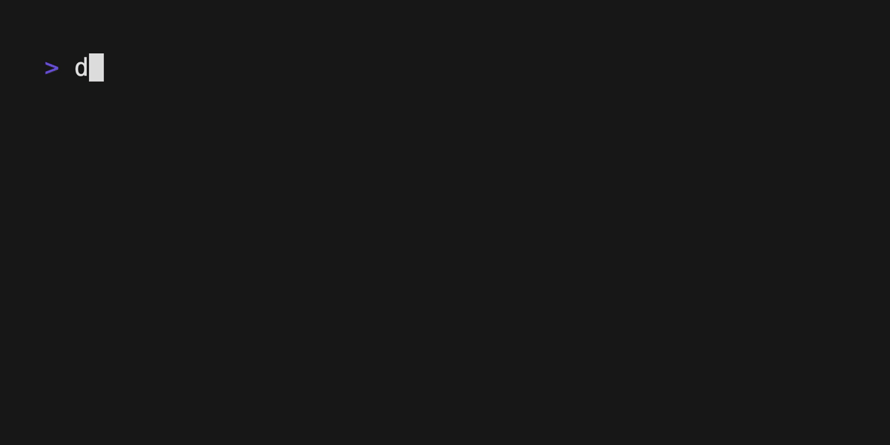

This section explores multi-stage builds. There are two main reasons for why
you’d want to use multi-stage builds:

- They allow you to run build steps in parallel, making your build pipeline
  faster and more efficient.
- They allow you to create a final image with a smaller footprint, containing
  only what's needed to run your program.

In a Dockerfile, a build stage is represented by a `FROM` instruction. The
Dockerfile from the previous section doesn’t leverage multi-stage builds. It’s
all one build stage. That means that the final image is bloated with resources
used to compile the program.

```console
$ docker build --tag=buildme .
$ docker images buildme
REPOSITORY   TAG       IMAGE ID       CREATED         SIZE
buildme      latest    c021c8a7051f   5 seconds ago   150MB
```

The program compiles to executable binaries, so you don’t need Go language
utilities to exist in the final image.

## Add stages

Using multi-stage builds, you can choose to use different base images for your
build and runtime environments. You can copy build artifacts from the build
stage over to the runtime stage.

Modify the Dockerfile as follows. This change creates another stage using a
minimal `scratch` image as a base. In the final `scratch` stage, the binaries
built in the previous stage are copied over to the filesystem of the new stage.

```diff
  # syntax=docker/dockerfile:1
  FROM golang:{}-alpine
  WORKDIR /src
  COPY go.mod go.sum .
  RUN go mod download
  COPY . .
  RUN go build -o /bin/client ./cmd/client
  RUN go build -o /bin/server ./cmd/server
+
+ FROM scratch
+ COPY --from=0 /bin/client /bin/server /bin/
  ENTRYPOINT [ "/bin/server" ]
```

Now if you build the image and inspect it, you should see a significantly
smaller number:

```console
$ docker build --tag=buildme .
$ docker images buildme
REPOSITORY   TAG       IMAGE ID       CREATED         SIZE
buildme      latest    436032454dd8   7 seconds ago   8.45MB
```

The image went from 150MB to only just 8.45MB in size. That’s because the
resulting image only contains the binaries, and nothing else.

## Parallelism

You've reduced the footprint of the image. The following step shows how you can
improve build speed with multi-stage builds, using parallelism. The build
currently produces the binaries one after the other. There is no reason why you
need to build the client before building the server, or vice versa.

You can split the binary-building steps into separate stages. In the final
`scratch` stage, copy the binaries from each corresponding build stage. By
segmenting these builds into separate stages, Docker can run them in parallel.

The stages for building each binary both require the Go compilation tools and
application dependencies. Define these common steps as a reusable base stage.
You can do that by assigning a name to the stage using the pattern
`FROM image AS stage_name`. This allows you to reference the stage name in a
`FROM` instruction of another stage (`FROM stage_name`).

You can also assign a name to the binary-building stages, and reference the
stage name in the `COPY --from=stage_name` instruction when copying the binaries
to the final `scratch` image.

```diff
  # syntax=docker/dockerfile:1
- FROM golang:{}-alpine
+ FROM golang:{}-alpine AS base
  WORKDIR /src
  COPY go.mod go.sum .
  RUN go mod download
  COPY . .
+
+ FROM base AS build-client
  RUN go build -o /bin/client ./cmd/client
+
+ FROM base AS build-server
  RUN go build -o /bin/server ./cmd/server

  FROM scratch
- COPY --from=0 /bin/client /bin/server /bin/
+ COPY --from=build-client /bin/client /bin/
+ COPY --from=build-server /bin/server /bin/
  ENTRYPOINT [ "/bin/server" ]
```

Now, instead of first building the binaries one after the other, the
`build-client` and `build-server` stages are executed simultaneously.



## Build targets

The final image is now small, and you’re building it efficiently using
parallelism. But this image is slightly strange, in that it contains both the
client and the server binary in the same image. Shouldn’t these be two different
images?

It’s possible to create multiple different images using a single Dockerfile. You
can specify a target stage of a build using the `--target` flag. Replace the
unnamed `FROM scratch` stage with two separate stages named `client` and
`server`.

```diff
  # syntax=docker/dockerfile:1
  FROM golang:{}-alpine AS base
  WORKDIR /src
  COPY go.mod go.sum .
  RUN go mod download
  COPY . .

  FROM base AS build-client
  RUN go build -o /bin/client ./cmd/client

  FROM base AS build-server
  RUN go build -o /bin/server ./cmd/server

- FROM scratch
- COPY --from=build-client /bin/client /bin/
- COPY --from=build-server /bin/server /bin/
- ENTRYPOINT [ "/bin/server" ]

+ FROM scratch AS client
+ COPY --from=build-client /bin/client /bin/
+ ENTRYPOINT [ "/bin/client" ]

+ FROM scratch AS server
+ COPY --from=build-server /bin/server /bin/
+ ENTRYPOINT [ "/bin/server" ]
```

And now you can build the client and server programs as separate Docker images
(tags):

```console
$ docker build --tag=buildme-client --target=client .
$ docker build --tag=buildme-server --target=server .
$ docker images "buildme*" 
REPOSITORY       TAG       IMAGE ID       CREATED          SIZE
buildme-client   latest    659105f8e6d7   20 seconds ago   4.25MB
buildme-server   latest    666d492d9f13   5 seconds ago    4.2MB
```

The images are now even smaller, about 4 MB each.

This change also avoids having to build both binaries each time. When selecting
to build the `client` target, Docker only builds the stages leading up to
that target. The `build-server` and `server` stages are skipped if they’re not
needed. Likewise, building the `server` target skips the `build-client` and
`client` stages.

## Summary

Multi-stage builds are useful for creating images with less bloat and a smaller
footprint, and also helps to make builds run faster.

Related information:

- [Multi-stage builds](../building/multi-stage.md)
- [Base images](../building/base-images.md)

## Next steps

The next section describes how you can use file mounts to further improve build
speeds.


