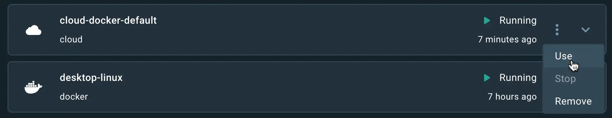

> **Early Access**
>
> Docker Hydrobuild is an early-access service that provides cloud-based
> builders for your Docker organization.
>
> If you want to get involved in testing Hydrobuild, you can
> [sign up for the early access program](https://www.docker.com/build-early-access-program/?utm_source=docs).
{ .restricted }

Hydrobuild is a service that lets you build your container images faster, both
locally and in CI. Builds run on cloud infrastructure optimally dimensioned for
your workloads, no configuration required. The service uses a remote build
cache, ensuring fast builds anywhere and for all team members.

## How Hydrobuild works

Using Hydrobuild is no different from running a regular build. You invoke a
build the same way you normally would, using `docker buildx build`. The
difference is in where and how that build gets executed.

By default when you invoke a build command, the build runs on a local instance
of BuildKit, bundled with the Docker daemon. With Hydrobuild, you send the
build request to a BuildKit instance running remotely, in the cloud.

The remote builder executes the build steps, and sends the resulting build
output to the destination that you specify. For example, back to your local
Docker Engine image store, or to an image registry.

Hydrobuild provides several benefits over local builds:

- Improved build speed
- Shared build cache
- Native multi-platform builds

And the best part: you don't need to worry about managing builders or
infrastructure. Just connect to your builders, and start building.

## Setup

To get started with Hydrobuild, you need to:

- Download and install a version of Buildx that supports Hydrobuild.

- Have a Docker ID that's part of a Docker organization participating in the
  [Hydrobuild early access program](https://www.docker.com/build-early-access-program/?utm_source=docs).

Docker Desktop 4.23.0 and later versions ship with a Hydrobuild-compatible
Buildx binary. Alternatively, you can download and install the binary manually
from [this repository](https://github.com/docker/buildx-desktop).

## Connect to Hydrobuild

To start using Hydrobuild, you must first add the builder's endpoint to your
local Docker configuration.




1. Sign in to your Docker account

   ```console
   $ docker login
   ```

2. Add the Hydrobuild endpoint.

   ```console
   $ docker buildx create --driver cloud <ORG>/default
   ```

   Replace `ORG` with the Docker Hub namespace of your Docker organization.

This creates a builder named `cloud-ORG-default`.




Enable the [Builds view](../desktop/use-desktop/builds.md) in Docker Desktop
and complete the following steps:

1. Sign in to your Docker account using the **Sign in** button in Docker Desktop.

2. Open the Docker Desktop settings and navigate to the **Builders** tab.

3. Under **Available builders**, select **Create builder**.

   




The builder has native support for the `linux/amd64` and `linux/arm64`
architectures. This gives you a high-performance build cluster for building
multi-platform images natively.

## Use Hydrobuild from the CLI

To build using Hydrobuild, invoke a build command and specify the name of the
builder using the `--builder` flag.

```console
$ docker buildx build --builder cloud-<ORG>-default --tag <IMAGE> .
```

If you want to use Hydrobuild without having to specify the `--builder` flag
each time, you can set it as the default builder.




Run the following command:

```console
$ docker buildx use cloud-<ORG>-default --global
```




1. Open the Docker Desktop settings and navigate to the **Builders** tab.
2. Find the Hydrobuild builder under **Available builders**.
3. Open the drop-down menu and select **Use**.

   




Changing your default builder with `docker buildx use` only changes the default
builder for the `docker buildx build` command. The `docker build` command still
uses the `default` builder, unless you specify the `--builder` flag explicitly.

If you use build scripts, such as `make`, we recommend that you update your
build commands from `docker build` to `docker buildx build`, to avoid any
confusion with regards to builder selection. Alternatively, you can run `docker
buildx install` to make the default `docker build` command behave like `docker
buildx build`, without discrepancies.

## Loading build results

Building with `--tag` loads the build result to the local image store
automatically when the build finishes. To build without a tag and load the
result, you must pass the `--load` flag.

Loading the build result for multi-platform images is not supported. Use the
`docker buildx build --push` flag when building multi-platform images to push
the output to a registry.

```console
$ docker buildx build --builder cloud-<ORG>-default \
  --platform linux/amd64,linux/arm64 \
  --tag <IMAGE> \
  --push .
```

If you want to build with a tag, but you don't want to load the results to your
local image store, you can export the build results to the build cache only:

```console
$ docker buildx build --builder cloud-<ORG>-default \
  --platform linux/amd64,linux/arm64 \
  --tag <IMAGE> \
  --output type=cacheonly .
```

## Multi-platform builds

To run multi-platform builds, you must specify all of the platforms that you
want to build for using the `--platform` flag.

```console
$ docker buildx build --builder cloud-<ORG>-default \
  --platform linux/amd64,linux/arm64 \
  --tag <IMAGE> \
  --push .
```

If you don't specify the platform, Hydrobuild automatically builds for the
architecture matching your local environment.

To learn more about building for multiple platforms, refer to [Multi-platform
builds](./building/multi-platform.md).

## Use Hydrobuild in CI

Using Hydrobuild in CI can speed up your build pipelines, which means less time
spent waiting and context switching. You control your CI workflows as usual,
and delegate the build execution to Hydrobuild.

Building with Hydrobuild in CI involve the following steps:

1. Sign in to a Docker account.
2. Set up Buildx and create the builder.
3. Run the build.

When using Hydrobuild in CI, it's recommended that you push the result to a
registry directly, rather than loading the image and then pushing it. Pushing
directly speeds up your builds and avoids unnecessary file transfers.

If you just want to build and discard the output, export the results to the
build cache or build without tagging the image. Hydrobuild automatically loads
the build result if you build a tagged image. See [Loading build
results](#loading-build-results) for details.




```yaml
name: ci

on:
  push:
    branches:
      - "main"

jobs:
  docker:
    runs-on: ubuntu-latest
    steps:
      - name: Checkout
        uses: actions/checkout@v4
      - name: Log in to Docker Hub
        uses: docker/login-action@v3
        with:
          username: ${{ secrets.DOCKER_USER }}
          password: ${{ secrets.DOCKER_PAT }}
      - name: Set up Docker Buildx
        uses: docker/setup-buildx-action@v3
        with:
          version: "lab:latest"
          driver: cloud
          endpoint: "<ORG>/default"
      - name: Build and push
        uses: docker/build-push-action@v5
        with:
          context: .
          tags: "<IMAGE>"
          # For pull requests, export results to the build cache.
          # Otherwise, push to a registry.
          outputs: ${{ github.event_name == 'pull_request' && 'type=cacheonly' || 'type=registry,push=true' }}
```




```yaml
default:
  image: docker:24-dind
  services:
    - docker:24-dind
  before_script:
    - docker info
    - echo "$DOCKER_PAT" | docker login --username "$DOCKER_USER" --password-stdin
    - |
      apk add curl jq
      ARCH=${CI_RUNNER_EXECUTABLE_ARCH#*/}
      BUILDX_URL=$(curl -s https://raw.githubusercontent.com/docker/actions-toolkit/main/.github/buildx-lab-releases.json | jq -r ".latest.assets[] | select(endswith(\"linux-$ARCH\"))")
      mkdir -vp ~/.docker/cli-plugins/
      curl --silent -L --output ~/.docker/cli-plugins/docker-buildx $BUILDX_URL
      chmod a+x ~/.docker/cli-plugins/docker-buildx
    - docker buildx create --use --driver cloud ${DOCKER_ORG}/default

variables:
  IMAGE_NAME: <IMAGE>
  DOCKER_ORG: <ORG>

# Build multi-platform image and push to a registry
build_push:
  stage: build
  script:
    - |
      docker buildx build \
        --platform linux/amd64,linux/arm64 \
        --tag "${IMAGE_NAME}:${CI_COMMIT_SHORT_SHA}" \
        --push .

# Build an image and discard the result
build_cache:
  stage: build
  script:
    - |
      docker buildx build \
        --platform linux/amd64,linux/arm64 \
        --tag "${IMAGE_NAME}:${CI_COMMIT_SHORT_SHA}" \
        --output type=cacheonly \
        --push .
```




```yaml
version: 2.1

jobs:
  # Build multi-platform image and push to a registry
  build_push:
    machine:
      image: ubuntu-2204:current
    steps:
      - checkout

      - run: |
          mkdir -vp ~/.docker/cli-plugins/
          ARCH=amd64
          BUILDX_URL=$(curl -s https://raw.githubusercontent.com/docker/actions-toolkit/main/.github/buildx-lab-releases.json | jq -r ".latest.assets[] | select(endswith(\"linux-$ARCH\"))")
          curl --silent -L --output ~/.docker/cli-plugins/docker-buildx $BUILDX_URL
          chmod a+x ~/.docker/cli-plugins/docker-buildx

      - run: echo "$DOCKER_PAT" | docker login --username $DOCKER_USER --password-stdin
      - run: docker buildx create --use --driver cloud "<ORG>/default"

      - run: |
          docker buildx build \
          --platform linux/amd64,linux/arm64 \
          --push \
          --tag "<IMAGE>" .

  # Build an image and discard the result
  build_cache:
    machine:
      image: ubuntu-2204:current
    steps:
      - checkout

      - run: |
          mkdir -vp ~/.docker/cli-plugins/
          ARCH=amd64
          BUILDX_URL=$(curl -s https://raw.githubusercontent.com/docker/actions-toolkit/main/.github/buildx-lab-releases.json | jq -r ".latest.assets[] | select(endswith(\"linux-$ARCH\"))")
          curl --silent -L --output ~/.docker/cli-plugins/docker-buildx $BUILDX_URL
          chmod a+x ~/.docker/cli-plugins/docker-buildx

      - run: echo "$DOCKER_PAT" | docker login --username $DOCKER_USER --password-stdin
      - run: docker buildx create --use --driver cloud "<ORG>/default"

      - run: |
          docker buildx build \
          --tag temp \
          --output type=cacheonly \
          .

workflows:
  pull_request:
    jobs:
      - build_cache
  release:
    jobs:
      - build_push
```




```bash
#!/bin/bash

# Get download link for latest buildx binary. Set $ARCH to the CPU architecture (e.g. amd64, arm64)
ARCH=amd64
BUILDX_URL=$(curl -s https://raw.githubusercontent.com/docker/actions-toolkit/main/.github/buildx-lab-releases.json | jq -r ".latest.assets[] | select(endswith(\"linux-$ARCH\"))")

# Download docker buildx with Hyrdobuild support
mkdir -vp ~/.docker/cli-plugins/
curl --silent -L --output ~/.docker/cli-plugins/docker-buildx $BUILDX_URL
chmod a+x ~/.docker/cli-plugins/docker-buildx

# Login to Docker Hub. For security reasons $DOCKER_PAT should be a Personal Access Token. See https://docs.docker.com/security/for-developers/access-tokens/
echo "$DOCKER_PAT" | docker login --username $DOCKER_USER --password-stdin

# Connect to your builder and set it as the default builder
docker buildx create --use --driver cloud "<ORG>/default"

# Cache-only image build
docker buildx build \
    --tag temp \
    --output type=cacheonly \
    .

# Build, tag, and push a multi-arch docker image
docker buildx build \
    --platform linux/amd64,linux/arm64 \
    --push \
    --tag "<IMAGE>" \
    .
```




## Hydrobuild in Docker Desktop

The Docker Desktop [Builds view](../desktop/use-desktop/builds.md) works with
Hydrobuild out of the box. With Hydrobuild, the Builds view becomes a
collaboration tool, showing information about not only your own builds, but
also builds initiated by your team members using the same builder.

Teams using a shared builder get access to information such as:

- Ongoing and completed builds
- Build configuration, statistics, dependencies, and results
- Build source (Dockerfile)
- Build logs and errors

This lets you and your team can work collaboratively on troubleshooting and
improving build speeds, without having to send build logs and benchmarks back
and forth between each other.

## Optimize for building in the cloud

Hydrobuild runs your builds remotely, and not on the machine where you invoke
the build. This means that file transfers between the client and builder happens
over the network.

Transferring files over the network has a higher latency and lower bandwidth
than local transfers. Hydrobuild has several features to mitigate this:

- It uses attached storage volumes for build cache, which makes reading and
  writing cache very fast.
- Loading build results back to the client only pulls the layers that were
  changed compared to previous builds.

Despite these optimizations, building remotely can still yield slow context
transfers and image loads, for large projects or if the network connection is
slow. Here are some ways that you can optimize your builds to make the transfer
more efficient:

- [Dockerignore files](#dockerignore-files)
- [Slim base images](#slim-base-images)
- [Multi-stage builds](#multi-stage-builds)
- [Fetch remote files in build](#fetch-remote-files-in-build)
- [Multi-threaded tools](#multi-threaded-tools)

### Dockerignore files

Using a [`.dockerignore` file](./building/context.md#dockerignore-files), you can be
explicit about which local files that you don’t want to include in the build
context. Files caught by the glob patterns you specify in your ignore-file are
not transferred to the remote builder.

Some examples of things you might want to add to your `.dockerignore` file are:

- `.git` — skip sending the version control history in the build context. Note
  that this means you won’t be able to run Git commands in your build steps,
  such as `git rev-parse` etc.
- Directories containing build artifacts, such as binaries. Build artifacts
  created locally during development.
- Vendor directories for package managers, such as `node_modules`.

In general, the contents of your `.dockerignore` file should be similar to what
you have in your `.gitignore`.

### Slim base images

Selecting smaller images for your `FROM` instructions in your Dockerfile can
help reduce the size of the final image. The [Alpine image](https://hub.docker.com/_/alpine)
is a good example of a minimal Docker image that provides all of the OS
utilities you would expect from a Linux container.

There’s also the [special `scratch` image](https://hub.docker.com/_/scratch),
which contains nothing at all. Useful for creating images of statically linked
binaries, for example.

### Multi-stage builds

[Multi-stage builds](./guide/multi-stage.md) can make your build run faster,
because stages can run in parallel. It can also make your end-result smaller.
Write your Dockerfile in such a way that the final runtime stage uses the
smallest possible base image, with only the resources that your program requires
to run.

It’s also possible to
[copy resources from other images or stages](./building/multi-stage.md#name-your-build-stages),
using the Dockerfile `COPY --from` instruction. This technique can reduce the
number of layers, and the size of those layers, in the final stage.

### Fetch remote files in build

When possible, you should fetch files from a remote location in the build,
rather than bundling the files into the build context. Downloading files on the
Hydrobuild server directly is better, because it will likely be faster than
transferring the files with the build context.

You can fetch remote files during the build using the
[Dockerfile `ADD` instruction](../engine/reference/builder.md#add),
or in your `RUN` instructions with tools like `wget` and `rsync`.

### Multi-threaded tools

Some tools that you use in your build instructions may not utilize multiple
cores by default. One such example is `make` which uses a single thread by
default, unless you specify the `make --jobs=<n>` option. For build steps
involving such tools, try checking if you can optimize the execution with
parallelization.

## Frequently asked questions

### How do I remove Hydrobuild from my system?

If you want to stop using Hydrobuild, and remove it from your system, remove
the builder using the `docker buildx rm` command.

```console
$ docker buildx rm cloud-<ORG>-default
```

This doesn't deprovision the builder backend, it only removes the builder from
your local Docker client.

### Are builders shared between organizations?

No. Each Hydrobuild builder provisioned to an organization is completely
isolated to a single Amazon EC2 instance, with a dedicated EBS volume for build
cache, and end-to-end encryption. That means there are no shared processes or
data between Hydrobuild jobs.

### Do I need to add my secrets the builder to access private resources?

No. Your interface to Hydrobuild is Buildx, and you can use the existing
`--secret` and `--ssh` CLI flags for managing build secrets.

For more information, refer to:

- [docker buildx build --secret](../engine/reference/commandline/buildx_build.md#secret)
- [docker buildx build --ssh](../engine/reference/commandline/buildx_build.md#ssh)

### How do I unset Hydrobuild as the default builder?

If you've set Hydrobuild as the default builder and want to revert to using the
default `docker` builder, run the following command:

```console
$ docker context use default
```

### How do I manage the build cache with Hydrobuild?

You don't need to manage the builder's cache manually. The system manages it
for you through [garbage collection](./cache/garbage-collection.md).

Hydrobuild uses the following garbage collection limits:

- Size: 90% of 1TB
- Age: cache not used in the past 180 days
- Number of build history records: 10 000

Old cache is automatically removed if you hit any of these limits. You can
check your current cache state using the [`docker buildx du`
command](../engine/reference/commandline/buildx_du.md).

To clear the builder's cache manually, you can use the [`docker buildx prune`
command](../engine/reference/commandline/buildx_prune.md) command. This works
like pruning the cache for any other builder.

> **Note**
>
> Pruning Hydrobuild cache also removes the cache for other team members using
> the same builder.
