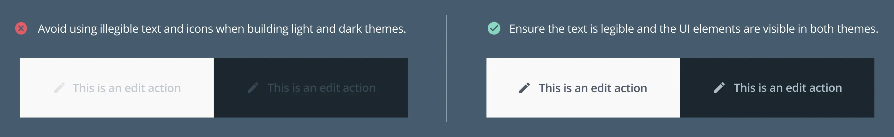
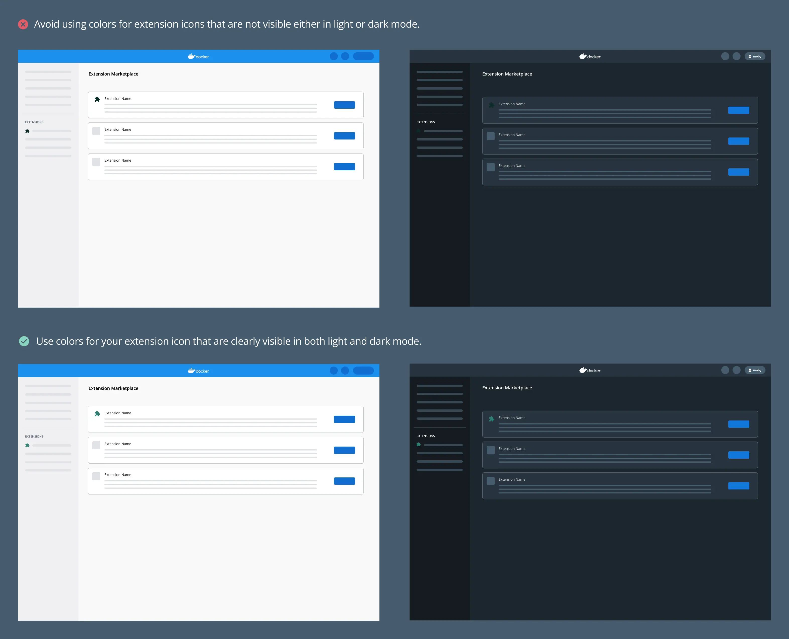
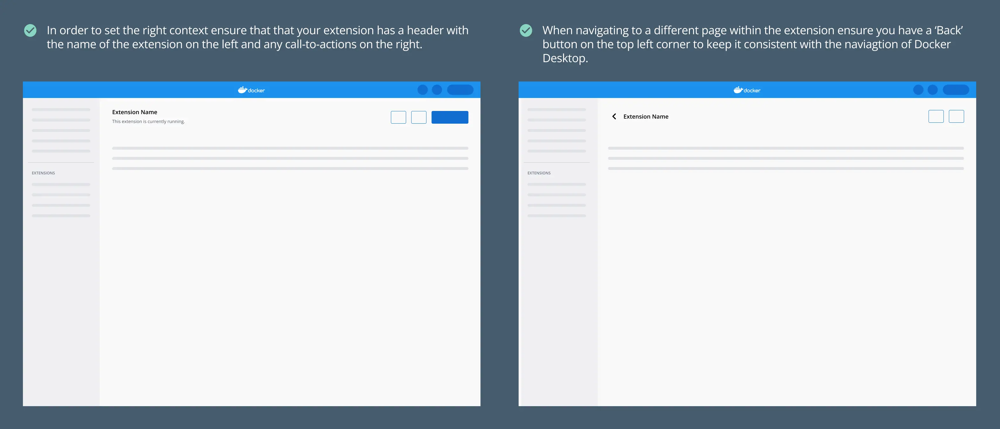
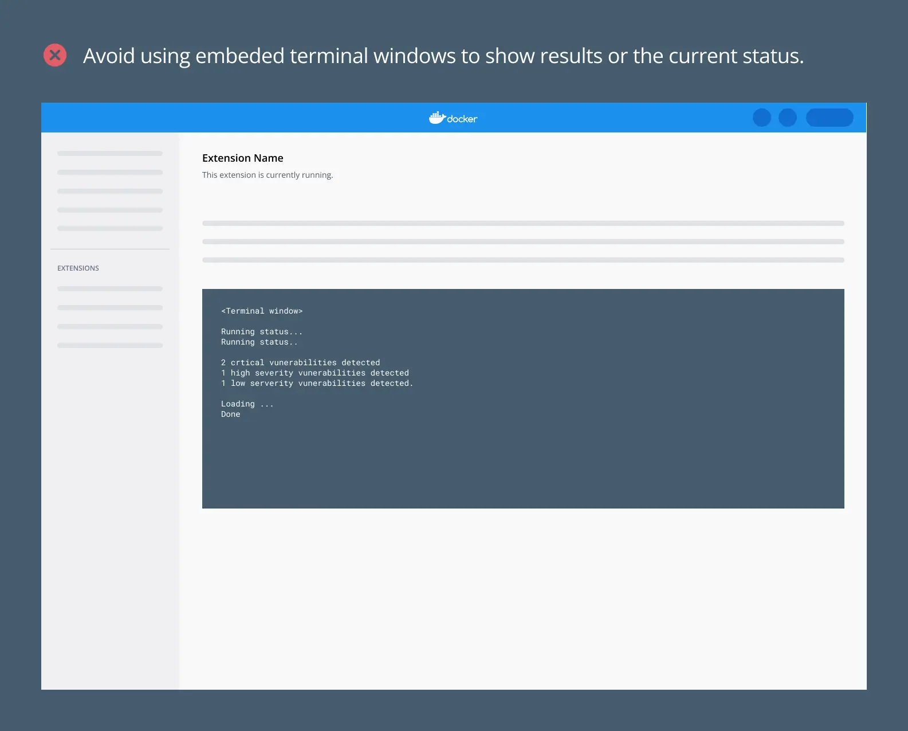
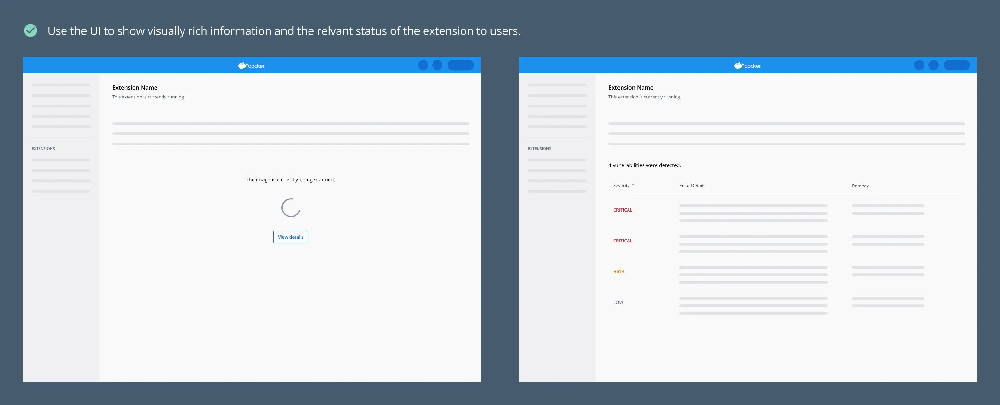
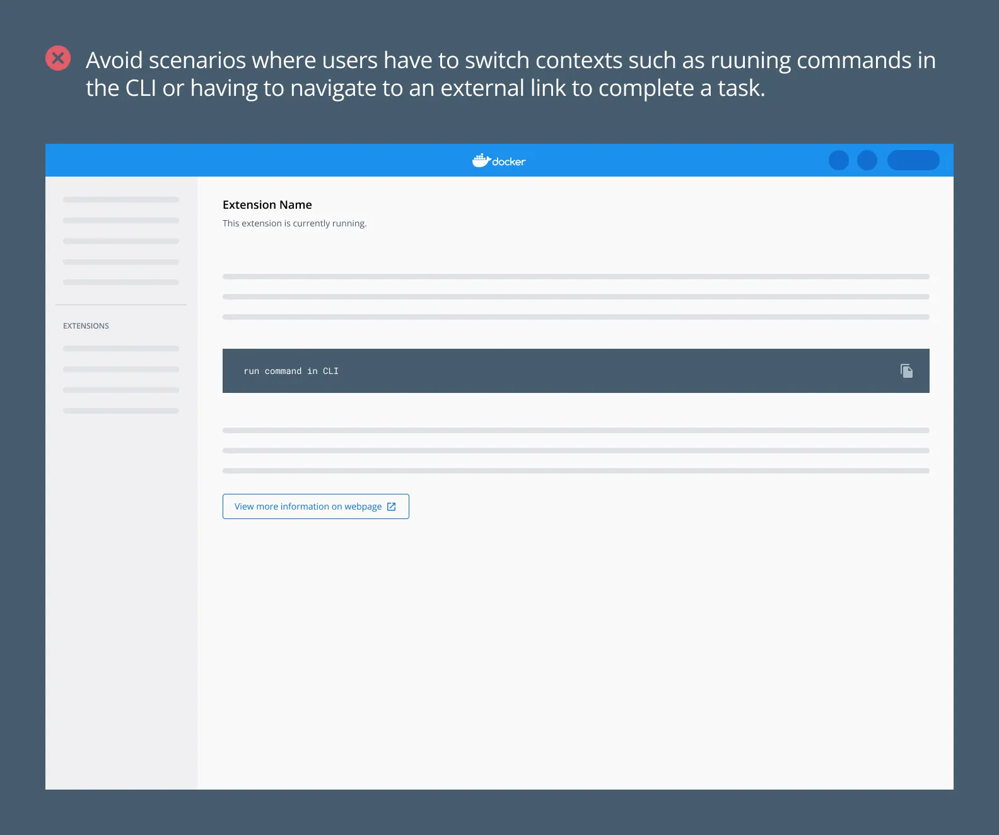
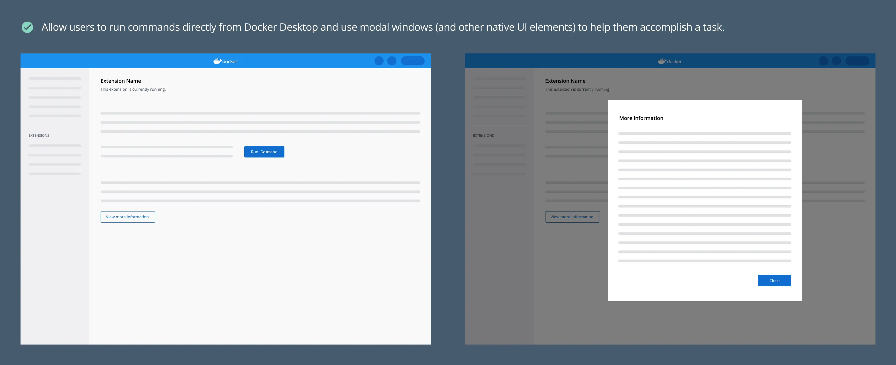
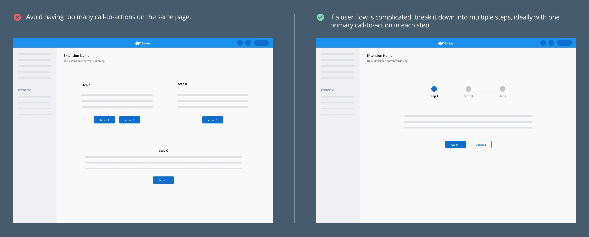
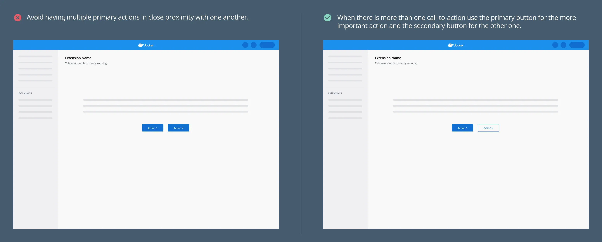
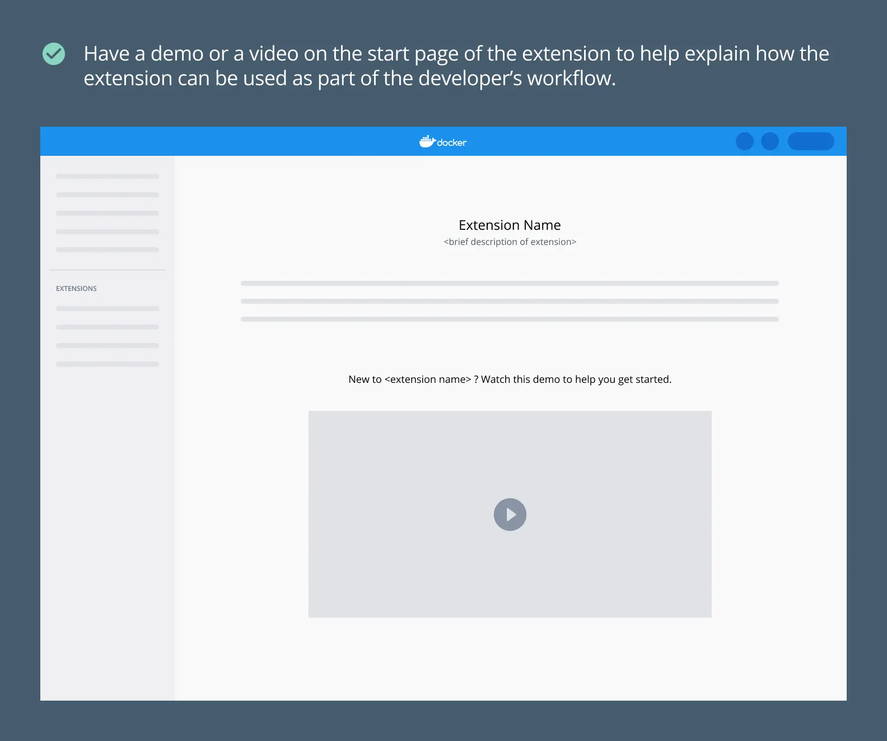

At Docker, we aim to build tools that integrate into a user's existing workflows rather than requiring them to adopt new ones. We strongly recommend that you follow these guidelines when creating extensions. We review and approve your Marketplace publication based on these requirements.

Here is a simple checklist to go through when creating your extension:
- Is it easy to get started?
- Is it easy to use?
- Is it easy to get help when needed?

## Create a consistent experience with Docker Desktop

Use the [Docker Material UI Theme](https://www.npmjs.com/package/@docker/docker-mui-theme) and the [Docker Extensions Styleguide](https://www.figma.com/file/U7pLWfEf6IQKUHLhdateBI/Docker-Design-Guidelines?node-id=1%3A28771) to ensure that your extension feels like it is part of Docker Desktop to create a seamless experience for users.

- Ensure the extension has both a light and dark theme. Using the components and styles as per the Docker style guide ensures that your extension meets the [level AA accessibility standard.](https://www.w3.org/WAI/WCAG2AA-Conformance).

  

- Ensure that your extension icon is visible both in light and dark mode.

  

- Ensure that the navigational behavior is consistent with the rest of Docker Desktop. Add a header to set the context for the extension.

  

- Avoid embedding terminal windows. The advantage we have with Docker Desktop over the CLI is that we have the opportunity to provide rich information to users. Make use of this interface as much as possible. 

  

  

## Build features natively

- In order not to disrupt the flow of users, avoid scenarios where the user has to navigate outside Docker Desktop, to the CLI or a webpage for example, in order to carry out certain functionalities. Instead, build features that are native to Docker Desktop.

  

  

## Break down complicated user flows

- If a flow is too complicated or the concept is abstract, break down the flow into multiple steps with one simple call-to-action in each step. This helps when onboarding novice users to your extension

  

- Where there are multiple call-to-actions, ensure you use the primary (filled button style) and secondary buttons (outline button style) to convey the importance of each action.

  

## Onboarding new users

When creating your extension, ensure that first time users of the extension and your product can understand its value-add and adopt it easily. Ensure you include contextual help within the extension.

- Ensure that all necessary information is added to the extensions Marketplace as well as the extensions detail page. This should include:
  - Screenshots of the extension. Note that the recommended size for screenshots is 2400x1600 pixels. 
  - A detailed description that covers what the purpose of the extension is, who would find it useful and how it works.
  - Link to necessary resources such as documentation.
- If your extension has particularly complex functionality, add a demo or video to the start page. This helps onboard a first time user quickly.

  

## What's next?

- Explore our [design principles](design-principles.md).
- Take a look at our [UI styling guidelines](index.md).
- Learn how to [publish your extension](../extensions/index.md).
