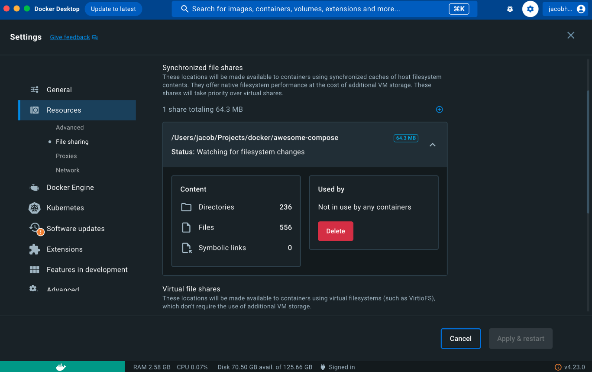

> **Early Access**
>
> Synchronized file sharing is an early-access feature. 
>
> If you would like to be considered for Synchronized file sharing testing, you can
> [sign up for the early access program](https://www.docker.com/docker-desktop-preview-program/).
{ .restricted }

Synchronized file sharing is an alternative file sharing mechanism powered by [Mutagen](https://mutagen.io/). It provides fast and flexible host-to-VM file sharing by replacing bind mounts with synchronized filesystem caches. 

 
## Who is it for?

Synchronized file sharing is for developers who: 
- Have large repositories or monorepos with 100 000 files or more totaling hundreds of megabytes or even gigabytes.
- Are using virtual filesystems, such as VirtioFS, gRPC FUSE, and osxfs, which are no longer scaling well with their codebases. 
- Regularly encounter performance limitations.
- Don't want to worry about file ownership or spend time resolving conflicting file-ownership information when modifying multiple containers.

## How does Synchronized file sharing work?

A Synchronized file share behaves just like a virtual file share, but takes advantage of Mutagen's high-performance, low-latency code synchronization engine to create a synchronized cache of the host files on an ext4 filesystem within the Docker Desktop VM. If you make filesystem changes on the host or in the VM’s containers, it propagates via bidirectional synchronization.

After creating a file share instance, any container using a bind mount that points to a location on the host filesystem matching the specified synchronized file share location, utilizes the Synchronized file sharing feature. Bind mounts that don't satisfy this condition are passed to the normal virtual filesystem bind-mounting mechanism, for example VirtioFS or gRPC-FUSE.

> **Important**
>
> Synchronized file sharing isn't available on WSL or when using Windows containers. 
{ .important }

## How to enable Synchronized file sharing

Before you get started with Synchronized file sharing, you need to:

- Download and install [Docker Desktop version 4.25](release-notes.md).
- Have a Pro, Team, or Business subscription.

To enable Synchronized file sharing:
1. Sign in to Docker Desktop.
2. In **Settings**, navigate to the **File sharing** tab within the **Resources** section. 
3. On your keyboard, press and hold the `Shift` key along with the `Command` key (Mac) or `Windows` key (Windows), then click anywhere within the description text to reveal a pop-up.
4. Select **Restart**. The Docker Dashboard closes.

When you re-open the Docker Dashboard, Synchronized file sharing is enabled and ready for you to create your first file share instance.

## Create a file share instance 

To create a synchronized file share:
1. In **Settings**, navigate to the **File sharing** tab within the **Resources** section. 
2. In the **Synchronized file shares** section, select the **plus** icon.
3. Select a host folder to share. The synchronized file share should initialize and be usable.

File shares take a few seconds to initialize as files are copied into the Docker Desktop VM. During this time, the status indicator displays **Preparing**.

When the status indicator displays **Watching for filesystem changes**, your files are available to the VM through all the standard bind mount mechanisms, whether that's `-v` in the command line or specified in your `compose.yml` file.

>**Note**
>
> When you create a new service, setting the [bind mount option consistency](../engine/reference/commandline/secret_create.md#options-for-bind-mounts) to `:consistent` bypasses synchronized file sharing. 

## Explore your file share instance

The **Synchronized file shares** section displays all your file share instances and provides useful information about each instance including:
- The origin of the file share content
- A status update
- How much space each file share is using
- The number of filesystem entry counts
- The number of symbolic links
- Which container(s) is using the file share instance

Selecting a file share instance expands the dropdown and exposes this information.

## Use `.syncignore`

You can use a `.syncignore` file at the root of each file share, to exclude local files from your file share instance. It supports the same syntax as `.dockerignore` files and excludes, and/or re-includes, paths from synchronization. `.syncignore` files are ignored at any location other than the root of the file share.
 
Some example of things you might want to add to your `.syncignore` file are:
- Large dependency directories, for example `node_modules` and `composer` directories (unless you rely on accessing them via a bind mount)
- `.git directories` (again, unless you need them)

In general, use your `.syncignore` file to exclude items that aren't critical to your workflow, especially those that would be slow to sync or use significant storage.

## Frequently asked questions

### What is the difference between Synchronized file sharing and the Mutagen extension?

Since Docker [acquired Mutagen](https://www.docker.com/blog/mutagen-acquisition/), Synchronized file sharing is essentially the direct integration of the Mutagen extension into Docker Desktop. However, Synchronized file sharing provides an improved user experience and the ability to use a [`.syncignore` file](#use-syncignore). You also no longer have to set the default ownership on files as this is now handled automatically.

## Known issues

- Upon launching Docker Desktop, it can take between 5-10 seconds for Synchronized file sharing to fully initialize. During this window, file share instances display as **Connecting** and any new containers created during this window won't replace bind mounts with Synchronized file sharing.

- Changes made to `.syncignore` don't lead to immediate deletions unless the file share is recreated. In other words, files that are newly ignored due to modifications in the `.syncignore` file remain in their current location, but are no longer updated during synchronization.

- Case conflicts, due to Linux being case-sensitive and macOS/Windows only being case-preserving, display as **File exists** problems in the GUI. These can be ignored. However, if they persist, you can report the issue.

- File share instances mounted into [ECI](hardened-desktop/enhanced-container-isolation/_index.md) containers are currently read-only.

- You cannot remove a file share instance during the initial synchronization. You have to wait for it to complete before **Delete** has any effect.

- Synchronized file sharing proactively reports temporary issues, which can result in occasional **Conflict** and **Problem** indicators appearing in the GUI during synchronization. These can be ignored. However, if they persist, you can report the issue.

- If you switch from WSL2 to Hyper-V on Windows, Docker Desktop needs to be fully restarted.

## Feedback

To give feedback, report bugs, or receive support, email `desktop-preview@docker.com`. There is also a dedicated Slack channel. To join, simply send an email to the provided address.
