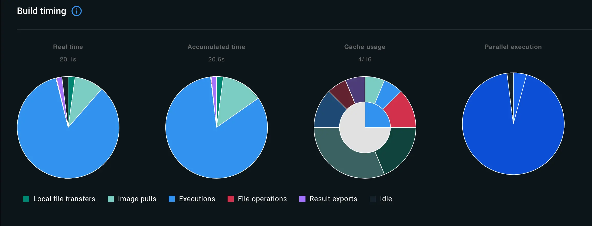

The **Builds** view is a simple interface that lets you inspect your build
history and manage builders using Docker Desktop. By default, it
displays a list of all your ongoing and completed builds.

## Show build list

Select the **Builds** view in the Docker Dashboard to open the build list.

The build list shows running and completed builds for your active builders. The
top-right corner shows the name of your currently selected builder, and the
**Builder settings** button lets you [manage builders](#manage-builders) in the
Docker Desktop settings.

Running builds are displayed in the top section of this view, with information
about the build target and progress.

The lower section of the view shows your recent builds. You can select any of
the builds from the active builds or completed builds section to view detailed
information, such as logs, a performance breakdown, cache utilization, and
more.

The build list doesn't include builds for inactive builders. That is, builders
that you've removed from your system, or builders that have been stopped.

## Inspect a build

To inspect a build, select the build that you want to view in the list.
The inspection view contains a number of tabs:

### Info tab

The **Info** tab displays details about the build.

If you're inspecting a multi-platform build, the drop-down menu in the
top-right of this tab lets you filter the information down to a specific
platform:

The **Source details** section shows the filepath to the
[frontend](../../build/dockerfile/frontend.md) that was used and, if available,
information about the source code repository.

The **Build timing** section contains charts showing a breakdown of the build
execution from various angles.

- **Real time** refers to the wall-clock time that it took to complete the build.
- **Accumulated time** shows the total CPU time for all steps.
- **Cache usage** shows the extent to which build operations were cached.
- **Parallel execution** shows how much of the build execution time was spent running steps in parallel.

The chart colors and legend keys describe the different build operations. Build
operations are defined as follows:

| Build operation      | Description                                                                                                                                                                     |
| :------------------- | :------------------------------------------------------------------------------------------------------------------------------------------------------------------------------ |
| Local file transfers | Time spend transferring local files from the client to the builder.                                                                                                             |
| File operations      | Any operations that involve creating and copying files in the build. For example, the `COPY`, `WORKDIR`, `ADD` instructions in a Dockerfile frontend all incur file operations. |
| Image pulls          | Time spent pulling images.                                                                                                                                                      |
| Executions           | Container executions, for example commands defined as `RUN` instructions in a Dockerfile frontend.                                                                              |
| HTTP                 | Remote artifact downloads using `ADD`.                                                                                                                                          |
| Git                  | Same as **HTTP** but for Git URLs.                                                                                                                                              |
| Result exports       | Time spent exporting the build results.                                                                                                                                         |
| SBOM                 | Time spent generating the [SBOM attestation](../../build/attestations/sbom.md).                                                                                                 |
| Idle                 | Idle time for build workers, which can happen if you have configured a [max parallelism limit](../../build/buildkit/configure.md#max-parallelism).                              |

The **Dependencies** section shows images and remote resources used to during
the build. Resources listed here include:

- Container images used during the build
- Git repositories included using the `ADD` Dockerfile instruction
- Remote HTTPS resources included using the `ADD` Dockerfile instruction

The **Configuration** section shows parameters passed to the build:

- Build arguments
- Secrets
- SSH sockets
- Labels
- Additional contexts

The **Build results** section shows a summary of the generated build artifacts,
including the image manifest media type and digest, and information about build
attestations such as SBOM and provenance data.

### Source tab

The **Source** tab shows the [frontend](../../build/dockerfile/frontend.md)
used to create the build.

### Error tab

The **Error** tab appears if the build finished with an error.

If the error was caused by an issue with the frontend, this tab displays the
frontend source with the error message inline where the build failed.

### Logs tab

The **Logs** tab displays the build logs. If the build is currently running,
the logs are updated in real-time.

### History tab

The **History** tab displays statistics data about completed builds.

The time series chart in the **Related history** section shows the duration,
build steps, and cache usage for related builds. This chart is useful for
identifying trends and changes in your build operations over time.

You can navigate to and inspect a related build by selecting it in the chart,
or in the **Past builds** list below the history tab.

## Manage builders

To inspect your builders, and change your default builder, select **Builder
settings** to open the settings menu.

For more information about managing builders, see:

- [Change settings, Windows](../settings/windows.md#builders)
- [Change settings, Mac](../settings/mac.md#builders)
- [Change settings, Linux](../settings/linux.md#builders)
