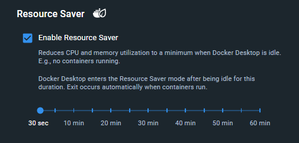

Resource Saver is a new feature .available in Docker Desktop version 4.24 and later, that significantly reduces Docker
Desktop's CPU and memory utilization on the host by 2 GBs or more, by
automatically stopping the Docker Desktop Linux VM when no containers are
running for a period of time (defaults to 5 minutes).

This way, Docker Desktop uses minimal system resources when it's idle, thereby
allowing you to save battery life on your laptop and improve your multi-tasking
experience.

Resource Saver is enabled by default but can be disabled via the Dashboard's
Settings -> Resources -> Advanced menu. You can also configure the idle
timer as shown below.

When Docker Desktop enters Resource Saver mode, a leaf icon is displayed on the
Docker Desktop status bar (see figure below) as well as in the Docker icon on
the system tray. As shown, the Linux VM CPU and memory utilization are reduced
to zero.

>**Note**
>
> Exit from Resource Saver mode occurs automatically when containers run. Exit
> may take a few seconds (~3 to 10 secs) as Docker Desktop restarts the Linux VM.
> It's generally faster on Mac and Linux, and a bit slower on Windows (with Hyper-V).

A bit more info about Resource Saver:

* The Resource Saver timer is configured to 5 minutes by default. That is,
  Docker Desktop will enter Resource Saver mode if no containers are running for
  5 minutes. Depending on your needs, you can adjust this to a lower or higher
  value.

* Keep in mind that exit from Resource Saver mode occurs automatically when
  containers run, but starting the first such container will incur the Resource
  Saver exit delay which can take between ~3 -> 10 seconds as Docker Desktop
  restarts the Linux VM. The restart is generally faster on Mac and Linux, and a
  bit slower on Windows with Hyper-V. Once the Linux VM is restarted, subsequent
  container runs will occurs immediately as usual.

* Resource Saver works a bit differently on Windows with WSL. Instead of
  stopping the WSL VM, it only pauses the Docker Engine inside the
  `docker-desktop` WSL distro. That's because in WSL there's a single Linux VM
  shared by all WSL distros, so Docker Desktop can't stop the Linux VM (i.e.,
  the WSL Linux VM is not owned by Docker Desktop). As a result, Resource Saver
  reduces CPU utilization on WSL, but it does not reduce Docker's memory
  utilization. To reduce memory utilization on WSL, we instead recommend that
  users enable WSL's `autoMemoryReclaim` feature as described in the
  [Docker  Desktop WSL docs](../wsl/_index.md). Finally, since Docker Desktop does not
  stop the Linux VM on WSL, exit from Resource Saver mode is immediate (there's
  no exit delay).

* When Docker Desktop enters Resource Saver mode, Docker commands that don't run
  containers (e.g., listing container images or volumes) do not necessarily
  trigger an exit from Resource Saver mode as Docker Desktop can serve such
  commands without unnecessarily waking up the Linux VM.

* Resource Saver has higher precedence than the older [Pause](pause.md) feature,
  meaning that while Docker Desktop is in Resource Saver mode, manually pausing
  Docker Desktop is not possible (nor does it make sense since Resource Saver
  actually stops the Docker Desktop Linux VM). In general, we recommend keeping
  Resource Saver enabled as opposed to disabling it and using the manual Pause
  feature, as it results in much better CPU and memory savings.

* When configuring the Resource Saver timer, if the values available via the
  Dashboard GUI (Settings -> Resources -> Advanced) are not sufficient for your
  needs, you can reconfigure it to any value (must be larger than 30 seconds) by
  changing `autoPauseTimeoutSeconds` in the Docker Desktop `settings.json` file
  (there's no need to restart Docker Desktop after reconfiguring):

  - **Mac**: `~/Library/Group Containers/group.com.docker/settings.json`
  - **Windows**: `C:\Users\[USERNAME]\AppData\Roaming\Docker\settings.json`
  - **Linux**: `~/.docker/desktop/settings.json`

* Resource Saver was initially introduced in Docker Desktop v4.21 as an
  experimental feature, where it simply paused the Linux VM when no containers
  were running for 30 seconds. In v4.22 it was improved to stop (not just pause)
  the Linux VM when no containers were running for 30 seconds. In v4.24, it was
  promoted to a full feature (i.e., it's no longer experimental), the Resource
  Saver timeout was increased from 30 seconds to 5 minutes, and the
  configuration controls became available via the Dashboard's Settings -> Resources -> Advanced menu.

* We continuously strive to improve Docker Desktop; if you find any problem with
  the Resource Saver feature, please file a ticket on the appropriate Docker
  Desktop GitHub repo (e.g., [for-mac](https://github.com/docker/for-mac),
  [for-win](https://github.com/docker/for-win)).
