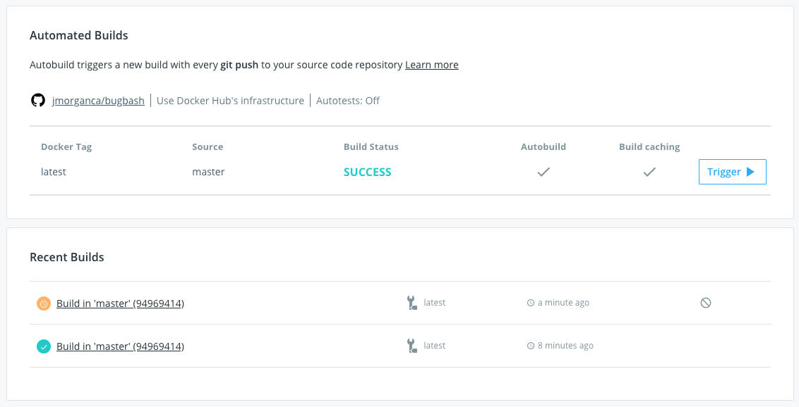

> [!NOTE]
>
> Automated builds require a
> [Docker Pro, Team, or Business subscription](../../subscription/index.md).

## Cancel or retry a build

While a build is in queue or running, a **Cancel** icon appears next to its build
report link on the **General** tab and on the **Builds** tab. You can also select
**Cancel** on the **Build report** page, or from the **Timeline** tab's logs
display for the build.

## Check your active builds

A summary of a repository's builds appears both on the repository **General**
tab, and in the **Builds** tab. The **Builds** tab also displays a color coded
bar chart of the build queue times and durations. Both views display the
pending, in progress, successful, and failed builds for any tag of the
repository.

From either location, you can select a build job to view its build report. The
build report shows information about the build job. This includes the source
repository and branch, or tag, the build logs, the build duration, creation time and location, and the user account the build occurred in.

>**Note**
>
> You can now view the progress of your builds every 30 seconds when you
> refresh the **Builds** page. With the in-progress build logs, you can debug your
> builds before they're finished.

## Disable an automated build

Automated builds are enabled per branch or tag, and can be disabled and
re-enabled. You might do this when you want to only build manually for
a while, for example when you are doing major refactoring in your code. Disabling autobuilds doesn't disable [autotests](automated-testing.md).

To disable an automated build:

1. From the **Repositories** page, select a repository, and select the **Builds** tab.

2. Select **Configure automated builds** to edit the repository's build settings.

3. In the **Build Rules** section, locate the branch or tag you no longer want
to automatically build.

4. Select the **Autobuild** toggle next to the configuration line. When disabled the toggle is gray.

5. Select **Save**.
