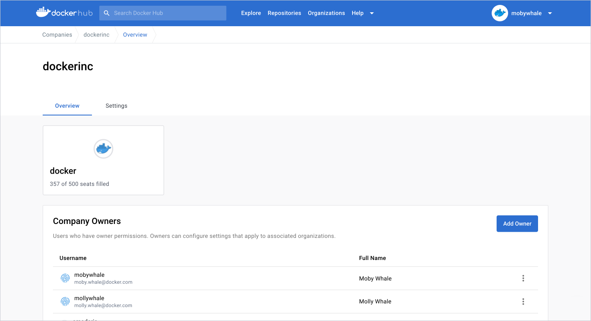

As a company owner, you can configure [Single Sign-on (SSO)](../security/for-admins/single-sign-on/configure/index.md) and [System for Cross-domain Identity Management (SCIM)](../docker-hub/scim.md) for all organizations under the company. This is only visible if your organization has a Docker Business subscription. If you want to upgrade your subscription to include the organization under the company, see [upgrade your subscription](../subscription/upgrade.md).

## Add a company owner

1. Sign in to [Docker Hub](https://hub.docker.com/), navigate to the **Organizations** page, and select your company.
2. In the **Overview** tab, select **Add owner** and enter their Docker ID or email address.
3. Once you've selected **Add Owner**, you can view the user in the **Company Owners** table.

    

## Remove a company owner

1. Sign in to [Docker Hub](https://hub.docker.com/), navigate to the **Organizations** page, and select your company.
2. In the **Overview** tab, find the **Company Owner** you want to remove.
3. Select the **Action** icon and remove the owner.

    