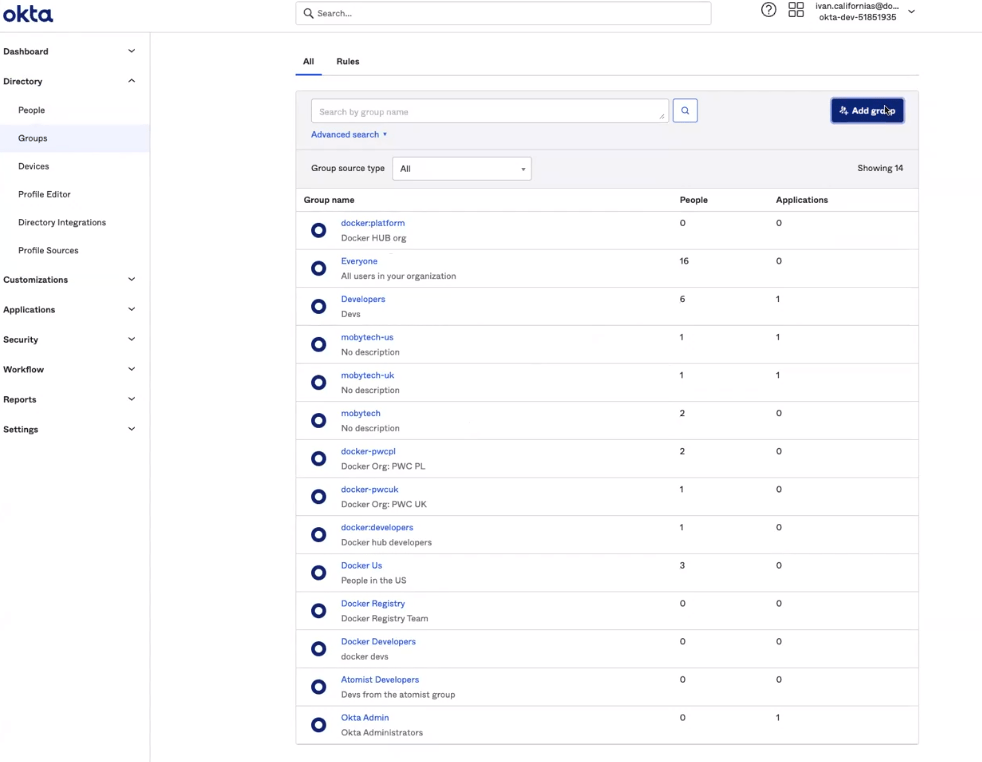
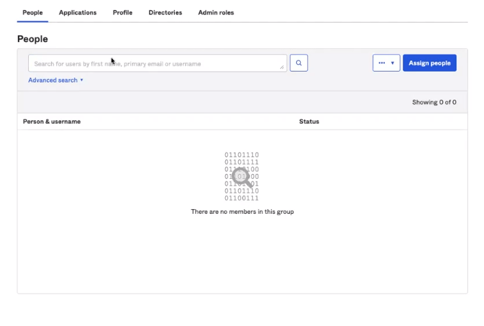
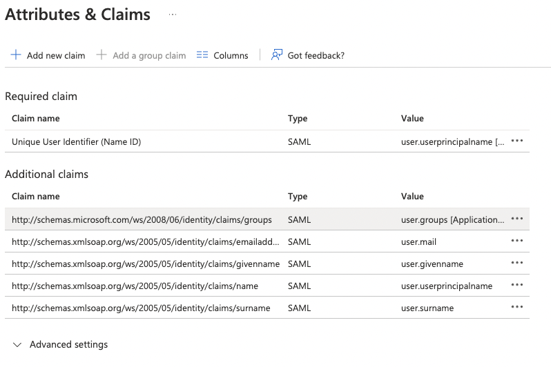

> **Note**
>
> The following features are only available to [Early Access](../release-lifecycle.md/#early-access-ea) participants.

## Okta SSO group mapping

Use directory groups to team provisioning from your identity provider, and these updates will sync with your Docker organizations and teams.
To correctly assign your users to Docker teams, you must create groups in your IDP following the naming pattern <organization>:<team>. For example, if you want to manage provisioning for the team “developers” in Docker, and your organization name is “moby,” you must create a group in your IDP with the name “moby:developers”. Once you enable group mappings in your connection, users assigned to that group in your IDP will automatically be added to the team “developers” in Docker.

   > **Note**
   >
   > Use the same names for the Docker teams as your group names in the IdP to prevent further configuration. When you sync groups, a group is created if it doesn't already exist.

1. In **Okta**, navigate to the directory and select **Group**.
2. Select **Add Group**, and type the name of your organization and team.

    > **Note**
    >
    > For example, **auacatenet:platform** (your organization:your team). This connects all of your teams in Docker to your groups in Okta.

    {: width="700px" }

    {: width="500px" }

3. In your group, select **Assign people** to add your users to the group.

    {: width="700px" }

4. Navigate to **Applications**, configure your application and select **General**.
5. Select **Next** and update the value for **Group Attribute Statements** (optional) and filter for **Group Attribute Statements**. Note it's recommended to specify a filter, so the groups relevant to your Docker organization and teams are shared with the Docker app.

    {: width="700px" }

6. Select **Next** and **Finish** to complete the configuration.

    > **Note**
    >
    > Once completed, when your user signs in to Docker through SSO, the user is automatically added to the organizations and teams mapped in the group attributes.

## Azure AD SSO group mapping

1. Navigate to **Enterprise application**, and select your application.
2. Select **Single-sign on** and **Attributes and Claims**.
3. Select **Add a group claim** and select groups assigned to the application.
4. In the **Source attribute**, select **Cloud-only group display name (Preview)** and **Save**. Note, you can filter the groups you want to share with the application as an option.

    {: width="700px" }
