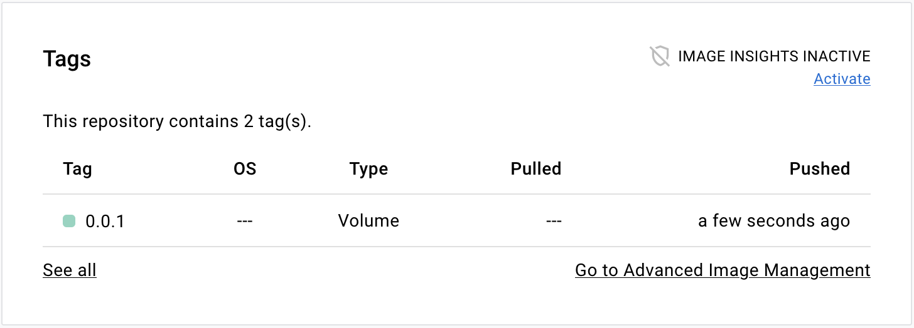

You can use Docker Hub to store any kind of software artifact, not just
container images. Docker Hub supports OCI artifacts by leveraging the config
property on the image manifest.

## What are OCI artifacts?

OCI artifacts are any arbitrary files related to a software application. Some
examples include:

- Helm charts
- Software Bill of Materials (SBOM)
- Digital signatures
- Provenance data
- Attestations
- Vulnerability reports

Docker Hub supporting OCI artifacts means you can use one repository for storing
and distributing container images as well as other assets.

A common use case for OCI artifacts is
[Helm charts](https://helm.sh/docs/topics/charts/). Helm charts is a packaging
format that defines a Kubernetes deployment for an application. Since Kubernetes
is a popular runtime for containers, it makes sense to host application images
and deployment templates all in one place.

## Using OCI artifacts with Docker Hub

You manage OCI artifacts on Docker Hub in a similar way you would container
images.

Pushing and pulling OCI artifacts to and from a registry is done using a
registry client. [ORAS CLI](https://oras.land/docs/installation)
is a command-line tool that provides the capability of managing
OCI artifacts in a registry. If you use Helm charts, the
[Helm CLI](https://helm.sh/docs/intro/install/) provides built-in
functionality for pushing and pulling charts to and from a registry.

Registry clients invoke HTTP requests to the Docker Hub registry API. The
registry API conforms to a standard protocol defined in the
[OCI distribution specification](https://github.com/opencontainers/distribution-spec).

## Examples

This section shows some examples on using OCI artifacts with Docker Hub.

### Push a Helm chart

The following procedure shows how to push a Helm chart as an OCI artifact to
Docker Hub.

Prerequisites:

- Helm version 3.0.0 or later

Steps:

1. Create a new Helm chart

   ```console
   $ helm create demo
   ```

   This command generates a boilerplate template chart.

2. Package the Helm chart into a tarball.

   ```console
   $ helm package demo
   Successfully packaged chart and saved it to: /Users/hubuser/demo-0.1.0.tgz
   ```

3. Sign in to Docker Hub with Helm, using your Docker ID credentials.

   ```console
   $ helm registry login registry-1.docker.io -u hubuser
   ```

4. Push the chart to a Docker Hub repository.

   ```console
   $ helm push demo-0.1.0.tgz oci://registry-1.docker.io/docker
   ```

   This uploads the Helm chart tarball to a `demo` repository in the `docker`
   namespace.

5. Go to the repository page on Docker Hub. The **Tags** section of the page
   shows the Helm chart tag.

   

6. Select the tag name to go to the page for that tag.

   The page lists a few useful commands for working with Helm charts.

   

### Push a volume

The following procedure shows how to push container volume as an OCI artifact to
Docker Hub.

Prerequisites:

- ORAS CLI version 0.15 or later

Steps:

1. Create a dummy file to use as volume content.

   ```console
   $ touch myvolume.txt
   ```

2. Sign in to Docker Hub using the ORAS CLI.

   ```console
   $ oras login -u hubuser registry-1.docker.io
   ```

3. Push the file to Docker Hub.

   ```console
   $ oras push registry-1.docker.io/docker/demo:0.0.1 \
     --artifact-type=application/vnd.docker.volume.v1+tar.gz \
     myvolume.txt:text/plain
   ```

   This uploads the volume to a `demo` repository in the `docker` namespace. The
   `--artifact-type` flag specifies a special media type that makes Docker Hub
   recognize the artifact as a container volume.

4. Go to the repository page on Docker Hub. The **Tags** section on that page
   shows the volume tag.

   

### Push a generic artifact file

The following procedure shows how to push a generic OCI artifact to Docker Hub.

Prerequisites:

- ORAS CLI version 0.15 or later

Steps:

1. Create your artifact file.

   ```console
   $ touch myartifact.txt
   ```

2. Sign in to Docker Hub using the ORAS CLI.

   ```console
   $ oras login -u hubuser registry-1.docker.io
   ```

3. Push the file to Docker Hub.

   ```console
   $ oras push registry-1.docker.io/docker/demo:0.0.1 myartifact.txt:text/plain
   ```

4. Go to the repository page on Docker Hub. The **Tags** section on that page
   shows the artifact tag.

   