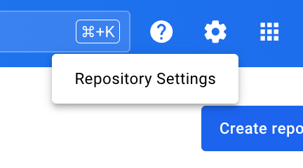

## Manage default repository settings

> **Early Access**
>
> Centralized repository settings are in [Early Access (EA)](/release-lifecycle/#early-access-ea). If your account isn't selected for EA, you can manage the following settings by visiting Docker Hub then navigating to your account settings.
{ .restricted }

You can manage the default repository settings for your personal account in Docker Hub. Select the **Settings** icon, then select **Repository Settings**.



Here you can manage the following:

- Default privacy: set the default repository privacy to either **Public** or **Private**.
- Linked accounts: for users with a Docker Pro, Team, or Business subscription, manage your source provider accounts to enable Automated Builds.
- Notifications: for users with a Docker Pro, Team, or Business subscription, manage how you receive notifications from autobuilds.

## Change a repository from public to private

1. Navigate to your repository.
2. Select the **Settings** tab.
3. Select **Make private**.
4. Enter the name of your repository to confirm. 

You get one free private repository with your Docker Hub user account (not
available for organizations you're a member of). If you need more private
repositories for your user account, upgrade your Docker Hub subscription from your [Billing Information](https://hub.docker.com/billing/plan) page.

## Move images between repositories

### Personal to personal

When consolidating personal repositories, you can pull private images from the initial repository and push them into another repository owned by you. To avoid losing your private images, perform the following steps:

1. Navigate to [Docker Hub](https://hub.docker.com) create a new Docker ID and select a personal subscription.
2. Using `docker login` from the CLI, sign in using your original Docker ID and pull your private images.
3. Tag your private images with your newly created Docker ID, for example:

   ```console
   $ docker tag namespace1/docker101tutorial new_namespace/docker101tutorial
   ```
4. Using `docker login` from the CLI, sign in with your newly created Docker ID, and push your newly tagged private images to your new Docker ID namespace:

   ```console
   $ docker push new_namespace/docker101tutorial
   ```

The private images that existed in your previous account are now available in your new account.

### Personal to an organization

To avoid losing your private images, you can pull your private images from your personal account and push them to an organization that's owned by you.

1. Navigate to [Docker Hub](https://hub.docker.com) and select **Organizations**.
2. Select the applicable organization and verify that your user account is a member of the organization.
3. Sign in to [Docker Hub](https://hub.docker.com) using your original Docker ID, and pull your images:

   ```console
   $ docker pull namespace1/docker101tutorial
   ```
4. Tag your images with your new organization namespace:

   ```console
   $ docker tag namespace1/docker101tutorial <new_org>/docker101tutorial
   ```
5. Push your newly tagged images to your new org namespace:

   ```console
   $ docker push new_org/docker101tutorial
   ```

The private images that existed in your user account are now available for your organization.

## Delete a repository

> **Warning**
>
> Deleting a repository deletes all the images it contains and its build settings. This action can't be undone.
{ .warning }

1. Navigate to your repository.
2. Select the **Settings** tab.
3. Select **Delete repository**.
4. Enter the name of your repository to confirm.