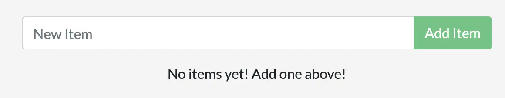

For the rest of this guide, you'll be working with a simple todo
list manager that runs on Node.js. If you're not familiar with Node.js,
don't worry. This guide doesn't require any prior experience with JavaScript.

## Prerequisites

- You have installed the latest version of [Docker Desktop](../get-docker.md).
- You have installed a [Git client](https://git-scm.com/downloads).
- You have an IDE or a text editor to edit files. Docker recommends using [Visual Studio Code](https://code.visualstudio.com/).

## Get the app

Before you can run the application, you need to get the application source code onto your machine.

1. Clone the [getting-started-app repository](https://github.com/docker/getting-started-app/tree/main) using the following command:

   ```console
   $ git clone https://github.com/docker/getting-started-app.git
   ```

2. View the contents of the cloned repository. You should see the following files and sub-directories.

   ```text
   ├── getting-started-app/
   │ ├── package.json
   │ ├── README.md
   │ ├── spec/
   │ ├── src/
   │ └── yarn.lock
   ```

## Build the app's image

To build the image, you'll need to use a Dockerfile. A Dockerfile is simply a text-based file with no file extension that contains a script of instructions. Docker uses this script to build a container image.

1. In the `getting-started-app` directory, the same location as the `package.json` file, create a file named `Dockerfile`. You can use the following commands to create a Dockerfile based on your operating system.

   
   

   In the terminal, run the following commands.

   Make sure you're in the `getting-started-app` directory. Replace `/path/to/getting-started-app` with the path to your `getting-started-app` directory.

   ```console
   $ cd /path/to/getting-started-app
   ```

   Create an empty file named `Dockerfile`.

   ```console
   $ touch Dockerfile
   ```

   
   

   In the Windows Command Prompt, run the following commands.

   Make sure you're in the `getting-started-app` directory. Replace `\path\to\getting-started-app` with the path to your `getting-started-app` directory.

   ```console
   $ cd \path\to\getting-started-app
   ```

   Create an empty file named `Dockerfile`.

   ```console
   $ type nul > Dockerfile
   ```

   
   

   In PowerShell, run the following commands.

   Make sure you're in the `getting-started-app` directory. Replace `\path\to\getting-started-app` with the path to your `getting-started-app` directory.

   ```console
   $ cd \path\to\getting-started-app
   ```

   Create an empty file named `Dockerfile`.

   ```powershell
   $ New-Item -Path . -Name Dockerfile -ItemType File
   ```

   
   

2. Using a text editor or code editor, add the following contents to the Dockerfile:

   ```dockerfile
   # syntax=docker/dockerfile:1
   
   FROM node:18-alpine
   WORKDIR /app
   COPY . .
   RUN yarn install --production
   CMD ["node", "src/index.js"]
   EXPOSE 3000
   ```

3. Build the image using the following commands:

   In the terminal, make sure you're in the `getting-started-app` directory. Replace `/path/to/getting-started-app` with the path to your `getting-started-app` directory.

   ```console
   $ cd /path/to/getting-started-app
   ```

   Build the image.
   ```console
   $ docker build -t getting-started .
   ```

   The `docker build` command uses the Dockerfile to build a new image. You might have noticed that Docker downloaded a lot of "layers". This is because you instructed the builder that you wanted to start from the `node:18-alpine` image. But, since you didn't have that on your machine, Docker needed to download the image.

   After Docker downloaded the image, the instructions from the Dockerfile copied in your application and used `yarn` to install your application's dependencies. The `CMD` directive specifies the default command to run when starting a container from this image.

   Finally, the `-t` flag tags your image. Think of this as a human-readable name for the final image. Since you named the image `getting-started`, you can refer to that image when you run a container.

   The `.` at the end of the `docker build` command tells Docker that it should look for the `Dockerfile` in the current directory.

## Start an app container

Now that you have an image, you can run the application in a container using the `docker run` command.

1. Run your container using the `docker run` command and specify the name of the image you just created:

   ```console
   $ docker run -dp 127.0.0.1:3000:3000 getting-started
   ```

   The `-d` flag (short for `--detach`) runs the container in the background.
   This means that Docker starts your container and returns you to the terminal
   prompt. You can verify that a container is running by viewing it in Docker
   Dashboard under **Containers**, or by running `docker ls` in the terminal.

   The `-p` flag (short for `--publish`) creates a port mapping between the host
   and the container. The `-p` flag takes a string value in the format of
   `HOST:CONTAINER`, where `HOST` is the address on the host, and `CONTAINER` is
   the port on the container. The command publishes the container's port 3000 to
   `127.0.0.1:3000` (`localhost:3000`) on the host. Without the port mapping,
   you wouldn't be able to access the application from the host.

2. After a few seconds, open your web browser to [http://localhost:3000](http://localhost:3000).
   You should see your app.

   
   

3. Add an item or two and see that it works as you expect. You can mark items as complete and remove them. Your frontend is successfully storing items in the backend.


At this point, you have a running todo list manager with a few items.

If you take a quick look at your containers, you should see at least one container running that's using the `getting-started` image and on port `3000`. To see your containers, you can use the CLI or Docker Desktop's graphical interface.




Run the following `docker ps` command in a terminal to list your containers.

```console
$ docker ps
```
Output similar to the following should appear.
```console
CONTAINER ID        IMAGE               COMMAND                  CREATED             STATUS              PORTS                      NAMES
df784548666d        getting-started     "docker-entrypoint.s…"   2 minutes ago       Up 2 minutes        127.0.0.1:3000->3000/tcp   priceless_mcclintock
```




In Docker Desktop, select the **Containers** tab to see a list of your containers.





## Summary

In this section, you learned the basics about creating a Dockerfile to build an image. Once you built an image, you started a container and saw the running app.

Related information:

 - [Dockerfile reference](../engine/reference/builder.md)
 - [docker CLI reference](/engine/reference/commandline/cli/)
 - [Build with Docker guide](../build/guide/index.md)

## Next steps

Next, you're going to make a modification to your app and learn how to update your running application with a new image. Along the way, you'll learn a few other useful commands.


