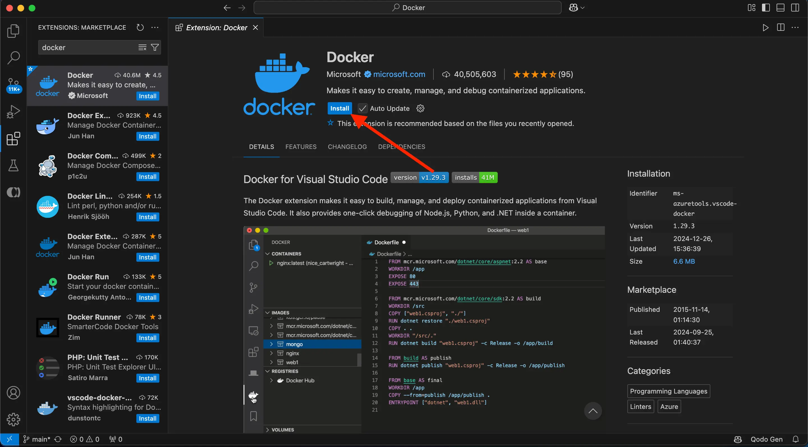



## Explanation

Now that you've updated the [to-do list app](develop-with-containers.md), you’re ready to create a container image for the application and share it on Docker Hub. To do so, you will need to do the following:

1. Sign in with your Docker account
2. Create an image repository on Docker Hub
3. Build the container image
4. Push the image to Docker Hub

Before you dive into the hands-on guide, the following are a few core concepts that you should be aware of.

### Container images

If you’re new to container images, think of them as a standardized package that contains everything needed to run an application, including its files, configuration, and dependencies. These packages can then be distributed and shared with others.

### Docker Hub

To share your Docker images, you need a place to store them. This is where registries come in. While there are many registries, Docker Hub is the default and go-to registry for images. Docker Hub provides both a place for you to store your own images and to find images from others to either run or use as the bases for your own images.

In [Develop with containers](develop-with-containers.md), you used the following images that came from Docker Hub, each of which are [Docker Official Images](/manuals/docker-hub/image-library/trusted-content.md#docker-official-images):

- [node](https://hub.docker.com/_/node) - provides a Node environment and is used as the base of your development efforts. This image is also used as the base for the final application image.
- [mysql](https://hub.docker.com/_/mysql) - provides a MySQL database to store the to-do list items
- [phpmyadmin](https://hub.docker.com/_/phpmyadmin) - provides phpMyAdmin, a web-based interface to the MySQL database
- [traefik](https://hub.docker.com/_/traefik) - provides Traefik, a modern HTTP reverse proxy and load balancer that routes requests to the appropriate container based on routing rules

Explore the full catalog of [Docker Official Images](https://hub.docker.com/search?image_filter=official&q=), [Docker Verified Publishers](https://hub.docker.com/search?q=&image_filter=store), and [Docker Sponsored Open Source Software](https://hub.docker.com/search?q=&image_filter=open_source) images to see more of what there is to run and build on.

## Try it out

In this hands-on guide, you'll learn how to sign in to Docker Hub and push images to Docker Hub repository.

## Sign in with your Docker account

To push images to Docker Hub, you will need to sign in with a Docker account.

1. Open the Docker Dashboard.

2. Select **Sign in** at the top-right corner.

3. If needed, create an account and then complete the sign-in flow.

Once you're done, you should see the **Sign in** button turn into a profile picture.

## Create an image repository

Now that you have an account, you can create an image repository. Just as a Git repository holds source code, an image repository stores container images.

1. Go to [Docker Hub](https://hub.docker.com).

2. Select **Create repository**.

3. On the **Create repository** page, enter the following information:

    - **Repository name** - `getting-started-todo-app`
    - **Short description** - feel free to enter a description if you'd like
    - **Visibility** - select **Public** to allow others to pull your customized to-do app

4. Select **Create** to create the repository.


## Build and push the image

Now that you have a repository, you are ready to build and push your image. An important note is that the image you are building extends the Node image, meaning you don't need to install or configure Node, yarn, etc. You can simply focus on what makes your application unique.

> **What is an image/Dockerfile?**
>
> Without going too deep yet, think of a container image as a single package that contains
> everything needed to run a process. In this case, it will contain a Node environment,
> the backend code, and the compiled React code. 
>
> Any machine that runs a container using the image, will then be able to run the application as 
> it was built without needing anything else pre-installed on the machine. 
>
> A `Dockerfile` is a text-based script that provides the instruction set on how to build
> the image. For this quick start, the repository already contains the Dockerfile.





1. To get started, either clone or [download the project as a ZIP file](https://github.com/docker/getting-started-todo-app/archive/refs/heads/main.zip) to your local machine.

   ```console
   $ git clone https://github.com/docker/getting-started-todo-app
   ```

   And after the project is cloned, navigate into the new directory created by the clone:

   ```console
   $ cd getting-started-todo-app
   ```

2. Build the project by running the following command, swapping out `DOCKER_USERNAME` with your username.

    ```console
    $ docker build -t <DOCKER_USERNAME>/getting-started-todo-app .
    ```

    For example, if your Docker username was `mobydock`, you would run the following:

    ```console
    $ docker build -t mobydock/getting-started-todo-app .
    ```

3. To verify the image exists locally, you can use the `docker image ls` command:

    ```console
    $ docker image ls
    ```

    You will see output similar to the following:

    ```console
    REPOSITORY                          TAG       IMAGE ID       CREATED          SIZE
    mobydock/getting-started-todo-app   latest    1543656c9290   2 minutes ago    1.12GB
    ...
    ```

4. To push the image, use the `docker push` command. Be sure to replace `DOCKER_USERNAME` with your username:

    ```console
    $ docker push <DOCKER_USERNAME>/getting-started-todo-app
    ```

    Depending on your upload speeds, this may take a moment to push.




1. Open Visual Studio Code. Ensure you have the **Docker extension for VS Code** installed from [Extension Marketplace](https://marketplace.visualstudio.com/items?itemName=ms-azuretools.vscode-docker).

   

2. In the **File** menu, select **Open Folder**. Choose **Clone Git Repository** and paste this URL: [https://github.com/docker/getting-started-todo-app](https://github.com/docker/getting-started-todo-app)

    


3. Right-click the `Dockerfile` and select the **Build Image...** menu item.


    

4. In the dialog that appears, enter a name of `DOCKER_USERNAME/getting-started-todo-app`, replacing `DOCKER_USERNAME` with your Docker username. 

5. After pressing **Enter**, you'll see a terminal appear where the build will occur. Once it's completed, feel free to close the terminal.

6. Open the Docker Extension for VS Code by selecting the Docker logo in the left nav menu.

7. Find the image you created. It'll have a name of `docker.io/DOCKER_USERNAME/getting-started-todo-app`. 

8. Expand the image to view the tags (or different versions) of the image. You should see a tag named `latest`, which is the default tag given to an image.

9. Right-click on the **latest** item and select the **Push...** option.

    

10. Press **Enter** to confirm and then watch as your image is pushed to Docker Hub. Depending on your upload speeds, it might take a moment to push the image.

    Once the upload is finished, feel free to close the terminal.





## Recap

Before you move on, take a moment and reflect on what happened here. Within a few moments, you were able to build a container image that packages your application and push it to Docker Hub.

Going forward, you’ll want to remember that:

- Docker Hub is the go-to registry for finding trusted content. Docker provides a collection of trusted content, composed of Docker Official Images, Docker Verified Publishers, and Docker Sponsored Open Source Software, to use directly or as bases for your own images.

- Docker Hub provides a marketplace to distribute your own applications. Anyone can create an account and distribute images. While you are publicly distributing the image you created, private repositories can ensure your images are accessible to only authorized users.

> **Usage of other registries**
>
> While Docker Hub is the default registry, registries are standardized and made 
> interoperable through the [Open Container Initiative](https://opencontainers.org/). This allows companies and 
> organizations to run their own private registries. Quite often, trusted content 
> is mirrored (or copied) from Docker Hub into these private registries.
>


## Next steps

Now that you’ve built an image, it's time to discuss why you as a developer should learn more about Docker and how it will help you in your day-to-day tasks.




