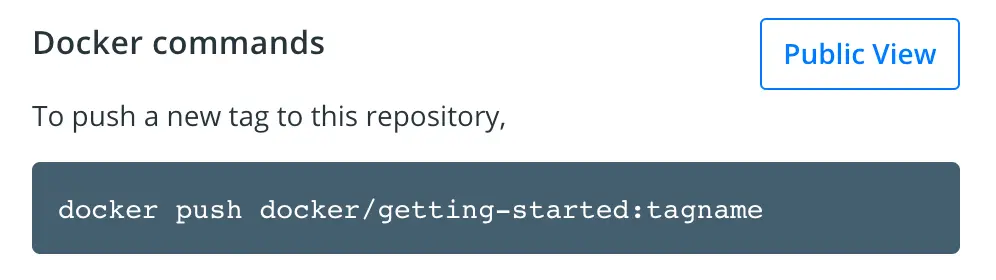

Now that you've built an image, you can share it. To share Docker images, you have to use a Docker
registry. The default registry is Docker Hub and is where all of the images you've used have come from.

> **Docker ID**
>
> A Docker ID lets you access Docker Hub, which is the world's largest library and community for container images. Create a [Docker ID](https://hub.docker.com/signup) for free if you don't have one.

## Create a repository

To push an image, you first need to create a repository on Docker Hub.

1. [Sign up](https://www.docker.com/pricing?utm_source=docker&utm_medium=webreferral&utm_campaign=docs_driven_upgrade) or Sign in to [Docker Hub](https://hub.docker.com).

2. Select the **Create Repository** button.

3. For the repository name, use `getting-started`. Make sure the **Visibility** is **Public**.

4. Select **Create**.

In the following image, you can see an example Docker command from Docker Hub. This command will push to this repository.




## Push the image

Let's try to push the image to Docker Hub.

1. In the command line, run the following command:

   ```console
   docker push docker/getting-started
   ```

   You'll see an error like this:

   ```console
   $ docker push docker/getting-started
   The push refers to repository [docker.io/docker/getting-started]
   An image does not exist locally with the tag: docker/getting-started
   ```

   This failure is expected because the image isn't tagged correctly yet.
   Docker is looking for an image name `docker/getting started`, but your
   local image is still named `getting-started`.

   You can confirm this by running:

   ```console
   docker image ls
   ```

2. To fix this, first sign in to Docker Hub using your Docker ID: `docker login YOUR-USER-NAME`.
3. Use the `docker tag` command to give the `getting-started` image a new name. Replace `YOUR-USER-NAME` with your Docker ID.

   ```console
   $ docker tag getting-started YOUR-USER-NAME/getting-started
   ```

4. Now run the `docker push` command again. If you're copying the value from
   Docker Hub, you can drop the `tagname` part, as you didn't add a tag to the
   image name. If you don't specify a tag, Docker uses a tag called `latest`.

   ```console
   $ docker push YOUR-USER-NAME/getting-started
   ```

## Run the image on a new instance

Now that your image has been built and pushed into a registry, try running your app on a brand
new instance that has never seen this container image. To do this, you will use Play with Docker.

> [!NOTE]
>
> Play with Docker uses the amd64 platform. If you are using an ARM based Mac with Apple silicon, you will need to rebuild the image to be compatible with Play with Docker and push the new image to your repository.
>
> To build an image for the amd64 platform, use the `--platform` flag.
> ```console
> $ docker build --platform linux/amd64 -t YOUR-USER-NAME/getting-started .
> ```
>
> Docker buildx also supports building multi-platform images. To learn more, see [Multi-platform images](/manuals/build/building/multi-platform.md).


1. Open your browser to [Play with Docker](https://labs.play-with-docker.com/).

2. Select **Login** and then select **docker** from the drop-down list.

3. Sign in with your Docker Hub account and then select **Start**.

4. Select the **ADD NEW INSTANCE** option on the left side bar. If you don't see it, make your browser a little wider. After a few seconds, a terminal window opens in your browser.

    

5. In the terminal, start your freshly pushed app.

   ```console
   $ docker run -dp 0.0.0.0:3000:3000 YOUR-USER-NAME/getting-started
   ```

    You should see the image get pulled down and eventually start up.

    > [!TIP]
    >
    > You may have noticed that this command binds the port mapping to a
    > different IP address. Previous `docker run` commands published ports to
    > `127.0.0.1:3000` on the host. This time, you're using `0.0.0.0`.
    >
    > Binding to `127.0.0.1` only exposes a container's ports to the loopback
    > interface. Binding to `0.0.0.0`, however, exposes the container's port
    > on all interfaces of the host, making it available to the outside world.
    >
    > For more information about how port mapping works, see
    > [Networking](/manuals/engine/network/_index.md#published-ports).

6. Select the 3000 badge when it appears.

   If the 3000 badge doesn't appear, you can select **Open Port** and specify `3000`.

## Summary

In this section, you learned how to share your images by pushing them to a
registry. You then went to a brand new instance and were able to run the freshly
pushed image. This is quite common in CI pipelines, where the pipeline will
create the image and push it to a registry and then the production environment
can use the latest version of the image.

Related information:

 - [docker CLI reference](/reference/cli/docker/)
 - [Multi-platform images](/manuals/build/building/multi-platform.md)
 - [Docker Hub overview](/manuals/docker-hub/_index.md)

## Next steps

In the next section, you'll learn how to persist data in your containerized application.


