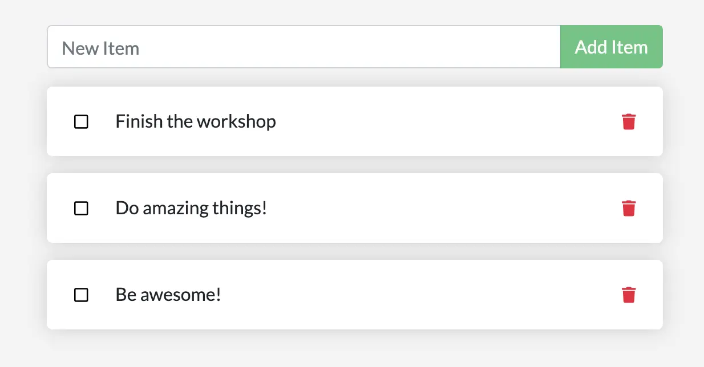

In case you didn't notice, your todo list is empty every single time
you launch the container. Why is this? In this part, you'll dive into how the container is working.

## The container's filesystem

When a container runs, it uses the various layers from an image for its filesystem.
Each container also gets its own "scratch space" to create/update/remove files. Any
changes won't be seen in another container, even if they're using the same image.

### See this in practice

To see this in action, you're going to start two containers. In one container,
you'll create a file. In the other container, you'll check whether that same
file exists.

1. Start an Alpine container and create a new file in it.

    ```console
    $ docker run --rm alpine touch greeting.txt
    ```

    > [!TIP]
    > Any commands you specify after the image name (in this case, `alpine`)
    > are executed inside the container. In this case, the command `touch
    > greeting.txt` puts a file named `greeting.txt` on the container's filesystem.

2. Run a new Alpine container and use the `stat` command to check whether the file exists.
   
   ```console
   $ docker run --rm alpine stat greeting.txt
   ```

   You should see output similar to the following that indicates the file does not exist in the new container.

   ```console
   stat: can't stat 'greeting.txt': No such file or directory
   ```

The `greeting.txt` file created by the first container did not exist in the
second container. That is because the writeable "top layer" of each container
is isolated. Even though both containers shared the same underlying layers that
make up the base image, the writable layer is unique to each container.

## Container volumes

With the previous experiment, you saw that each container starts from the image definition each time it starts. 
While containers can create, update, and delete files, those changes are lost when you remove the container 
and Docker isolates all changes to that container. With volumes, you can change all of this.

[Volumes](/manuals/engine/storage/volumes.md) provide the ability to connect specific filesystem paths of 
the container back to the host machine. If you mount a directory in the container, changes in that
directory are also seen on the host machine. If you mount that same directory across container restarts, you'd see
the same files.

There are two main types of volumes. You'll eventually use both, but you'll start with volume mounts.

## Persist the todo data

By default, the todo app stores its data in a SQLite database at
`/etc/todos/todo.db` in the container's filesystem. If you're not familiar with SQLite, no worries! It's simply a relational database that stores all the data in a single file. While this isn't the best for large-scale applications,
it works for small demos. You'll learn how to switch this to a different database engine later.

With the database being a single file, if you can persist that file on the host and make it available to the
next container, it should be able to pick up where the last one left off. By creating a volume and attaching
(often called "mounting") it to the directory where you stored the data, you can persist the data. As your container 
writes to the `todo.db` file, it will persist the data to the host in the volume.

As mentioned, you're going to use a volume mount. Think of a volume mount as an opaque bucket of data. 
Docker fully manages the volume, including the storage location on disk. You only need to remember the
name of the volume.

### Create a volume and start the container

You can create the volume and start the container using the CLI or Docker Desktop's graphical interface.




1. Create a volume by using the `docker volume create` command.

   ```console
   $ docker volume create todo-db
   ```

2. Stop and remove the todo app container once again with `docker rm -f <id>`,
   as it is still running without using the persistent volume.

3. Start the todo app container, but add the `--mount` option to specify a
   volume mount. Give the volume a name, and mount it to `/etc/todos` in the
   container, which captures all files created at the path.

   ```console
   $ docker run -dp 127.0.0.1:3000:3000 --mount type=volume,src=todo-db,target=/etc/todos getting-started
   ```

   > [!NOTE]
   >
   > If you're using Git Bash, you must use different syntax for this command.
   >
   > ```console
   > $ docker run -dp 127.0.0.1:3000:3000 --mount type=volume,src=todo-db,target=//etc/todos getting-started
   > ```
   >
   > For more details about Git Bash's syntax differences, see
   > [Working with Git Bash](/desktop/troubleshoot-and-support/troubleshoot/topics/#working-with-git-bash).





To create a volume:

1. Select **Volumes** in Docker Desktop.
2. In **Volumes**, select **Create**.
3. Specify `todo-db` as the volume name, and then select **Create**.

To stop and remove the app container:

1. Select **Containers** in Docker Desktop.
2. Select **Delete** in the **Actions** column for the container.

To start the todo app container with the volume mounted:

1. Select the search box at the top of Docker Desktop.
2. In the search window, select the **Images** tab.
3. In the search box, specify the image name, `getting-started`.

   > [!TIP]
   >
   >  Use the search filter to filter images and only show **Local images**.

4. Select your image and then select **Run**.
5. Select **Optional settings**.
6. In **Host port**, specify the port, for example, `3000`.
7. In **Host path**, specify the name of the volume, `todo-db`.
8. In **Container path**, specify `/etc/todos`.
9. Select **Run**.




### Verify that the data persists

1. Once the container starts up, open the app and add a few items to your todo list.

    
    

2. Stop and remove the container for the todo app. Use Docker Desktop or `docker ps` to get the ID and then `docker rm -f <id>` to remove it.

3. Start a new container using the previous steps.

4. Open the app. You should see your items still in your list.

5. Go ahead and remove the container when you're done checking out your list.

You've now learned how to persist data.

## Dive into the volume

A lot of people frequently ask "Where is Docker storing my data when I use a volume?" If you want to know, 
you can use the `docker volume inspect` command.

```console
$ docker volume inspect todo-db
```
You should see output like the following:
```console
[
    {
        "CreatedAt": "2019-09-26T02:18:36Z",
        "Driver": "local",
        "Labels": {},
        "Mountpoint": "/var/lib/docker/volumes/todo-db/_data",
        "Name": "todo-db",
        "Options": {},
        "Scope": "local"
    }
]
```

The `Mountpoint` is the actual location of the data on the disk. Note that on most machines, you will
need to have root access to access this directory from the host.

## Summary

In this section, you learned how to persist container data.

Related information:

 - [docker CLI reference](/reference/cli/docker/)
 - [Volumes](/manuals/engine/storage/volumes.md)

## Next steps

Next, you'll learn how you can develop your app more efficiently using bind mounts.


