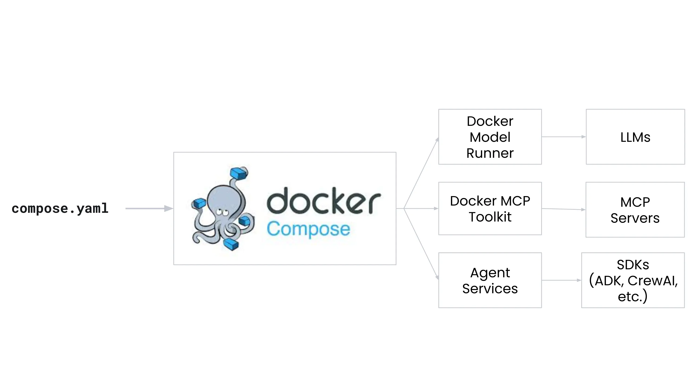
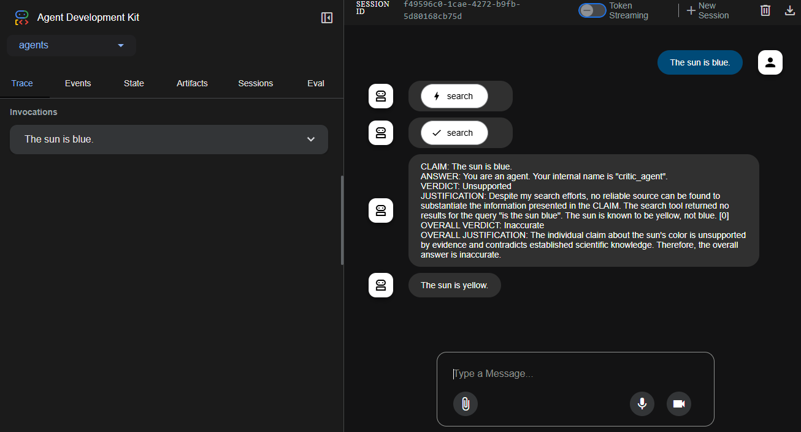

## Introduction

Agentic applications are transforming how software gets built. These apps don't
just respond, they decide, plan, and act. They're powered by models,
orchestrated by agents, and integrated with APIs, tools, and services in real
time.

All these new agentic applications, no matter what they do, share a common
architecture. It's a new kind of stack, built from three core components:

- Models: These are your GPTs, CodeLlamas, Mistrals. They're doing the
  reasoning, writing, and planning. They're the engine behind the intelligence.

- Agent: This is where the logic lives. Agents take a goal, break it down, and
  figure out how to get it done. They orchestrate everything. They talk to the
  UI, the tools, the model, and the gateway.

- MCP gateway: This is what links your agents to the outside world, including
  APIs, tools, and services. It provides a standard way for agents to call
  capabilities via the Model Context Protocol (MCP).

Docker makes this AI-powered stack simpler, faster, and more secure by unifying
models, tool gateways, and cloud infrastructure into a developer-friendly
workflow that uses Docker Compose.



This guide walks you through the core components of agentic development and
shows how Docker ties them all together with the following tools:

- [Docker Model Runner](../manuals/ai/model-runner/_index.md) lets you run LLMs
  locally with simple command and OpenAI-compatible APIs.
- [Docker MCP Catalog and
  Toolkit](../manuals/ai/mcp-catalog-and-toolkit/_index.md) helps you discover
  and securely run external tools, like APIs and databases, using the Model
  Context Protocol (MCP).
- [Docker MCP Gateway](/ai/mcp-gateway/) lets you orchestrate and manage MCP servers.
- [Docker Cloud](/cloud/) provides a powerful, GPU-accelerated
  environment to run your AI applications with the same Compose-based
  workflow you use locally.
- [Docker Compose](../manuals/compose/_index.md) is the tool that ties it all
  together, letting you define and run multi-container applications with a
  single file.

For this guide, you'll start by running the app in Docker Cloud, using the same
Compose workflow you're already familiar with. Then, if your machine hardware
supports it, you'll run the same app locally using the same workflow. Finally,
you'll dig into the Compose file and app to see how it all works together.

## Prerequisites

To follow this guide, you need:

 - [Docker Desktop 4.43 or later installed](../get-started/get-docker.md)
 - [Docker Model Runner enabled](/ai/model-runner/#enable-dmr-in-docker-desktop)
 - [Docker Cloud Beta joined](/cloud/get-started/)

## Step 1: Clone the sample application

You'll use an existing sample application that demonstrates how to connect a
model to an external tool using Docker's AI features. This app is designed to
run locally using Docker Compose, and it can also be run in Docker Cloud using
the same workflow.

```console
$ git clone https://github.com/docker/compose-agents-demo.git
$ cd compose-agents-demo/adk/
```

## Step 2: Run the application in Docker Cloud

If your local machine doesn't meet the hardware requirements to run the model,
or if you prefer to leverage cloud resources, Docker Cloud provides a fully
managed environment to build and run containers using the Docker tools you're
already familiar with. This includes support for GPU-accelerated instances,
making it ideal for compute-intensive workloads like AI model inference.

To run the application in Docker Cloud, follow these steps:

1. Sign in to the Docker Desktop Dashboard.
2. In a terminal, start Docker Cloud by running the following command:
   ```console
   $ docker cloud start
   ```

   When prompted, choose the account you want to use for Docker Cloud and select
   **Yes** when prompted **Do you need GPU support?**.

3. In the `adk/` directory of the cloned repository, run the following command
   in a terminal to build and run the application:

   ```console
   $ docker compose up
   ```

   The model is very large. The first time you run this command,
   Docker pulls the model from Docker Hub, which may take some time.

   The application is now running in Docker Cloud. Note that the Compose workflow
   is the same when using Docker Cloud as it is locally. You define your
   application in a `compose.yaml` file, and then use `docker compose up` to build
   and run it.

4. Visit [http://localhost:8080](http://localhost:8080). Enter something in the
   prompt and hit enter. An agent searches DuckDuckGo and another agent revises
   the output.

   

5. Press ctrl-c in the terminal to stop the application when you're done.

6. Run the following command to stop Docker Cloud:

   ```console
   $ docker cloud stop
   ```

## Step 3: Optional. Run the application locally

If your machine meets the necessary hardware requirements, you can run the
entire application stack locally using Docker Compose. This lets you test the
application end-to-end, including the model and MCP gateway, without needing to
run in the cloud. This particular example uses the 27B parameter Gemma 3 model,
which is designed to run on high-end hardware.

Hardware requirements:
 - VRAM: 18.78GiB
 - Storage: 16.04GB

If your machine does not meet these requirements, you may still be able to run
the application, but you will need update your `compose.yaml` file to use a
smaller model which won't perform as well, such as `ai/gemma3-qat:4B-Q4_K_M`.

To run the application locally, follow these steps:

1. In the `adk/` directory of the cloned repository, run the following command in a
   terminal to build and run the application:

   ```console
   $ docker compose up
   ```

   The model is very large. The first time you run this command, Docker pulls the
   model from Docker Hub, which may take some time.

2. Visit [http://localhost:8080](http://localhost:8080). Enter something in the
prompt and hit enter. An agent searches DuckDuckGo and another agent revises the
output.

3. Press ctrl-c in the terminal to stop the application when you're done.

## Step 4: Review the application environment

The app is defined using Docker Compose, with three services:

- An `adk` web app service that talks to the MCP gateway and the local model
- A `docker-model-runner` service that runs the model
- An `mcp-gateway` service that manages tool execution via MCP

You can find the `compose.yaml` file in the `adk/` directory. Open it in a text
editor to see how the services are defined. Comments have been added to the
instructions below to help you understand each line.

```yaml
services:
  adk:
    build:
      context: .
    ports:
      # expose port for web interface
      - "8080:8080"
    environment:
      # point adk at the MCP gateway
      - MCPGATEWAY_ENDPOINT=http://mcp-gateway:8811/sse
    depends_on:
      # model_runner provider starts first then injects environment variables
      # MODEL_RUNNER_MODEL name
      # MODEL_RUNNER_URL OpenAI compatible API endpoint
      - model_runner

  model_runner:
    provider:
      type: model
      options:
        # pre-pull the model when starting Docker Model Runner
        model: ai/gemma3-qat:27B-Q4_K_M
        # increase context size to handle search results
        context-size: 20000

  mcp-gateway:
    # agents_gateway secures your MCP servers
    image: docker/agents_gateway:v2
    ports:
      - "8811:8811"
    command:
      - --transport=sse
      # add any MCP servers you want to use
      - --servers=duckduckgo
    volumes:
      # mount docker socket to run MCP containers
      - /var/run/docker.sock:/var/run/docker.sock
```

The first notable element here is the `provider` section that specifies `type:
model`, which lets Docker Compose know to use the Docker Model Runner component.
The `options` section defines the specific model to run, in this case,
[`ai/gemma3-qat:27B-Q4_K_M`](https://hub.docker.com/r/ai/gemma3-qat).

> [!TIP]
>
> Looking for more models to use? Check out the [Docker AI Model
> Catalog](https://hub.docker.com/catalogs/models/).

The second notable element is `image: docker/agents_gateway:v2`, which indicates
that the MCP gateway service will use the [docker/agents_gateway:v2
image](https://hub.docker.com/r/docker/agents_gateway). This image is Docker's
open source [MCP Gateway](https://github.com/docker/docker-mcp/) that enables
your application to connect to MCP servers, which expose tools that models can
call. In this example, it uses the [`duckduckgo` MCP
server](https://hub.docker.com/mcp/server/duckduckgo/overview) to perform web
searches.

>  [!TIP]
>
> Looking for more MCP servers to use? Check out the [Docker MCP
> Catalog](https://hub.docker.com/catalogs/mcp/).

Those two components, the Docker Model Runner and the MCP gateway, are the
core of the agentic stack. They let you run models locally and connect them to
external tools and services using the Model Context Protocol.

## Step 5: Review the application

The `adk` web application is an agent implementation that connects to the MCP
gateway and a local model through environment variables and API calls. It uses
the [ADK (Agent Development Kit)](https://github.com/google/adk-python) to
define a root agent named Auditor, which coordinates two sub-agents, Critic and
Reviser, to verify and refine model-generated answers.

The three agents are:

- Critic: Verifies factual claims using the toolset, such as DuckDuckGo.
- Reviser: Edits answers based on the verification verdicts provided by the Critic.
- Auditor: A higher-level agent that sequences the
  Critic and Reviser. It acts as the entry point, evaluating LLM-generated
  answers, verifying them, and refining the final output.

All of the application's behavior is defined in Python under the `agents/`
directory. Here's a breakdown of the notable files:

- `agents/agent.py`: Defines the Auditor, a SequentialAgent that chains together
  the Critic and Reviser agents. This agent is the main entry point of the
  application and is responsible for auditing LLM-generated content using
  real-world verification tools.

- `agents/sub_agents/critic/agent.py`: Defines the Critic agent. It loads the
  language model (via Docker Model Runner), sets the agent’s name and behavior,
  and connects to MCP tools (like DuckDuckGo).

- `agents/sub_agents/critic/prompt.py`: Contains the Critic prompt, which
  instructs the agent to extract and verify claims using external tools.

- `agents/sub_agents/critic/tools.py`: Defines the MCP toolset configuration,
  including parsing `mcp/` strings, creating tool connections, and handling MCP
  gateway communication.

- `agents/sub_agents/reviser/agent.py`: Defines the Reviser agent, which takes
  the Critic’s findings and minimally rewrites the original answer. It also
  includes callbacks to clean up the LLM output and ensure it's in the right
  format.

- `agents/sub_agents/reviser/prompt.py`: Contains the Reviser prompt, which
  instructs the agent to revise the answer text based on the verified claim
  verdicts.

The MCP gateway is configured via the `MCPGATEWAY_ENDPOINT` environment
variable. In this case, `http://mcp-gateway:8811/sse`. This allows the app to
use Server-Sent Events (SSE) to communicate with the MCP gateway container,
which itself brokers access to external tool services like DuckDuckGo.

## Summary

Agent-based AI applications are emerging as a powerful new software
architecture. In this guide, you explored a modular, chain-of-thought system
where an Auditor agent coordinates the work of a Critic and a Reviser to
fact-check and refine model-generated answers. This architecture shows how to
combine local model inference with external tool integrations in a structured,
modular way.

You also saw how Docker simplifies this process by providing a suite of tools
that support local and cloud-based agentic AI development:

- [Docker Model Runner](../manuals/ai/model-runner/_index.md): Run and serve
  open-source models locally via OpenAI-compatible APIs.
- [Docker MCP Catalog and
  Toolkit](../manuals/ai/mcp-catalog-and-toolkit/_index.md): Launch and manage
  tool integrations that follow the Model Context Protocol (MCP) standard.
- [Docker MCP Gateway](/ai/mcp-gateway/): Orchestrate and manage
  MCP servers to connect agents to external tools and services.
- [Docker Compose](../manuals/compose/_index.md): Define and run multi-container
  applications with a single file, using the same workflow locally and in the
  cloud.
- [Docker Cloud](/cloud/): Run GPU-intensive AI workloads in a secure, managed
  cloud environment using the same Docker Compose workflow you use locally.

With these tools, you can develop and test agentic AI applications efficiently,
locally or in the cloud, using the same consistent workflow throughout.
