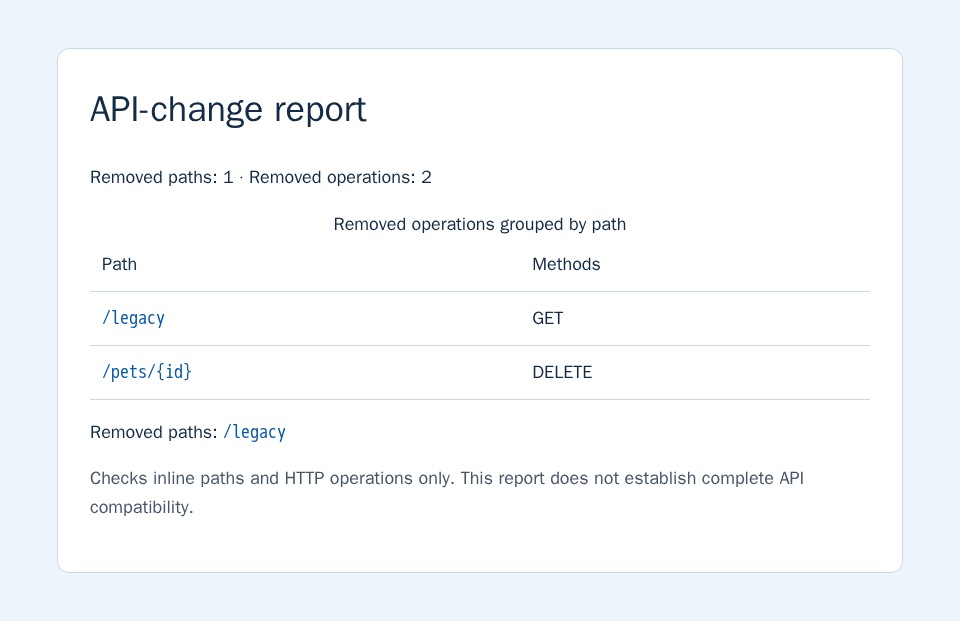
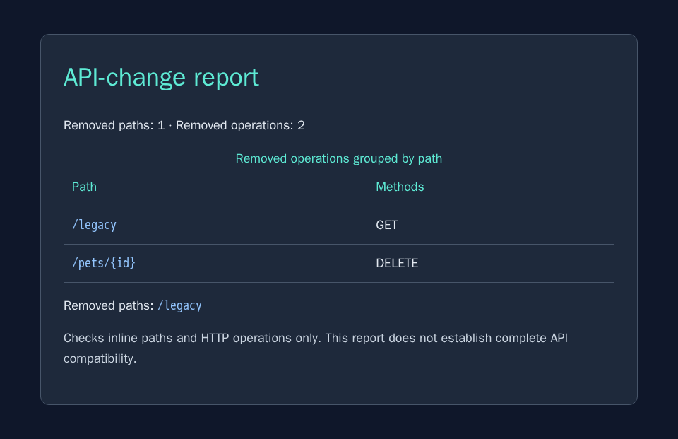

<!-- Publication gate: run the Console journey with a recorded Claude Code kit
version. Verify the public report and ZIP after sandbox deletion. The screenshots
and test excerpt below were reproduced locally for illustration.
See samples/cloud-sandbox-workflows/README.md for the remaining checks. -->

Build a small utility without setting up a development environment on your
computer. In this guide, you give Claude Code a task in a cloud sandbox, inspect
its tests, and open the result in your browser. You finish with a ZIP containing
the source, examples, tests, and report.

The utility compares two OpenAPI documents and reports removed paths and HTTP
operations. These checks can flag changes that affect API clients. They don't
establish complete API compatibility.

## Before you start

You need a browser, a personal Docker account with an active
[Docker Agentic Platform subscription](/manuals/agentic-platform/signup.md#activate-cloud-access),
and an Anthropic API key. No local installation or GitHub account is required.
Docker bills sandbox compute, and Anthropic bills model usage separately.

## Start the agent

1. Open the [Console](https://agentic-platform.docker.com/) and select **New**.
2. Select the Claude Code kit and add your Anthropic API key through the
   credential control. Keep the key out of the task prompt.
3. Select the **Balanced** network policy for agent and package-registry access.

   Optional. Use a [custom network policy](/manuals/agentic-platform/policies.md#create-a-policy)
   with `api.anthropic.com:443`, `pypi.org:443`, and `files.pythonhosted.org:443`
   instead of **Balanced**. Deselect **Open** if it is selected, since its rules
   permit broader access.

4. Select **Run**.

The Console opens a terminal connected to the agent. Dependencies, files, and
processes created here belong to the sandbox. They don't change your computer.

## Give the agent a bounded task

Paste this request into the agent terminal:

```text
Build a Python CLI in /home/agent/workspace/api-change-reporter to compare
OpenAPI JSON or YAML files. Report removed paths and HTTP operations, without
claiming complete API compatibility. Reject referenced Path Items.

Use a local .venv, pinned requirements.txt, and a README with run instructions.
Test unchanged, added, and removed operations, invalid input, and HTML escaping.

Create examples/before.yaml and examples/after.json: keep GET /pets and
GET /pets/{id}, add POST /pets, remove DELETE /pets/{id}, and remove /legacy
with its GET operation. Generate a self-contained output/index.html report
with a light color scheme.
Keep output/ limited to browser outputs. Run the tests and show the results.
```

The agent handles setup and implementation. Inspect its results before moving
on. The example should report one removed path and two removed operations.
Adding `POST /pets` should not count as a removal.

For example, a test summary and CLI output might look like this:

```text
Ran 8 tests
OK

Removed paths: 1
Removed operations: 2
  /legacy: GET
  /pets/{id}: DELETE
```

Your agent's test count can differ. Check that the tests cover the requested
behavior and that the report agrees with the inputs.

## Open the report

Ask the agent to serve the report:

```text
Serve /home/agent/workspace/api-change-reporter/output on 0.0.0.0:8080.
Verify that GET / returns the report, and keep the server running.
```

In the sandbox detail page, open **Connect**, find **Connect via a Port**, enter
`8080`, and select **Open Port**. Open the returned URL in your browser.

This is a public endpoint tied to the running sandbox. The server's dedicated
directory limits what you publish to the demonstration outputs. Use sample
specifications without private API details.

An example report shows the removed operations and the scope of the check:



## Refine the result

Ask for a visible change to the report:

```text
Give the report a dark background, light text, and teal headings.
Keep the contents unchanged. Rerun the tests and regenerate output/index.html.
```

Refresh the same URL to inspect the result. For example:



## Download the work

Ask the agent to package the project:

```text
Create output/api-change-reporter.zip with the source, README, requirements,
tests, examples, and report. Exclude .venv, caches, credentials, and Git metadata.
Extract the ZIP and verify its tests and example command work. Add a download
link to the ZIP on the report page.
```

Refresh the report and follow the download link. Open the downloaded ZIP and
confirm that it contains the project and report. Saving this bundle is the step
that keeps the work after sandbox deletion.

After verifying the download, select **Delete** in the Console to remove the
sandbox. Deletion also closes its published port.

## Use your own inputs

Point the agent at two specification files in a repository it can access. Give
it the repository URL, revisions, and file paths, and allow the repository host
in the sandbox's network policy. For private GitHub files, select a
[GitHub credential](/manuals/agentic-platform/secrets.md#github-credential)
with repository read access before launching. Keep reports containing private
details out of a public port unless the service authenticates readers.

To learn how to transfer work between local and cloud environments, see
[Send local work to the cloud](cloud-sandbox-local-handoff.md).
