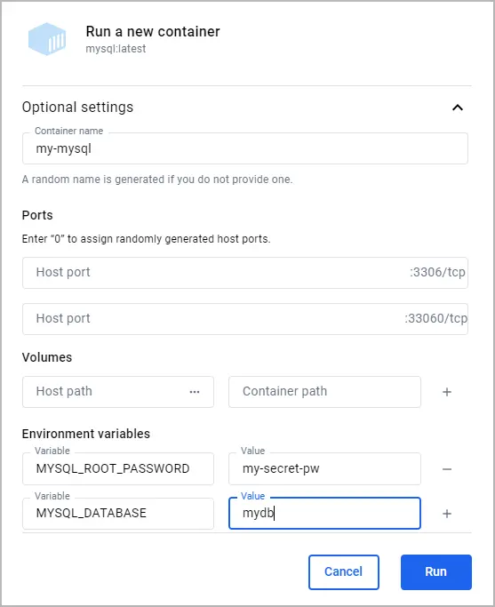
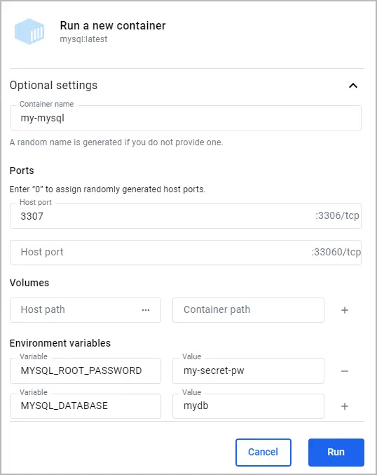

Using a local containerized database offers flexibility and ease of setup,
letting you mirror production environments closely without the overhead of
traditional database installations. Docker simplifies this process, enabling you
to deploy, manage, and scale databases in isolated containers with just a few
commands.

In this guide, you'll learn how to:

- Run a local containerized database
- Access the shell of a containerized database
- Connect to a containerized database from your host
- Connect to a containerized database from another container
- Persist database data in a volume
- Build a customized database image
- Use Docker Compose to run a database

This guide uses the MySQL image for examples, but the concepts can be applied to other database images.

## Prerequisites

To follow along with this guide, you must have Docker installed. To install Docker, see [Get Docker](/get-started/get-docker.md).

## Run a local containerized database

Most popular database systems, including MySQL, PostgreSQL, and MongoDB, have a
Docker Official Image available on Docker Hub. These images are a curated set
images that follow best practices, ensuring that you have access to the latest
features and security updates. To get started, visit
[Docker Hub](https://hub.docker.com) and search for the database you're
interested in. Each image's page provides detailed instructions on how to run
the container, customize your setup, and configure the database according to
your needs. For more information about the MySQL image used in this guide, see the Docker Hub [MySQL image](https://hub.docker.com/_/mysql) page.

To run a database container, you can use either the Docker Desktop GUI or
CLI.




To run a container using the CLI, run the following command in a terminal:

```console
$ docker run --name my-mysql -e MYSQL_ROOT_PASSWORD=my-secret-pw -e MYSQL_DATABASE=mydb -d mysql:latest
```

In this command:

- `--name my-mysql` assigns the name my-mysql to your container for easier
  reference.
- `-e MYSQL_ROOT_PASSWORD=my-secret-pw` sets the root password for MySQL to
  my-secret-pw. Replace my-secret-pw with a secure password of your choice.
- `-e MYSQL_DATABASE=mydb` optionally creates a database named mydb. You can
  change mydb to your desired database name.
- `-d` runs the container in detached mode, meaning it runs in the background.
- `mysql:latest` specifies that you want to use the latest version of the MySQL
  image.

To verify that you container is running, run `docker ps` in a terminal




To run a container using the GUI:

1. In the Docker Desktop Dashboard, select the global search at the top of the window.
2. Specify `mysql` in the search box, and select the `Images` tab if not already
   selected.
3. Hover over the `mysql` image and select `Run`.
   The **Run a new container** modal appears.
4. Expand **Optional settings**.
5. In the optional settings, specify the following:

   - **Container name**: `my-mysql`
   - **Environment variables**:
     - `MYSQL_ROOT_PASSWORD`:`my-secret-pw`
     - `MYSQL_DATABASE`:`mydb`

   

6. Select `Run`.
7. Open the **Container** view in the Docker Desktop Dashboard to verify that your
   container is running.




## Access the shell of a containerized database

When you have a database running inside a Docker container, you may need to
access its shell to manage the database, execute commands, or perform
administrative tasks. Docker provides a straightforward way to do this using the
`docker exec` command. Additionally, if you prefer a graphical interface, you
can use Docker Desktop's GUI.

If you don't yet have a database container running, see
[Run a local containerized database](#run-a-local-containerized-database).




To access the terminal of a MySQL container using the CLI, you can use the
following `docker exec` command.

```console
$ docker exec -it my-mysql bash
```

In this command:

- `docker exec` tells Docker you want to execute a command in a running
  container.
- `-it` ensures that the terminal you're accessing is interactive, so you can
  type commands into it.
- `my-mysql` is the name of your MySQL container. If you named your container
  differently when you ran it, use that name instead.
- `bash` is the command you want to run inside the container. It opens up a bash
  shell that lets you interact with the container's file system and installed
  applications.

After executing this command, you will be given access to the bash shell inside
your MySQL container, from which you can manage your MySQL server directly. You
can run `exit` to return to your terminal.




1. Open the Docker Desktop Dashboard and select the **Containers** view.
2. In the **Actions** column for your container, select **Show container
   actions** and then select **Open in terminal**.

In this terminal you can access to the shell inside your MySQL container, from
which you can manage your MySQL server directly.




Once you've accessed the container's terminal, you can run any tools available
in that container. The following example shows using `mysql` in the container to
list the databases.

```console
# mysql -u root -p
Enter password: my-secret-pw

mysql> SHOW DATABASES;

+--------------------+
| Database           |
+--------------------+
| information_schema |
| mydb               |
| mysql              |
| performance_schema |
| sys                |
+--------------------+
5 rows in set (0.00 sec)
```

## Connect to a containerized database from your host

Connecting to a containerized database from your host machine involves mapping a
port inside the container to a port on your host machine. This process ensures
that the database inside the container is accessible via the host machine's
network. For MySQL, the default port is 3306. By exposing this port, you can use
various database management tools or applications on your host machine to
interact with your MySQL database.

Before you begin, you must remove any containers you previously ran for this
guide. To stop and remove a container, either:

- In a terminal, run `docker rm --force my-mysql` to remove the container
  named `my-mysql`.
- Or, in the Docker Desktop Dashboard, select the **Delete** icon next to your
  container in the **Containers** view.

Next, you can use either the Docker Desktop GUI or CLI to run the container with
the port mapped.




Run the following command in a terminal.

```console
$ docker run -p 3307:3306 --name my-mysql -e MYSQL_ROOT_PASSWORD=my-secret-pw -e MYSQL_DATABASE=mydb -d mysql:latest
```

In this command, `-p 3307:3306` maps port 3307 on the host to port 3306 in the container.

To verify the port is mapped, run the following command.

```console
$ docker ps
```

You should see output like the following.

```console
CONTAINER ID   IMAGE          COMMAND                  CREATED          STATUS          PORTS                               NAMES
6eb776cfd73c   mysql:latest   "docker-entrypoint.s…"   17 minutes ago   Up 17 minutes   33060/tcp, 0.0.0.0:3307->3306/tcp   my-mysql
```




To run a container using the GUI:

1. In the Docker Desktop Dashboard, select the global search at the top of the window.
2. Specify `mysql` in the search box, and select the `Images` tab if not already
   selected.
3. Hover over the `mysql` image and select `Run`.
   The **Run a new container** modal appears.
4. Expand **Optional settings**.
5. In the optional settings, specify the following:

   - **Container name**: `my-mysql`
   - **Host port** for the **3306/tcp** port: `3307`
   - **Environment variables**:
     - `MYSQL_ROOT_PASSWORD`:`my-secret-pw`
     - `MYSQL_DATABASE`:`mydb`

   

6. Select `Run`.
7. In the **Containers** view, verify that the port is mapped under the
   **Port(s)** column. You should see **3307:3306** for the **my-mysql**
   container.




At this point, any application running on your host can access the MySQL service in the container at `localhost:3307`.

## Connect to a containerized database from another container

Connecting to a containerized database from another container is a common
scenario in microservices architecture and during development processes.
Docker's networking capabilities make it easy to establish this connection
without having to expose the database to the host network. This is achieved by
placing both the database container and the container that needs to access it on
the same Docker network.

Before you begin, you must remove any containers you previously ran for this
guide. To stop and remove a container, either:

- In a terminal, run `docker rm --force my-mysql` to remove the container
  named `my-mysql`.
- Or, in the Docker Desktop Dashboard, select the **Delete** icon next to your
  container in the **Containers** view.

To create a network and run containers on it:

1. Run the following command to create a Docker network named my-network.

   ```console
   $ docker network create my-network
   ```

2. Run your database container and specify the network using the `--network`
   option. This runs the container on the my-network network.

   ```console
   $ docker run --name my-mysql -e MYSQL_ROOT_PASSWORD=my-secret-pw -e MYSQL_DATABASE=mydb --network my-network -d mysql:latest
   ```

3. Run your other containers and specify the network using the `--network`
   option. For this example, you'll run a phpMyAdmin container that can connect
   to your database.

   1. Run a phpMyAdmin container. Use the `--network` option to specify the
      network, the `-p` option to let you access the container from your host
      machine, and the `-e` option to specify a required environment variable
      for this image.

      ```console
      $ docker run --name my-phpmyadmin -d --network my-network -p 8080:80 -e PMA_HOST=my-mysql phpmyadmin
      ```

4. Verify that the containers can communicate. For this example, you'll access
   phpMyAdmin and verify that it connects to the database.

   1. Open [http://localhost:8080](http://localhost:8080) to access your phpMyAdmin container.
   2. Log in using `root` as the username and `my-secret-pw` as the password.
      You should connect to the MySQL server and see your database listed.

At this point, any application running on your `my-network` container network
can access the MySQL service in the container at `my-mysql:3306`.

## Persist database data in a volume

Persisting database data in a Docker volume is necessary for ensuring that your
data survives container restarts and removals. A Docker volume lets you store
database files outside the container's writable layer, making it possible to
upgrade the container, switch bases, and share data without losing it. Here’s
how you can attach a volume to your database container using either the Docker
CLI or the Docker Desktop GUI.

Before you begin, you must remove any containers you previously ran for this
guide. To stop and remove a container, either:

- In a terminal, run `docker rm --force my-mysql` to remove the container
  named `my-mysql`.
- Or, in the Docker Desktop Dashboard, select the **Delete** icon next to your
  container in the **Containers** view.

Next, you can use either the Docker Desktop GUI or CLI to run the container with a volume.




To run your database container with a volume attached, include the `-v` option
with your `docker run` command, specifying a volume name and the path where the
database stores its data inside the container. If the volume doesn't exist,
Docker automatically creates it for you.

To run a database container with a volume attached, and then verify that the
data persists:

1. Run the container and attach the volume.

   ```console
   $ docker run --name my-mysql -e MYSQL_ROOT_PASSWORD=my-secret-pw -e MYSQL_DATABASE=mydb -v my-db-volume:/var/lib/mysql -d mysql:latest
   ```

   This command mounts the volume named `my-db-volume` to the `/var/lib/mysql` directory in the container.

2. Create some data in the database. Use the `docker exec` command to run
   `mysql` inside the container and create a table.

   ```console
   $ docker exec my-mysql mysql -u root -pmy-secret-pw -e "CREATE TABLE IF NOT EXISTS mydb.mytable (column_name VARCHAR(255)); INSERT INTO mydb.mytable (column_name) VALUES ('value');"
   ```

   This command uses the `mysql` tool in the container to create a table named
   `mytable` with a column named `column_name`, and finally inserts a value of
   `value`.

3. Stop and remove the container. Without a volume, the table you created would
   be lost when removing the container.

   ```console
   $ docker rm --force my-mysql
   ```

4. Start a new container with the volume attached. This time, you don't need to
   specify any environment variables as the configuration is saved in the
   volume.

   ```console
   $ docker run --name my-mysql -v my-db-volume:/var/lib/mysql -d mysql:latest
   ```

5. Verify that the table you created still exists. Use the `docker exec` command
   again to run `mysql` inside the container.

   ```console
   $ docker exec my-mysql mysql -u root -pmy-secret-pw -e "SELECT * FROM mydb.mytable;"
   ```

   This command uses the `mysql` tool in the container to select all the
   records from the `mytable` table.

   You should see output like the following.

   ```console
   column_name
   value
   ```




To run a database container with a volume attached, and then verify that the
data persists:

1. Run a container with a volume attached.

   1. In the Docker Desktop Dashboard, select the global search at the top of the window.
   2. Specify `mysql` in the search box, and select the **Images** tab if not
      already selected.
   3. Hover over the **mysql** image and select **Run**.
      The **Run a new container** modal appears.
   4. Expand **Optional settings**.
   5. In the optional settings, specify the following:

      - **Container name**: `my-mysql`
      - **Environment variables**:
        - `MYSQL_ROOT_PASSWORD`:`my-secret-pw`
        - `MYSQL_DATABASE`:`mydb`
      - **Volumes**:
        - `my-db-volume`:`/var/lib/mysql`

      

      Here, the name of the volume is `my-db-volume` and it is mounted in the
      container at `/var/lib/mysql`.

   6. Select `Run`.

2. Create some data in the database.

   1. In the **Containers** view, next to your container select the **Show
      container actions** icon, and then select **Open in terminal**.
   2. Run the following command in the container's terminal to add a table.

      ```console
      # mysql -u root -pmy-secret-pw -e "CREATE TABLE IF NOT EXISTS mydb.mytable (column_name VARCHAR(255)); INSERT INTO mydb.mytable (column_name) VALUES ('value');"
      ```

      This command uses the `mysql` tool in the container to create a table
      named `mytable` with a column named `column_name`, and finally inserts a
      value of value`.

3. In the **Containers** view, select the **Delete** icon next to your
   container, and then select **Delete forever**. Without a volume, the table
   you created would be lost when deleting the container.
4. Run a container with a volume attached.

   1. In the Docker Desktop Dashboard, select the global search at the top of the window.
   2. Specify `mysql` in the search box, and select the **Images** tab if not
      already selected.
   3. Hover over the **mysql** image and select **Run**.
      The **Run a new container** modal appears.
   4. Expand **Optional settings**.
   5. In the optional settings, specify the following:

      - **Container name**: `my-mysql`
      - **Environment variables**:
        - `MYSQL_ROOT_PASSWORD`:`my-secret-pw`
        - `MYSQL_DATABASE`:`mydb`
      - **Volumes**:
        - `my-db-volume`:`/var/lib/mysql`

      

   6. Select `Run`.

5. Verify that the table you created still exists.

   1. In the **Containers** view, next to your container select the **Show
      container actions** icon, and then select **Open in terminal**.
   2. Run the following command in the container's terminal to verify that table
      you created still exists.

      ```console
      # mysql -u root -pmy-secret-pw -e "SELECT * FROM mydb.mytable;"
      ```

      This command uses the `mysql` tool in the container to select all the
      records from the `mytable` table.

      You should see output like the following.

      ```console
      column_name
      value
      ```




At this point, any MySQL container that mounts the `my-db-volume` will be able
to access and save persisted data.

## Build a customized database image

Customizing your database image lets you include additional configuration,
scripts, or tools alongside the base database server. This is particularly
useful for creating a Docker image that matches your specific development or
production environment needs. The following example outlines how to build and
run a custom MySQL image that includes a table initialization script.

Before you begin, you must remove any containers you previously ran for this
guide. To stop and remove a container, either:

- In a terminal, run `docker rm --force my-mysql` to remove the container
  named `my-mysql`.
- Or, in the Docker Desktop Dashboard, select the **Delete** icon next to your
  container in the **Containers** view.

To build and run your custom image:

1. Create a Dockerfile.

   1. Create a file named `Dockerfile` in your project directory. For this
      example, you can create the `Dockerfile` in an empty directory of your
      choice. This file will define how to build your custom MySQL image.
   2. Add the following content to the `Dockerfile`.

      ```dockerfile
      # syntax=docker/dockerfile:1

      # Use the base image mysql:latest
      FROM mysql:latest

      # Set environment variables
      ENV MYSQL_DATABASE mydb

      # Copy custom scripts or configuration files from your host to the container
      COPY ./scripts/ /docker-entrypoint-initdb.d/
      ```

      In this Dockerfile, you've set the environment variable for the MySQL
      database name. You can also use the `COPY` instruction to add custom
      configuration files or scripts into the container. In this
      example, files from your host's `./scripts/` directory are copied into the
      container's `/docker-entrypoint-initdb.d/` directory. In this directory,
      `.sh`, `.sql`, and `.sql.gz` scripts are executed when the container is
      started for the first time. For more details about Dockerfiles, see the
      [Dockerfile reference](/reference/dockerfile/).

   3. Create a script file to initialize a table in the database. In the
      directory where your `Dockerfile` is located, create a subdirectory named
      `scripts`, and then create a file named `create_table.sql` with the
      following content.

   ```text
   CREATE TABLE IF NOT EXISTS mydb.myothertable (
     column_name VARCHAR(255)
   );

   INSERT INTO mydb.myothertable (column_name) VALUES ('other_value');
   ```

   You should now have the following directory structure.

   ```text
   ├── your-project-directory/
   │ ├── scripts/
   │ │ └── create_table.sql
   │ └── Dockerfile
   ```

2. Build your image.

   1. In a terminal, change directory to the directory where your `Dockerfile`
      is located.
   2. Run the following command to build the image.

      ```console
      $ docker build -t my-custom-mysql .
      ```

      In this command, `-t my-custom-mysql` tags (names) your new image as
      `my-custom-mysql`. The period (.) at the end of the command specifies the
      current directory as the context for the build, where Docker looks for the
      Dockerfile and any other files needed for the build.

3. Run your image as you did in [Run a local containerized
   database](#run-a-local-containerized-database). This time, specify your
   image's name instead of `mysql:latest`. Also, you no longer need to specify
   the `MYSQL_DATABASE` environment variable as it's now defined by your
   Dockerfile.

   ```console
   $ docker run --name my-mysql -e MYSQL_ROOT_PASSWORD=my-secret-pw -d my-custom-mysql
   ```

4. Verify that your container is running with the following command.

   ```console
   $ docker ps
   ```

   You should see output like the following.

   ```console
   CONTAINER ID   IMAGE              COMMAND                  CREATED        STATUS          PORTS                 NAMES
   f74dcfdb0e59   my-custom-mysql   "docker-entrypoint.s…"    2 hours ago    Up 51 minutes   3306/tcp, 33060/tcp   my-mysql
   ```

5. Verify that your initialization script was ran. Run the following command in
   a terminal to show the contents of the `myothertable` table.

   ```console
   $ docker exec my-mysql mysql -u root -pmy-secret-pw -e "SELECT * FROM mydb.myothertable;"
   ```

   You should see output like the following.

   ```console
   column_name
   other_value
   ```

Any container ran using your `my-custom-mysql` image will have the table
initialized when first started.

## Use Docker Compose to run a database

Docker Compose is a tool for defining and running multi-container Docker
applications. With a single command, you can configure all your application's
services (like databases, web apps, etc.) and manage them. In this example,
you'll create a Compose file and use it to run a MySQL database container and a phpMyAdmin container.

To run your containers with Docker Compose:

1. Create a Docker Compose file.

   1. Create a file named `compose.yaml` in your project directory. This file
      will define the services, networks, and volumes.
   2. Add the following content to the `compose.yaml` file.

      ```yaml
      services:
        db:
          image: mysql:latest
          environment:
            MYSQL_ROOT_PASSWORD: my-secret-pw
            MYSQL_DATABASE: mydb
          ports:
            - 3307:3306
          volumes:
            - my-db-volume:/var/lib/mysql

        phpmyadmin:
          image: phpmyadmin/phpmyadmin:latest
          environment:
            PMA_HOST: db
            PMA_PORT: 3306
            MYSQL_ROOT_PASSWORD: my-secret-pw
          ports:
            - 8080:80
          depends_on:
            - db

      volumes:
        my-db-volume:
      ```

      For the database service:

      - `db` is the name of the service.
      - `image: mysql:latest` specifies that the service uses the latest MySQL
        image from Docker Hub.
      - `environment` lists the environment variables used by MySQL to
        initialize the database, such as the root password and the database
        name.
      - `ports` maps port 3307 on the host to port 3306 in the container,
        allowing you to connect to the database from your host machine.
      - `volumes` mounts `my-db-volume` to `/var/lib/mysql` inside the container
        to persist database data.

      In addition to the database service, there is a phpMyAdmin service. By
      default Compose sets up a single network for your app. Each container for
      a service joins the default network and is both reachable by other
      containers on that network, and discoverable by the service's name.
      Therefore, in the `PMA_HOST` environment variable, you can specify the
      service name, `db`, in order to connect to the database service. For more details about Compose, see the [Compose file reference](/reference/compose-file/).

2. Run Docker Compose.

   1. Open a terminal and change directory to the directory where your
      `compose.yaml` file is located.
   2. Run Docker Compose using the following command.

      ```console
      $ docker compose up
      ```

      You can now access phpMyAdmin at
      [http://localhost:8080](http://localhost:8080) and connect to your
      database using `root` as the username and `my-secret-pw` as the password.

   3. To stop the containers, press `ctrl`+`c` in the terminal.

Now, with Docker Compose you can start your database and app, mount volumes,
configure networking, and more, all with a single command.

## Summary

This guide introduced you to the essentials of using containerized databases,
specifically focusing on MySQL, to enhance flexibility, ease of setup, and
consistency across your development environments. The use-cases covered in
this guide not only streamline your development workflows but also prepare you
for more advanced database management and deployment scenarios, ensuring your
data-driven applications remain robust and scalable.

Related information:

- [Docker Hub database images](https://hub.docker.com/search?q=database&type=image)
- [Dockerfile reference](/reference/dockerfile/)
- [Compose file reference](/reference/compose-file/)
- [CLI reference](/reference/cli/docker/)
- [Database samples](../../reference/samples/_index.md#databases)
