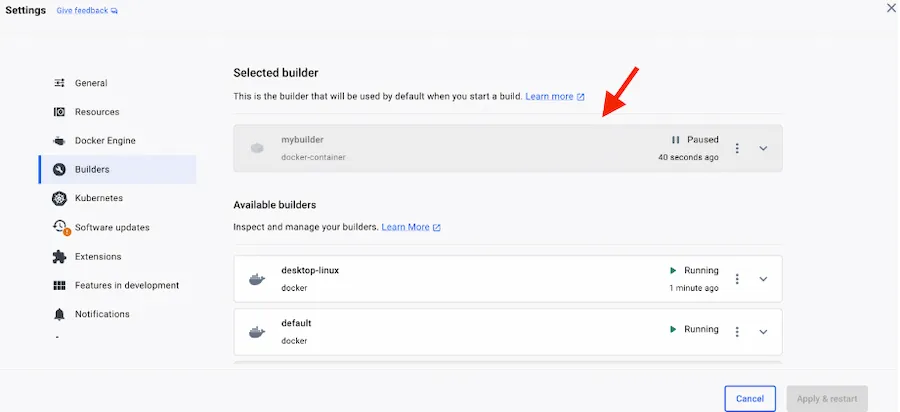

<iframe width="650" height="365" src="https://www.youtube.com/embed/nsWWQ1xoEy0?rel=0" title="YouTube video player" frameborder="0" allow="accelerometer; autoplay; clipboard-write; encrypted-media; gyroscope; picture-in-picture; web-share" allowfullscreen></iframe>

## Explanation

In this concept, you will learn the following:
- How to build multi-platform Docker Images


Traditionally, Docker images were tied to a specific architecture and operating system. However, with multi-platform support, a single Docker image can contain variants for different architectures and operating systems. This means that developers can build images that run seamlessly across diverse environments, from x86_64 machines to ARM-based devices, and even different operating systems like Windows.


### Building Multi-Platform Images

When building Docker images, developers can specify the target platform using the `--platform` flag. For example, you can build images for Linux on AMD64, ARM64, or other architectures. By default, Docker allows building for a single platform at a time. However, with advanced strategies, such as QEMU emulation or using multiple native nodes, developers can build for multiple platforms simultaneously.


## Try it out

In this hands-on, you will will learn how to build multi-platform Docker images using tools like `docker buildx`, which provides support for multi-platform builds out of the box. By creating a new builder and specifying the target platforms, developers can seamlessly build, push, and run multi-platform images.

Consider the following Dockerfile:

```console
 FROM node:20-alpine
 WORKDIR /app
 COPY . .
 RUN yarn install --production
 CMD ["node", "./src/index.js"]
```

```console
 docker build -t node-app:1.0 .
```

## Create a Multi-Architecture Buildx Builder

Next, we'll create a multi-architecture builder using Docker Buildx. Run the following command:

```console 
 docker buildx create --name mybuilder --use
```


This command creates a new builder named `mybuilder` and sets it as the current builder.




## Build for Multiple Architectures


Now that we have a multi-architecture builder set up, we can build the Docker image for multiple architectures. Run the following command:

```console
 docker buildx build --platform linux/amd64,linux/arm64 -t my-node-app:1.0 --push .
```


This command builds the Docker image for both x86_64 and ARM64 architectures and tags it as my-node-app:multiarch. The `--push` flag pushes the built image to a container registry.

You can verify if the ``docker buildx build`` command is picking up the right builder with the first line of the output:

```console
 docker buildx build --platform linux/amd64,linux/arm64 -t node-app:1.0 --push .
[+] Building 18.2s (13/15)                                                                            docker-container:mybuilder
...
...
...
View build details: docker-desktop://dashboard/build/mybuilder/mybuilder0/z1ear72ovp81cf4rqmk0rrq22

Build multi-platform images faster with Docker Build Cloud: https://docs.docker.com/go/docker-build-cloud
```

### Verify Multi-Architecture Support

Finally, you can verify that the Docker image supports multiple architectures by inspecting its manifest:

```console
 docker manifest inspect <your_dockerhub_id>/ node-app:1.0
```

```console
 {
   "schemaVersion": 2,
   "mediaType": "application/vnd.oci.image.index.v1+json",
   "manifests": [
      {
         "mediaType": "application/vnd.oci.image.manifest.v1+json",
         "size": 1626,
         "digest": "sha256:e5423cde978d7fbdc8c18da7786c0b468cd6076b728ba32ca9e9eb85222656c8",
         "platform": {
            "architecture": "amd64",
            "os": "linux"
         }
      },
      {
         "mediaType": "application/vnd.oci.image.manifest.v1+json",
         "size": 1626,
         "digest": "sha256:1bc05628be13b93d1731616b0701f66c88a25d822006f4e15bd22fded19ef7e6",
         "platform": {
            "architecture": "arm64",
            "os": "linux"
         }
      },
      {
         "mediaType": "application/vnd.oci.image.manifest.v1+json",
         "size": 566,
         "digest": "sha256:13bb853ae7e16476b49c2defade1825ccc21858c06c24019db9536876ee5cd94",
         "platform": {
            "architecture": "unknown",
            "os": "unknown"
         }
      },
      {
         "mediaType": "application/vnd.oci.image.manifest.v1+json",
         "size": 566,
         "digest": "sha256:95fdac652190e844fb8135d72869d57fff14da0184e274c1da7307bebfc036d5",
         "platform": {
            "architecture": "unknown",
            "os": "unknown"
         }
      }
   ]
}
```

## Additional resources

- [Building Multi-platform Images](https://docs.docker.com/build/building/multi-platform/)


Now that you have learned about building a multi-platform Docker images, it's time to learn how to use Remote builder like Docker Build Cloud that  lets you build your container images faster, both locally and in CI.



