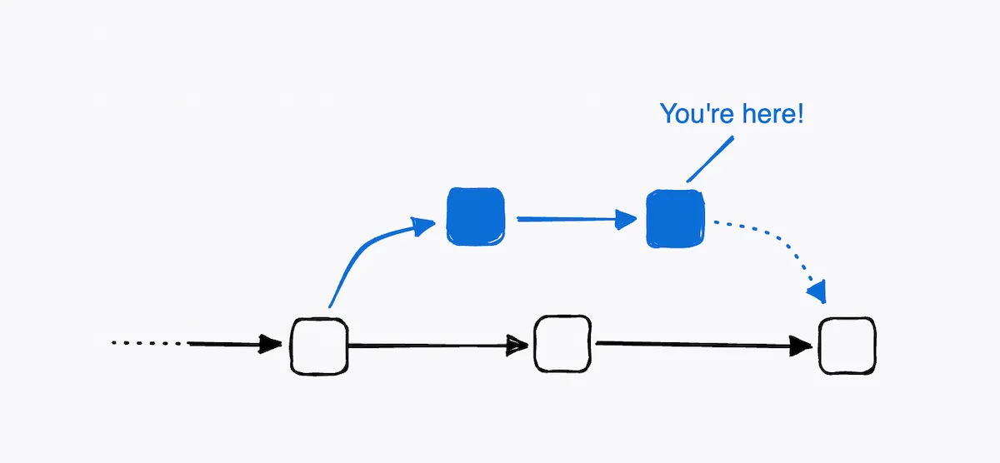
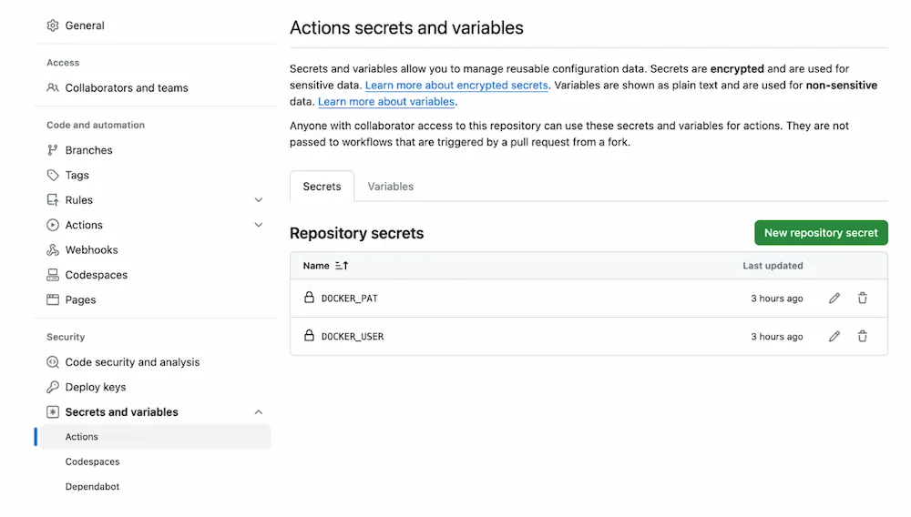
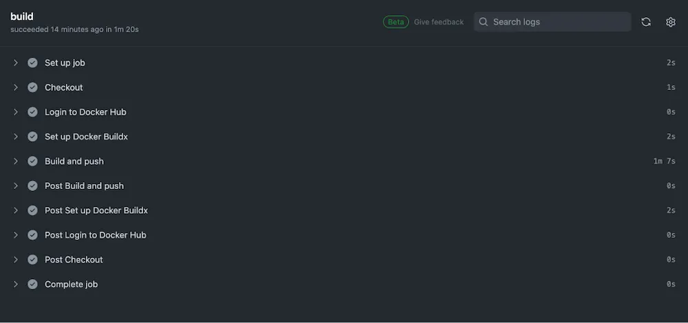

<iframe width="650" height="365" src="https://www.youtube.com/embed/nsWWQ1xoEy0?rel=0" title="YouTube video player" frameborder="0" allow="accelerometer; autoplay; clipboard-write; encrypted-media; gyroscope; picture-in-picture; web-share" allowfullscreen></iframe>

## Explanation

In this concept, you will learn the following:

- How to setup and use GitHub Actions to build and test your Docker image
- How to push the Docker image to the registry

###  What is CI/CD?



Once you've built and tested your Docker image locally, it's time to integrate it into the broader development workflow, where CI/CD (Continuous Integration and Continuous Delivery) plays a pivotal role. CI/CD is a practice that automates and streamlines the software development lifecycle. It's essentially a two-step process:

1. **Continuous Integration (CI)**: This involves frequently merging code changes from various developers into a shared central repository. As you submit each change, it triggers the automated tests that identifies and fixes any issues early on. This helps catch errors and prevents them from snowballing into larger problems later in the development process.

2. **Continuous Delivery (CD)**: Once the code passes the automated tests in the CI stage, CD kicks in. It automates the process of building, testing, and deploying the code to various environments, such as staging or production. This allows for faster delivery of new features and bug fixes to the end users.

### Benefits of CI/CD:

1. **Faster development cycles**: By automating testing and deployment, teams can release new features and bug fixes more frequently.
2. **Improved software quality**: Early detection and fixing of bugs through continuous integration leads to higher quality software.
3. **Reduced risk of errors**: Automation minimizes the potential for human errors during manual deployment processes.
4. **Increased developer productivity**: Developers can focus on writing code instead of spending time on manual build and deployment tasks.

GitHub Actions is one of the popular continuous integration and continuous delivery(CI/CD) platform that let you to automate your build, test and deployment pipeline. It let you to create workflows that build and test every pull requests to your repository, or merge pull requests to the production.

Building in CI involves the following steps:

* Create a GitHub Account(if not created yet)
* Create a new repository on GitHub
* Define the GitHub Actions workflow
* Run the workflow

## Try it out

In this hands-on, you'll learn how to set up and use GitHub Actions to build and test your Docker image as well as push it to Docker Hub.


## Create a new GitHub account

To get started with GitHub, you'll need to create a free personal account on GitHub.com and verify your email address.

- Navigate to [GitHub](https://github.com/)
- Click the `Sign up` button.
- Follow the prompts to create your personal account.


## Create the repository

Create a GitHub repository, configure the Docker Hub secrets, and push your source code.


1. Configuring the repository

Open the GitHub project repository` Settings`, and go to `Secrets and variables > Actions. `Create a new secret named `DOCKER_USER` and your Docker ID as value.



2. Create a new Personal Access Token (PAT) for Docker Hub

Add the PAT as a second secret in your GitHub repository, with the name` DOCKER_PAT`.


## Define the GitHub Actions workflow

Let’s follow the steps below to set up the GitHub Actions workflow for building, testing, and pushing the image to Docker Hub. 


1. Open [https://github.com/docker/getting-started-todo-app](https://github.com/docker/getting-started-todo-app) and click on “Actions”
2.  Click on the “set up a workflow yourself” link.


3. This creates an empty  .github/workflows directory in your project root.
4. Add the following content into the YAML file. You can name this file anything you like.

```console
name: ci

on:
  push:
    branches:
      - "main"

jobs:
  docker:
    runs-on: ubuntu-latest
    steps:
      - name: Checkout
        uses: actions/checkout@v4
      - name: Log in to Docker Hub
        uses: docker/login-action@v3
        with:
          username: ${{ secrets.DOCKER_USER }}
          password: ${{ secrets.DOCKER_PAT }}
      - name: Set up Docker Buildx
        uses: docker/setup-buildx-action@v3
      
      - name: Build and push
        uses: docker/build-push-action@v5
        with:
          context: .
          push: true
          target: final
          tags: ${{ secrets.DOCKER_USER }}/${{ github.event.repository.name }}:latest
      
```

The following workflow automates the process of building and pushing a Docker image when code is pushed to the main branch of the repository. It uses Docker Hub for registry storage and leverages Docker Buildx for efficient multi-platform image building.

Here's a breakdown of the GitHub Actions workflow:


1. **Workflow Name:**

`ci`: This name suggests it's a continuous integration workflow, likely intended to build and test code changes as they're made.

2. **Triggers:**

`on: push`: The workflow will be triggered when code is pushed to the repository.
`branches`: - "main": It will specifically run when code is pushed to the main branch.

3. **Jobs:**

`docker`: This job contains the steps for building and pushing a Docker image.
`runs-on`: ubuntu-latest: The job will run on a virtual machine with the latest Ubuntu OS.

## Steps:

1. **Checkout:**
* `uses : actions/checkout@v4`: This step checks out the code from the repository to the virtual machine.
2. **Log in to Docker Hub:**
* `uses`: docker/login-action@v3`: Logs in to Docker Hub using provided credentials.
* `username: ${{ secrets.DOCKER_USER }}`: Retrieves the username from a secret named DOCKER_USER.
* `password: ${{ secrets.DOCKER_PAT }}`: Retrieves the password from a secret named DOCKER_PAT.
3. **Setup Docker Buildx:**
* `uses: docker/setup-buildx-action@v3`: Sets up Docker Buildx for building multi-platform images.
4. **Build and push:**
* `uses: docker/build-push-action@v5`: Builds and pushes the Docker image.
* `context: .`: Uses the current directory as the build context.
* `target`: specifies the build target within the Dockerfile
* `tags`: defines the image tag for the  built image. It dynamically uses the username from the secrets and the repository name from the event context t create a unique tag.

## Run the workflow

Save the workflow file and run the job.



When the workflow is complete, go to your repositories on Docker Hub. If you see the new repository in that list, it means the GitHub Actions successfully pushed the image to Docker Hub ! 🎉

### Additional resources

To learn more about building in CI/CD, visit the following resources:

- [Continuous Integration with Docker](https://docs.docker.com/build/ci/)
- [Introduction to GitHub Actions](https://docs.docker.com/build/ci/github-actions/)
- [Using secrets with GitHub Actions](https://docs.docker.com/build/ci/github-actions/secrets/)
- [Configuring CI/CD for your Node.js application](https://docs.docker.com/language/nodejs/configure-ci-cd/)
- [Configuring CI/CD for your Python application](https://docs.docker.com/language/python/configure-ci-cd/)
- [Configuring CI/CD for your Java application](https://docs.docker.com/language/java/configure-ci-cd/)


Now that you have learned about building and publishing images to Docker Hub using CI/CD, it's time to learn how to make your Docker builds faster and more efficient using build cache.



